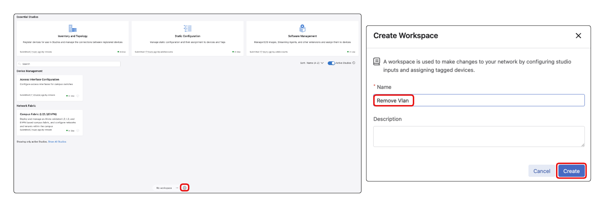
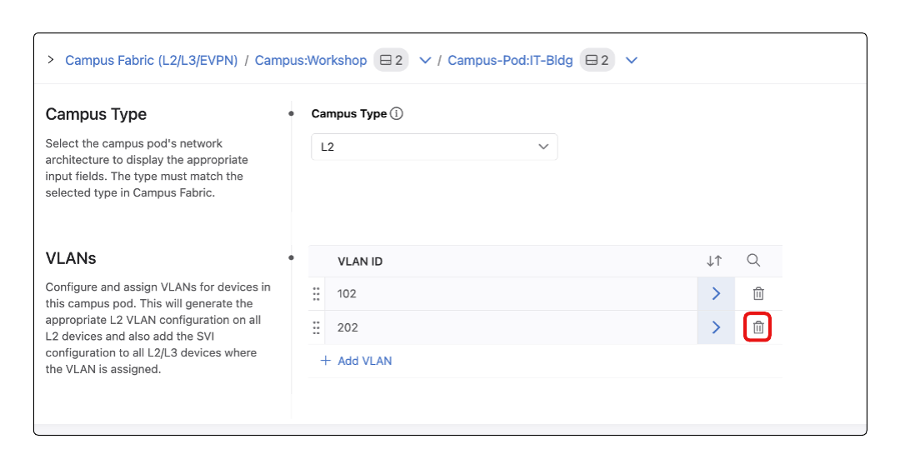
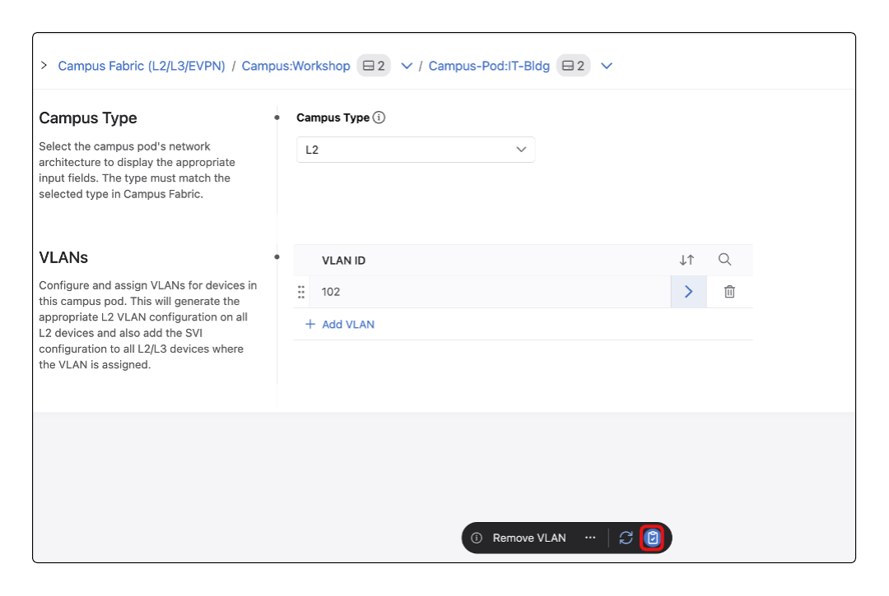
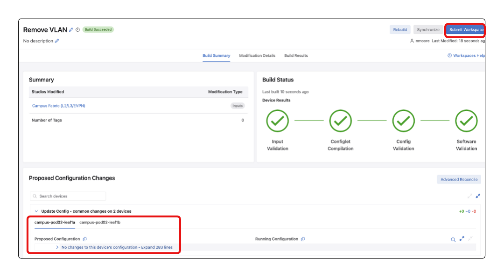
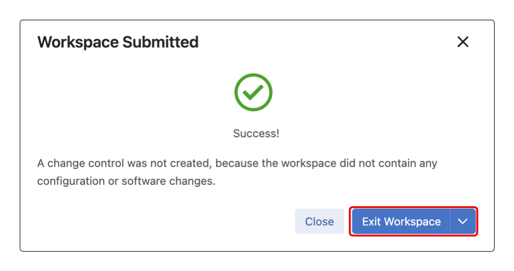

# Campus A-03 Wired Lab Guide

## Day-2 Operations, Dashboards, and Events

## This Lab Guide:

[Campus A-03 Wired Lab Guide - Day-2 Operations, Dashboards, and Events](https://github.com/arista-rockies/Workshops/blob/main/Campus/2026_Campus_Workshop/A-03/2026_Campus_A-03_Wired_Lab_Guide.md)

---

## Table of Contents

1. [Full Lab Topology](#1-full-lab-topology)
2. [POD Topology](#2-pod-topology)
3. [Accessing CloudVision as a Service](#3-accessing-cloudvision-as-a-service)
4. [Operations: Add a VLAN](#4-operations-add-a-vlan)
5. [Rollback a Change Control](#5-rollback-a-change-control)
6. [Dashboards (Built-in and Custom)](#6-dashboards-built-in-and-custom)
7. [Events](#7-events)
8. [Customize Notifications](#8-customize-notifications)

---

## 1. Full Lab Topology

---

## 2. POD Topology

---

## 3. Accessing CloudVision as a Service

1. Go to the Arista Ignition GUI via: https://ignition.campus-atd.net/ 
- Enter the 6 digit Access Code found on the Pod Handout Worksheet 
- Click.  

2. Click the **CVaaS** tile

3. You will now be logged into CloudVision

---

## 4. Operations: Add a VLAN

Adding a VLAN is a common provisioning task. Let’s use the existing Campus Fabric Studio to add an incremental configuration (add a VLAN). This VLAN will be specific to your pod and not routable outside.

1. Select **Provisioning**, then **Studios**

2. Create a new Workspace 
     - Select the **+** on the Workspace bar on the bottom of the page
     - name the workspace  “<add-vlan2##>” where ## is your pod number. Examples:

        Pod 1 = VLAN 201  
        Pod 2 = VLAN 202  
        …  
        Pod 13 = VLAN 213  
        etc.

3. Once the workspace is created, select **Campus Fabric (L2/L3/EVPN)** studio. 

*If the Studios main page is not present you may have to select the blue Studios breadcrumb towards the top left of the page*

4. Within the Campus Fabric studio, validate that the Device Selection still applies to All Devices. Select the **down arrow** under **Device Selection**

5. Within the **Campus Services (Non-VXLAN)** select the **Campus:Workshop expand arrow** on the right

6. Add new VLAN and add to the **IT-Bldg** Campus POD.

     -  Within the Campus: Workshop section, click the Campus-Pod: **IT-Bldg name** or the **expand arrow** on the right

7. click the **+ Add VLAN** 

8. In the newly created section under **VLAN ID** input VLAN number **200+POD#**, click the **arrow expand** on the right

9. Createing a new VLAN
     * For the purpose of this lab we will create an L2 VLAN. Select **L2 Only** 
     * Add a **name** for your VLAN with **no spaces** 

*Notice the avaialble inputs change based on L2 Only and Routed selections*

10. Assigning VLANs to devices
    * Select **+ Add Pod**
    * Select the **dropdown** from the new line that was created
    * Select **IDF1**

You can skip entries for all of the remaining vlan configuration sections.

11. Select the **Clipboard Icon** on the bottom of the page to **Review Workspace** and see the proposed changes.

12. Notice that the Studio is adding the VLAN to all devices within the Pod as well as adding the newly created VLAN to the trunk interfaces.

13. Once you review the changes, click **Submit Workspace**

14. Click **View Change Control**

15. Review the Change Control and select **Review and Approve**

16. If necessary toggle the Execute Immediately button and select **Approve and Execute**

17. Verify the VLAN has been added to the device configuration by using the Devices Comparison function.

     - Select ***Devices** and then **Comparison** menu
  
  

18. Time Comparison
    - Select a **Time Comparison**
    - Choose a device from the list. example leaf1a
    - Select a **time period**, for example 30 minutes ago 
    - Click the **Compare** button 

19. Time Comparison (Continued)
    - The first screen presented shows the overview:
    - Select the **Configuration** section

*Note: Notice that the configuration has been updated. Feel free to explore other comparisons by feature. Since this VLAN was localized only, no new IP routes or MAC addresses should be learned.*

**LAB SECTION COMPLETE**

 In the next lab section you will see how to roll back a previous change control

---
## 5. Rollback a Change Control

A common operational task is to roll back a specific configuration and restore back to previous state. You may need to do this for all devices affected by a change, or only a subset of devices under troubleshooting.

CloudVision change controls allow this flexibility for granular change management per device and fleet-wide

Let’s roll back the change control we used to add a VLAN via Studios.

1. First go to **Provisioning** then **Change Control** menu. Select the **completed change control corresponding to your VLAN addition**

2. Click the **Rollback** button

3. In the next screen, **select all the devices** and click **Create Rollback Change Control**

4. Verify the Configuration Changes section by clicking **View Diff**  Once you have reviewed the change, click the **Review and Approve** button

5. You’ll be presented with one more opportunity to review the changes. Select **Execute Immediately** if not already toggled on and then click **Approve and Execute**

6. Monitor the change control for completion to ensure the added VLAN is cleaned up on both switches.

*You have now successfully added a VLAN through Studios and then rolled back that change across all switches.*

A rollback of a change control does not change the CloudVision Designed Configuration. Currently your devices will show as out of compliance. 

Let's update the Studio so that current running configuration matches the designed configuration.

7. Select **Provisioning**, then **Studios**

 

8. Create a new Workspace 
     - Select the **+** on the Workspace bar on the bottom of the page
     - name the workspace  “<remove-vlan2##>” where ## is your pod number. Examples:

        Pod 1 = VLAN 201  
        Pod 2 = VLAN 202  
        …  
        Pod 13 = VLAN 213  
        etc.

9. Once the workspace is created, select **Campus Fabric (L2/L3/EVPN)** studio. 

10. Within the **Campus Services (Non-VXLAN)** select the **Campus:Workshop expand arrow** on the right

11. Within the Campus: Workshop section, click the Campus-Pod: **IT-Bldg name** or the **expand arrow** on th

12. Locate the **VLANs** section. Click the **Trash Can** icon next to VLAN **2[POD#]**

13. Select the **Clipboard Icon** in your Workspace Island bar to review your workspace.

14. Because we have already removed **VLAN 2[POD#]** from the running configuration, there should be no proposed changes to the network. Select **Submit Workspace**

15. Since no changes are occurring there is no change control created. Select **Exit Workspace**

*Now your running configuration and CloudVision's Designed configuration are aligned*

**LAB SECTION COMPLETE**
---

## 6. Dashboards (Built-in and Custom)

Dashboards are an important way to visualize commonly requested information. This lab section shows you how to navigate the built-in dashboards and customize your own.

### Built in Dashboard: Campus Health Overview

1. Navigate to **Dashboards** to arrive at the Dashboards landing page.

2. Select the built-in **Campus Health Overview dashboard**

3. You’ll be presented with a curated selection of common campus related monitoring tools

*Note: We will explore the Quick Actions interactive functions of this dashboard in another lab section.* 

4. Feel free to explore the Campus Health dashboard briefly and then navigate back to the Dashboards landing page by selecting **Dashboards** in the upper left.

### Built in Dashboard: “Device Hardware”

1. Next, Select the **Device Hardware** dashboard

2. By default, this dashboard selects all devices. 
  
  
  
3. Change the dashboard to select only **leaf1a** by deleting the current query device:*. Replace with the query **device:campus-pod[pod#]leaf1a**

4. Once you’ve selected an individual device, the dashboard will filter to results for only this device.

5. Navigate back to the Dashboards landing page by clicking **Dashboards** in upper left.

---
 ### Customized dashboard.

1. Click the **New Dashboard** button.

2. New Dashboard
    - Select the **pencil** next to Untitled dashboard
    - Provide a useful name for the Dashboard, such as **Workshop Dashboard**

3. Next, let’s add some metrics to display from the workshop devices.

4. Within new metrics tile now added to your dashboard, select either the **3 dots > Configure** or **Click to Configure**

5. Within the right side menu bar, locate the device metric **Memory > Memory Usage** 

6. Review the availabe Visualization options. Select each of them to determine which would best suit your personal preference. 

*Note: sometimes when changing the visualization you will have to re-select the metric you would like displayed*

7. Close the dashboard editor by selecting the **X** towards the top right of the **Configure Metric Panel**

8. Create another metric by selecting **Metrics** panel and configure the new dashboard tile.

9. Within the Configure Metrics Panel menu,
   - Select the dropdown under **Data Sources**
   - Select **Interfaces**

10. Additional Dashboard Tile
    - Under the available metrics scroll down and locate **Bitrate In** and **Bitrate Out**
    - Under Dataset select **Ethernet13** on both **leaf1a and leaf1b**. Ensure between each interface you include a **|** or an **OR** so that both interface will be displayed.

11. Interface Dashboard Tile
    - In the dashboard tile select the Pencil Icon and change the tile name to **Pod Uplinks Bitrate**
    - Select the visualization style that you believe best displays this data

*Note: sometimes when changing the visualization you will have to re-select the metric you would like displayed*

12. Dismiss the customization menu with the **X** button in upper right

*You can resize an individual tile by dragging the lower right corner. To move the tile location you can drab the op middle of the tile and re-locate it to it's desired location.*

*Take some time to explore additional dashboard tile options*

13. When done save and complete the dashboard customization by clicking the **Done** button in upper menu bar

### Exporting and Importing Dashboards Sharing your Dashboard across Cloudvision systems!

1. In the upper right corner, select the **three-dots** menu and click Export as JSON
   - Click **Download** in the lower right corner. This will download a file you can share with others.

2. To demonstrate the ability to import a dashboard we will delete our custom dashboard
    - After exporting your dashboard in the previous step
    - Select the **Dashboard** breadcrumb at the top of the page
    - Select the Check Box next to the **Workshop Dashboard**
    - Select the **Delete**

3. Import Dashboard
    - In the top corner select **Import**
    - Click **Select File**
    - Locate the dashboard downloaded to your local PC.
    - Select **Upload**

4. Import Dashboard (Continued)
    - Review the Dashboard Name and the Status displays **Ready to Upload**
    - Select **Import**
    - Select **Finish**

**LAB SECTION COMPLETE**

---

## 7. Events

In this section, we will explore the CloudVision Events. We will reivew the tools and filters to help process and manage critical errors versus informational data.

1. First navigate to the **Events** section in CloudVision:

2. Filter Events
    - To filter and only display more recent events, select the dropdown next to the displayed timeframe
    - Select **1 Hour**
    - You can select how the events are displayed in the menu by selecting the icon for either a **graphical view** or a **table view**

3. Focusing on the Event List next, Note the **Export** button to download the current Event list as CSV. Notice you can **Download All Events** or **Only Selected**:

4. Select the Gear icon to toggle Event List **Roll Up**. *This setting combines repeated events into groups.* Toggle this On and Off, watch the effect this has on the list of Events.

5. Next, utilizing the Event Filters on the right you can reduce the amount of data displayed.

    - Ensure that **Critical** and **Warning** are the only highlighted event severity by toggling off all other severity levels.
    - Select the dropdown under Type. Search for **Device Clock Out of Sync** and **Unexpected Link Failure**

*We are now only seeing events associated with the filter we have established*

6. Acknowledge and Unacknowledging events

    - Review the events displayed. You can acknoledge events by selecting the radial button next to the displayed event.
    - Select **Acknowledge X**
    - A pop up window will be displayed. You can **Acknowledge** these events and include a note to provide additional context on root cause or fix action.

7. Acknowledged events are not deleted from the event list, only flagged as acknowledged and can be referenced by changing the filtered Acknowledgement State. Click Acknowledgement State and select Acknowledged

8. You can also **Un-acknowledge** an event.
    - While reviewing the Acknowledged events, select the check box next to the events. 
    - Select **Unacknowledge X**
    - Select **Unacknowledge**

**Events and filtering lab section complete!**

---

## 8. Customize Notifications
In this section we will show you how to customize the notifications that can be generated (e.g. email, chat, SNMP, Syslog, etc) from the events.

### Configure SendGrid email service.

1. Navigate to the **Events** menu

2. Navigate to Notificaiton
    - Select the **Configure** dropdown 
    - Select **Event Notifications** 

3. Add Receiver
    - Select **Receivers**
    - Select **+ Add Receiver**

4. Receiver Configuration
    - Provide a name for the reciever Example: **SendGrid for Campus Workshop**
    - Select **+Add Configuration**
    - Select **SendGrid** from the list

5. Receiver Configuration(Continued) 
    - Provide your email address under **Recipient Email**
    - Select **Save**

6. Configure Rules to identify what events are sent
    - Select **Rules** from the Menu
    - Select **+ Add Rule**

7. Configure Rule Conditions
    - Select **+ Device**
    - under the dropdown select **leaf1a**

8. Select **+ Event Type** 
    - Select Events **Change Control Created, Change Control Executed, Change Control Failed, Device Designed Configuration Changed, Change Control Succeeded, Device Clock Out of Sync, and Device Stopped Streamining** feel free to add additional event types
    - Under the dropdown for Receiver Select **SendGrid for Campus Workshop**

9. Make sure to save your changes in this screen with the **Save** button along the top of your screen.

10. Now test your new receiver and rule.

    - Select **Status** on the left navigation pane
    - Under Event Type locate **Device Stopped Streaming** in the dropdown
    - Under Devic select **Leaf1a** from the dropdown
    - Select **Send Test Notification**

11. After a minute or two, you should receive the email alert at the email address you configured in the Receiver.

**Congratulations, you’ve completed the Event Notification Lab!**

**LAB GUIDE COMPLETE**

---
