# Campus C-02 AGNI Lab Guide
## UPSK Wireless Policy 

---

## This Lab Guide: 
[Campus C-02 AGNI Lab Guide - UPSK Wireless Policy](https://github.com/arista-rockies/Workshops/blob/main/Campus/2026_Campus_Workshop/C-02/2026_Campus_C-02_AGNI_Lab_Guide-UPSK_Wireless_Policy.md)

## Table of Contents

1. [Full Lab Topology](#1-full-lab-topology)  
2. [POD Topology](#2-pod-topology)  
3. [Create a UPSK SSID](#3-create-a-upsk-ssid)  
4. [Create UPSK Network and Segment](#4-create-upsk-network-and-segment)  
5. [Create an AGNI Local User and Enroll Personal Device](#5-create-an-agni-local-user-and-enroll-personal-device) 
6. [Create an AGNI Client Group](#6-create-an-agni-client-group)  

---

## 1. Full Lab Topology

---

## 2. POD Topology

---

## 3. Create a UPSK SSID:

1. Return to the **LaunchPad**, and select the **CV-CUE** tile, or go to your **CV-CUE** tab in your browser.

2. Next, we will modify the PSK SSID we created in the CV-CUE lab.

3. While on the **Corp** folder, Click on **Configure** and then **WiFi**

4. Next, click on the 3 Dots and select **Create a Copy** on the SSID **ATD-##-PSK** where **##** is a 2 digit character between 01-20 that was assigned to your lab/Pod

5. **Select - Currently Selected Folders** and then **Continue**.

6. Click on the **Pencil icon** in the new copied SSID to **Edit** the SSID.  

**NOTE**: The Copied SSIDs Profile Name will show **Copy of**

7. On the Basic Tab rename the SSID to **ATD-##-UPSK**, and copy the SSID Name and paste it in the Profile Name field.

8. Next, click on the Security Tab and change the Security Level to **WPA3 Transition Mode** - **USPK**

**NOTE**: For WPA2 and WPA/WPA2 Mixed Mode, UPSK Identity Lookup is auto-enabled. For WPA3 and WPA3 Transition Mode, you cannot enable UPSK Identity Lookup.  

**NOTE**: For more information on UPSK click here: https://arista.my.site.com/AristaCommunity/s/article/Unique-PSKs

9. Next, Click on the **Access Control** tab.  Under **RADIUS Settings**, select **RadSec** and then **AGNI** for the Authentication and Accounting Servers, and select **Send DHCP Options and HTTP User Agent**.

10. Confirm the **Username and Password, Called Station, COA information**.

11. Click **Save**.

. 

**NOTE - Please Read!**  

12. **Only select the “5 GHz” option** on the next screen (**uncheck** the 2.4 GHz box if it’s checked), then click **Turn SSID On**.

  

**LAB SECTION COMPLETE**

---

## 4. Create UPSK Network and Segment:

1. Return to the **LaunchPad**, and select the **AGNI - Trial** tile, or go to your **AGNI** tab in your browser.

2. Click on **Networks** and then **+ Add**.

3. Add the following:

- Name: **Wireless-UPSK**  
- Connection Type: **Wireless**  
- SSID: **ATD-##-UPSK**  
- Authentication Type: **Unique PSK (UPSK)**

4. **Click Add Network**

5. You should now see this listed in your **Networks**  .

6. **Next**, we will add a **Segment**.

7. Under Access Control, click on **Segments** and then **+ Add**

- Name: **Wireless-UPSK**  
- Description: **Wireless-UPSK**

8. Click on **+ Add Condition**

- Conditions: **Network:Authentication Type is UPSK**

**NOTE:** Conditions are always **MATCHES ALL**.

9. Click on **+ Add Action**

- Actions: **Allow Access**

10. Finally, click on **Add Segment**.

11. You should now see **Wireless-UPSK** in the list of segments.

**LAB SECTION COMPLETE**

---

## 5. Create an AGNI Local User and Enroll Personal Device

In this section you will create a local user and enroll the MAC of your device.

1. In AGNI, under Identity, click on **User** and then **+ Add User**.

2. Fill out the sections.  Use **Arista01!** for the password.

3. **Disable** - User must change password at next login:

4. Click **Add User**

**NOTE: You will notice that Password has now changed to UPSK Passphrase**

5. **Copy** and write down or save to text file the new **UPSK Passphrase**.

6. Next, since we are using WPA3 Transition Mode with UPSK, we need to add your personal device to your Managed Clients database via the AGNI Self-Service Portal.

7. Go to, Configuration - System - Self-service Portal. 

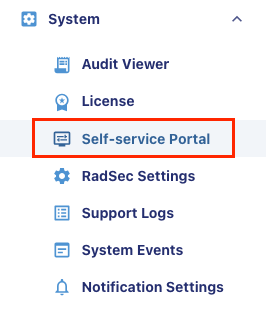 

8. Click on Self-service Portal in the upper right corner to copy the Portal link to the clipboard.

9. Open another browser tab and paste the Portal link on the browser URL Address bar to access the Self-Service Portal.  

10. Sign in to the Self-Service Portal with your username and password that you created earlier.

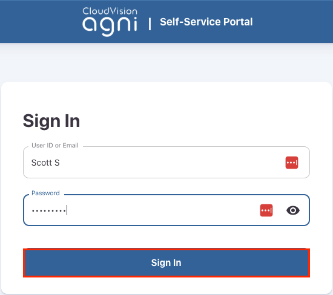

11. Once you are in the Self-Service Portal, click on Add or Import Clients, add your client device MAC Address and Description, and click Register.

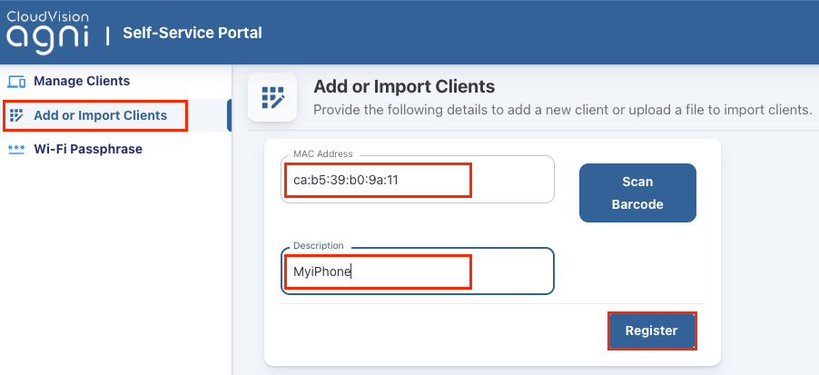

12. Your client will be shown in the Managed Clients table.

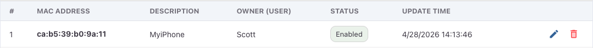

13. Now connect your client to **ATD-##-UPSK** using your **UPSK Passphrase**.

14. Click on **Monitoring - Sessions** and select your UPSK Session and validate your device connection.

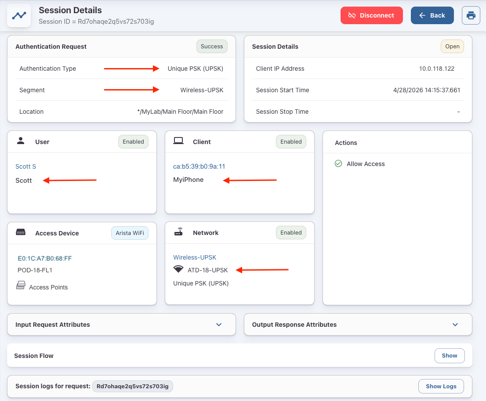

**LAB SECTION COMPLETE**

---

## 6. Create an AGNI Client Group

In this section, you will simulate your device as an IoT device.

1. **Disable and forget previously saved lab networks** so your wireless connection on your test device does not auto connect.  

2. Under your user client list, **Delete** your device.

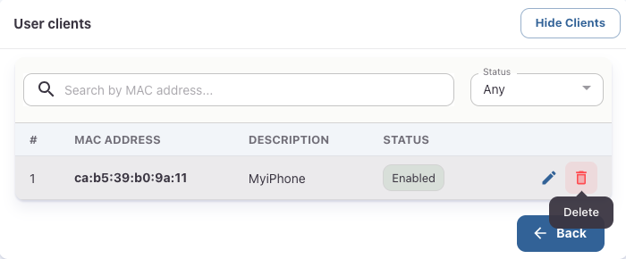
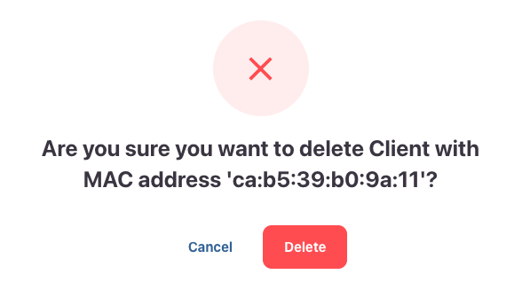

3. Next, you will **add your client device as an IoT device in a Client Group.**

First, we will need to create the Client Group.

4. In **AGNI**, under **Identity**, click on **Client Groups** and then **+ Add**.

- Name: **Corp Approved Devices**  
- Description: **Corp Approved Devices**  
- User Association: **Not user associated**  

5. **Enable the Group UPSK.  Copy the UPSK Passphrase**

6. Then click on **Add Group**

7. Next, add your device as a Not User Associated local Client.

8. In AGNI, go to Identity - Client - Clients.

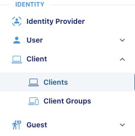

9. Select + Add or Import in the upper right corner.

10. Select the Corp Approved Devices, add your client MAC Address and Description, and select Add Client. 

**NOTE: Makes sure to set your device MAC Addresses that is not randomized when configuring your Client.**

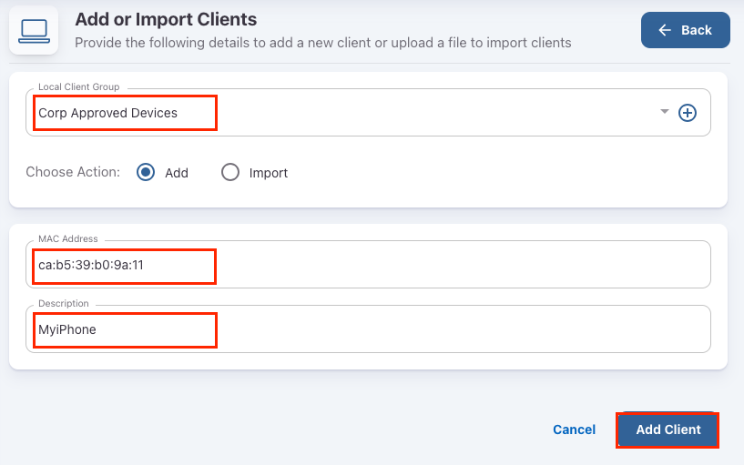

11. Verify your Client details in the client table.

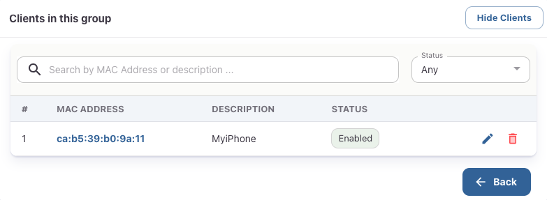

Next, connect your client to **ATD-##-UPSK** using the Client Group UPSK Passphrase.

12. Click on **Monitoring - Sessions** and select your **UPSK Session** and validate your device connection.

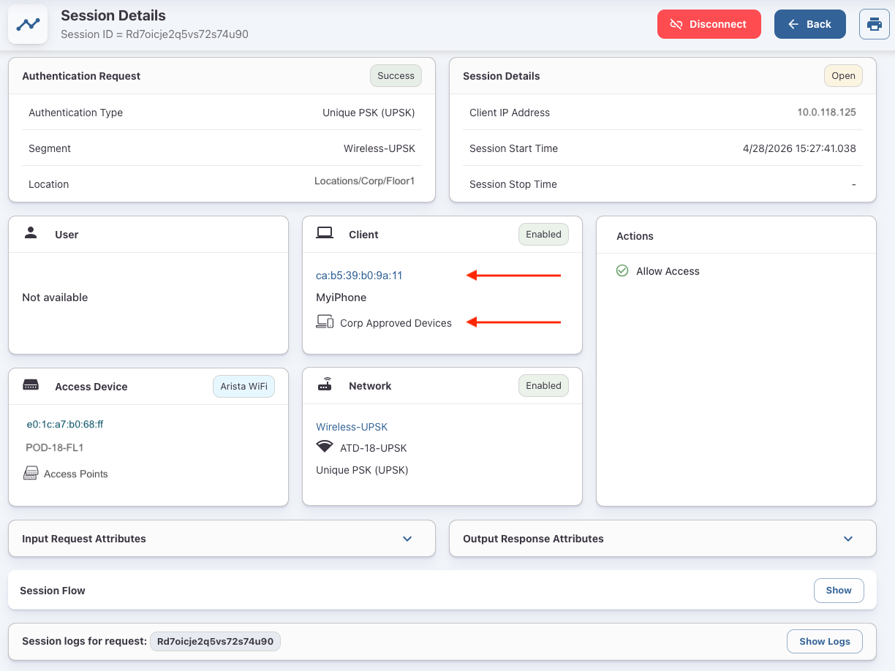

**LAB GUIDE COMPLETE**
--- 