# Campus SD-01
## Create SD-WAN Edge

<!-- TODO: Add Images -->

---

## This Lab Guide:
[Campus SD-01 VeloCloud Lab Guide - Create SD-WAN Edge](https://github.com/arista-rockies/Workshops/blob/main/Campus/2026_Campus_Workshop/SD-01/2026_Campus_SD-01_VeloCloud_Lab_Guide_Create_SD-WAN_Edge.md)

## Table of Contents

1. [Full Lab Topology](#1-full-lab-topology)
2. [Pod Topology](#2-pod-topology)
3. [Access VeloCloud Orchestrator](#3-access-velocloud-orchestrator)
4. [Create a new VeloCloud Edge](#4-create-a-new-velocloud-edge)

---

## 1. Full Lab Topology

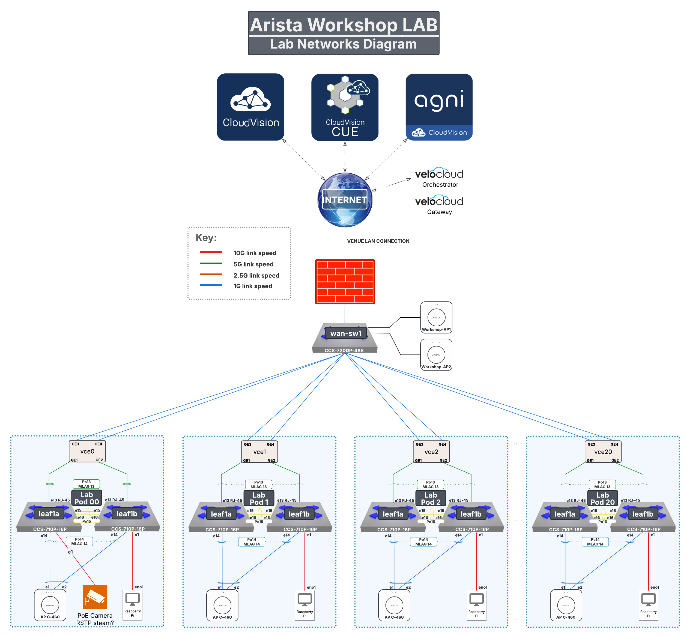

---

## 2. POD Topology

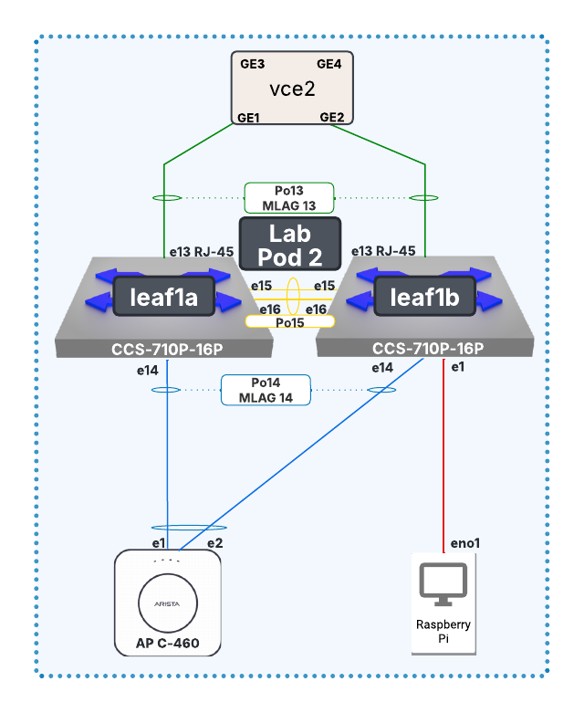

---

## 3. Access VeloCloud Orchestrator

1. Go to the Arista Ignition GUI via: https://ignition.campus-atd.net/
- Enter the 6 digit Access Code found on the Pod Handout Worksheet
- Click. 

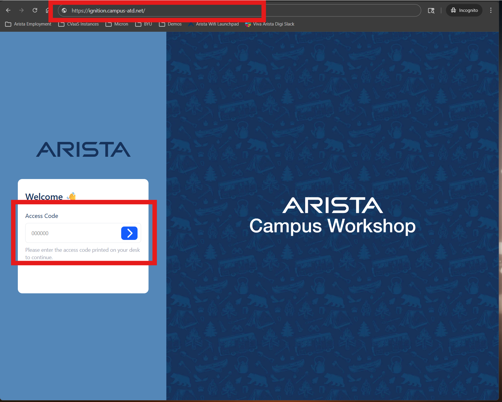

2. Click the **VeloCloud Orchestrator** tile

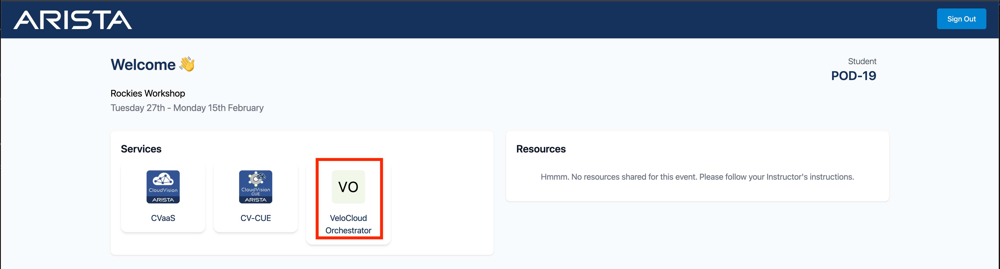

3. Enter the VeloCloud Orchestrator credentials provided in the Pod Handout Worksheet
- Click. 

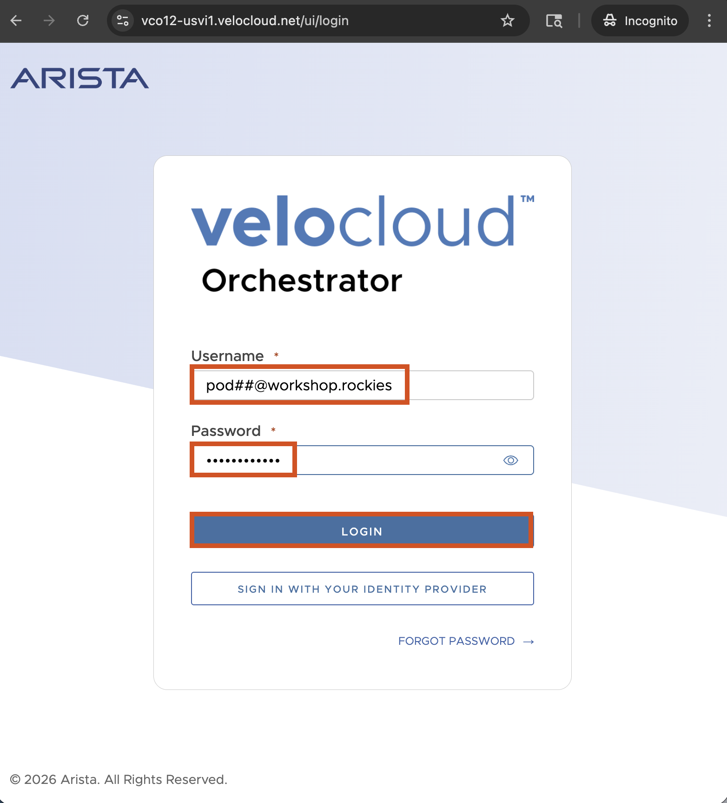

4. You will now be logged into VeloCloud Orchestrator (VCO)

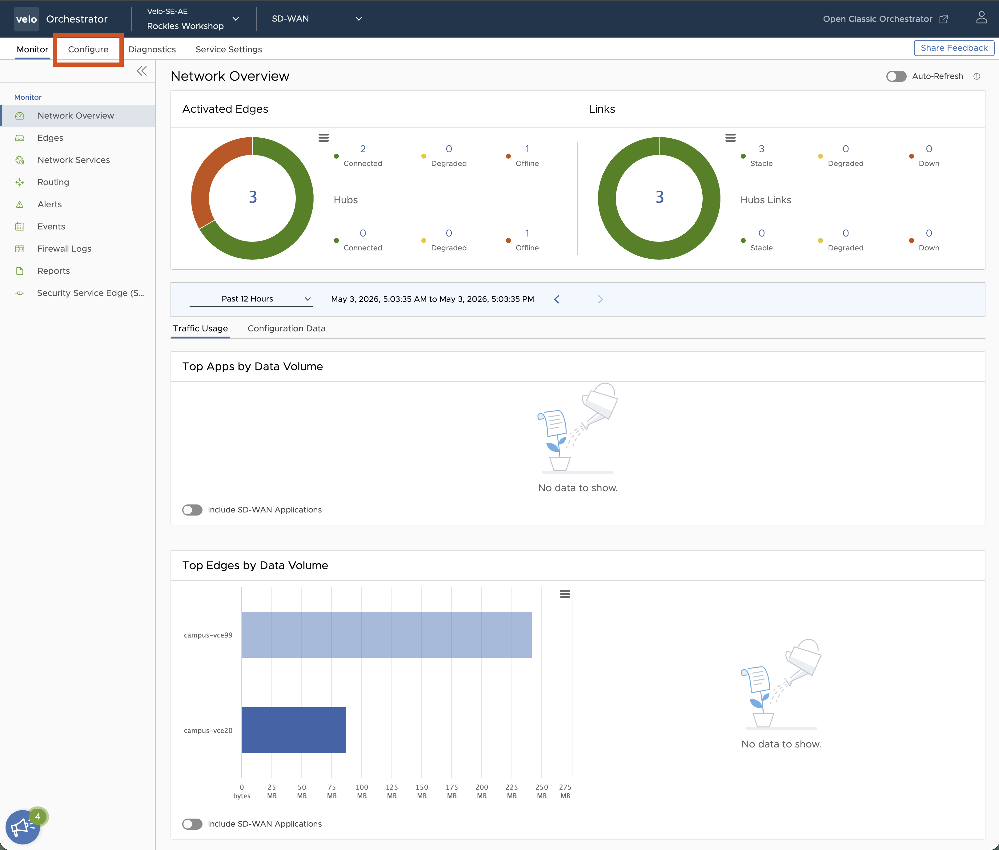

---

## 4. Create a new VeloCloud Edge

In this lab, you will be configuring a new SD-WAN edge. You will use an existing Profile and add the Edge to an existing Enterprise that a Datacenter in Pod00 and all the other Pods in the room as branch locations.

1. Login to VeloCloud Orchestrator, then click on the **Configure** tab.

2. Navigate to the **Edges** menu option and then click **+ ADD EDGE**.

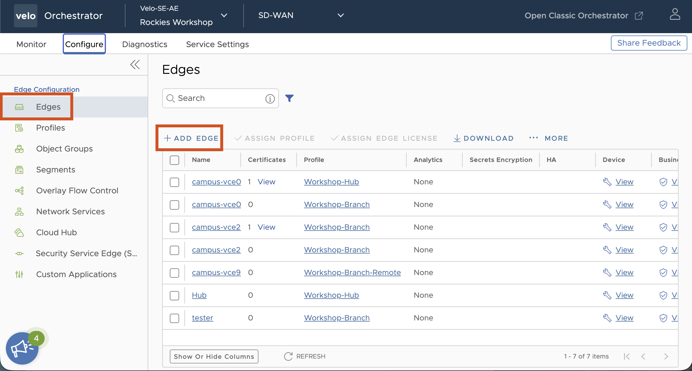

3. Enter the Required details to Provision an Edge using the details below,
   - Name: **campus-vce\#\#**
   - Model: **Edge 710**
   - Profile: **Workshop-Branch**
   - License: **POC | 10 Gbps || North America, Europe Middle East and Africa, Asia Pacific and Latin America | 60 Months**
   - Select **ADD EDGE**

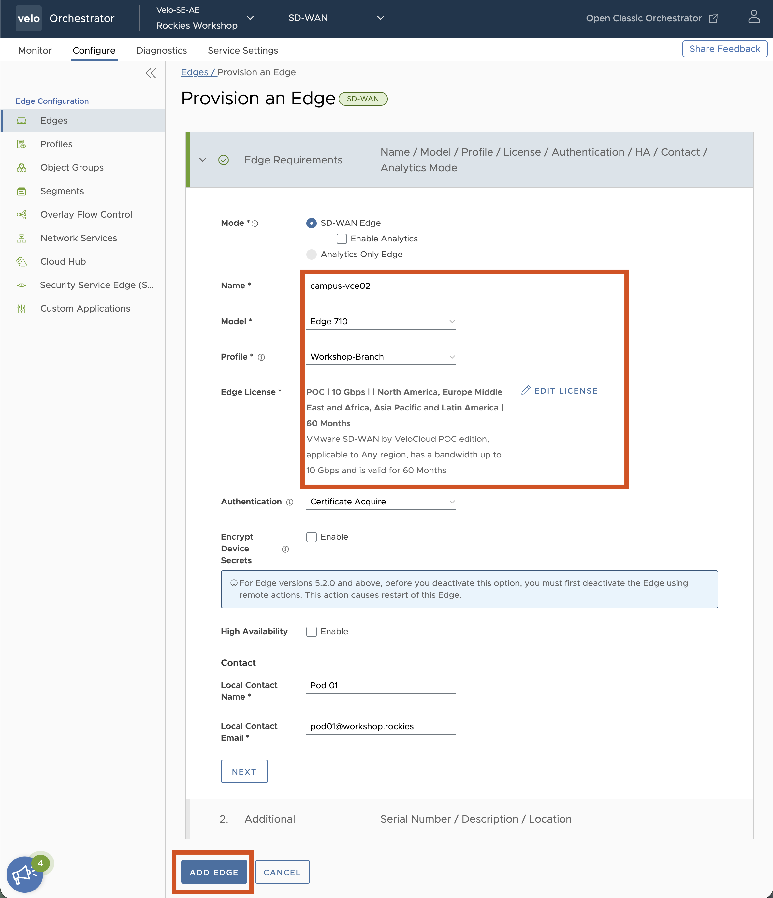

4. The LAN interfaces is a Link Aggregation Group (LAG) comprised of physical interfaces GE1 and GE2. Navigate to **Device > Connectivity > Interfaces -> Edge 710** and select **LAG1**.

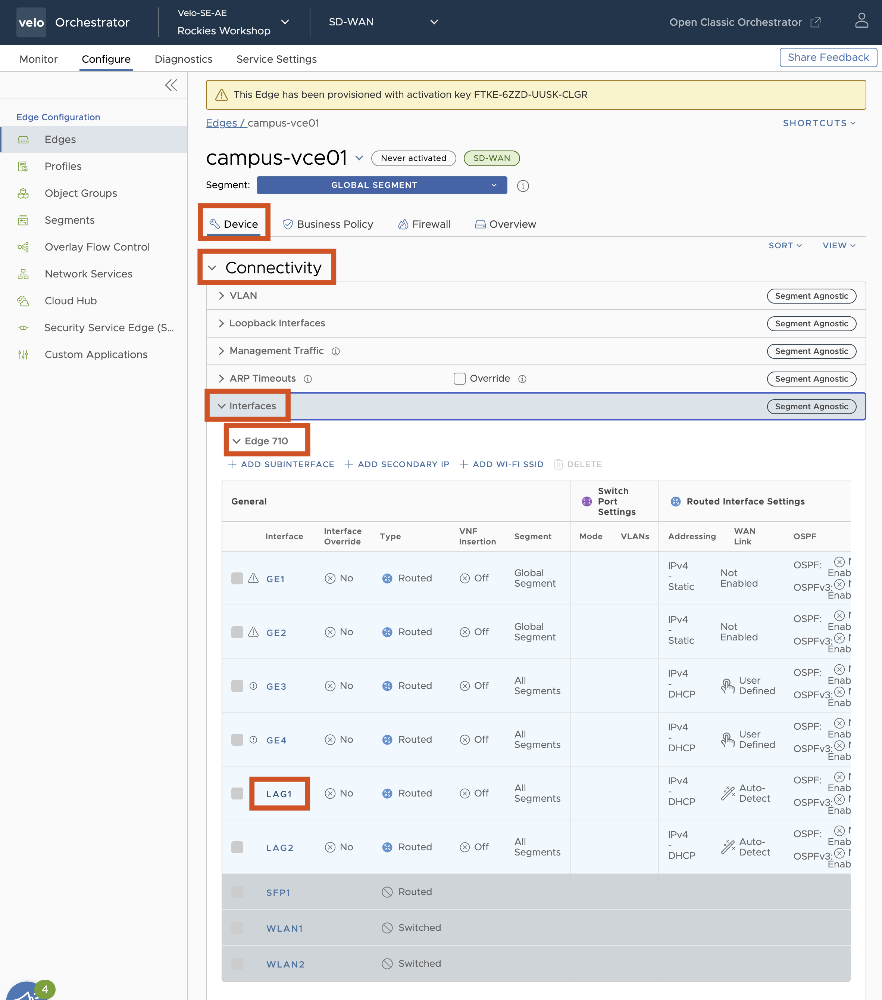

5. On the **Interface LAG1** screen set the parameters below,

   - Select Interfaces: **GE1** and **GE2**
   - Clear the warning box using the **X**
   - LAG Interface Settings
     - Disable **Enable WAN Link**
   - IPv4 Settings
     - Addressing Type: **Static**
     - IP Address: **10.0.1\#\#.1**
     - CIDR Prefix: **25**
     - Enable **Advertise**
     - Disable **NAT Direct Traffic**
   - IPv4 DHCP Server
     - Type: **RELAY**
     - Relay Agnet IP(s): **100.64.0.1**
   - Select **SAVE**

6. Next we are going to configure our WAN links. All the edges in our Workshop environment are connected to two simulated Private WAN networks. This requires that we explicitly define thw WAN networks. Interfaces GE3 and GE4 are the interfaces connected to our WANs and they have already been configured by the Profile to use DHCP for IP addressing. Navigate to **Device > Connectivity > Interface > WAN Link Configuration** and select **+ ADD USER DEFINED WAN LINK**.

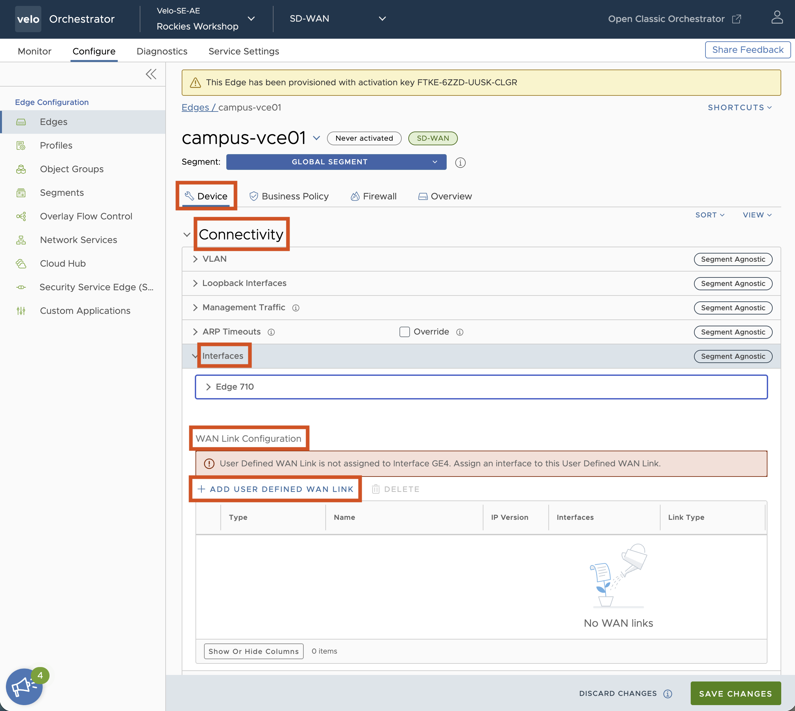

7. For your first **User Defined WAN Link**, set the parameters below,

   - Link Type: **Private**
   - Name: **isp1**
   - Enable **SD-WAN Service Reachable**
   - Interfaces: **GE3**
   - View advanced settings
     - Private Network Name: **Use existing Private Network Name**
     - Existing Private Network Name: **WAN 1**
   - Select **ADD LINK**

8. Select **+ADD USER DEFINED WAN LINK** again and create a second link with the parameters below,

   - Link Type: **Private**
   - Name: **isp2**
   - Enable **SD-WAN Service Reachable**
   - Interfaces: **GE4**
   - View advanced settings
     - Private Network Name: **Use existing Private Network Name**
     - Existing Private Network Name: **WAN 2**
   - Select **ADD LINK**

9. Now that we have made the necessary LAN and WAN configurations, please click **SAVE CHANGES** to commit the changes.

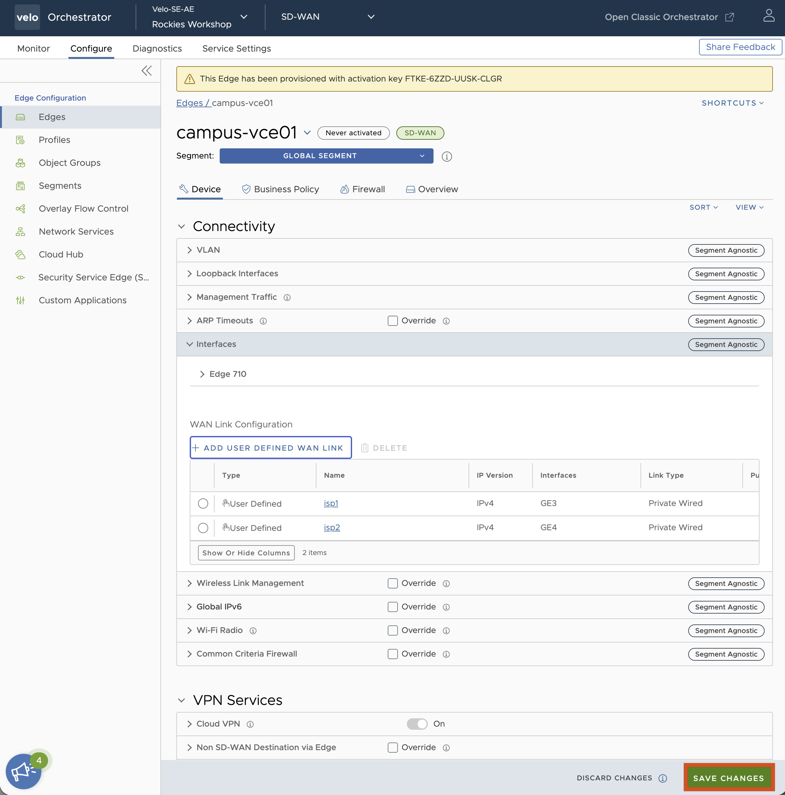

10. Verify that the profile has enabled the Cloud VPN and has your Edge configured to use **campus-vce00** as a Hub by navigating to **Device > VPN Services > Cloud VPN**

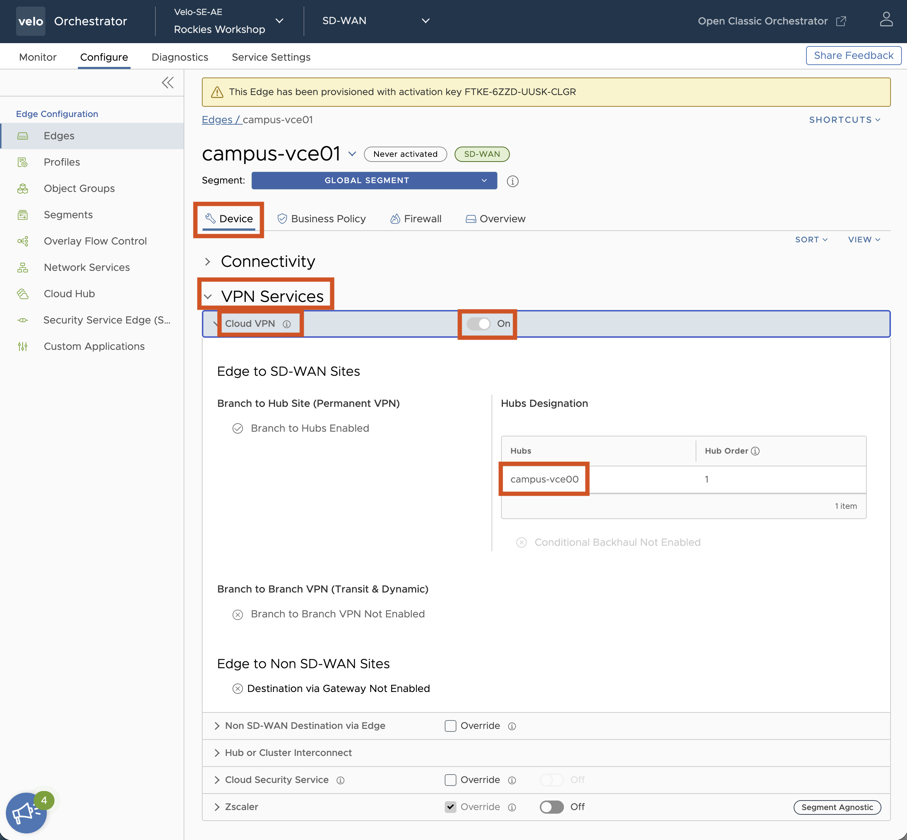