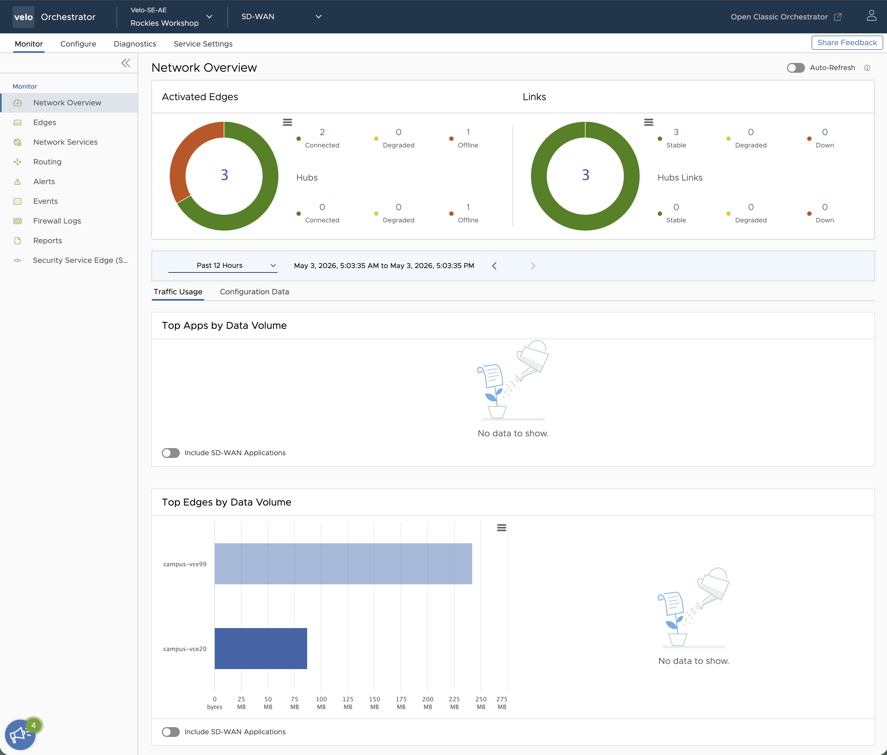
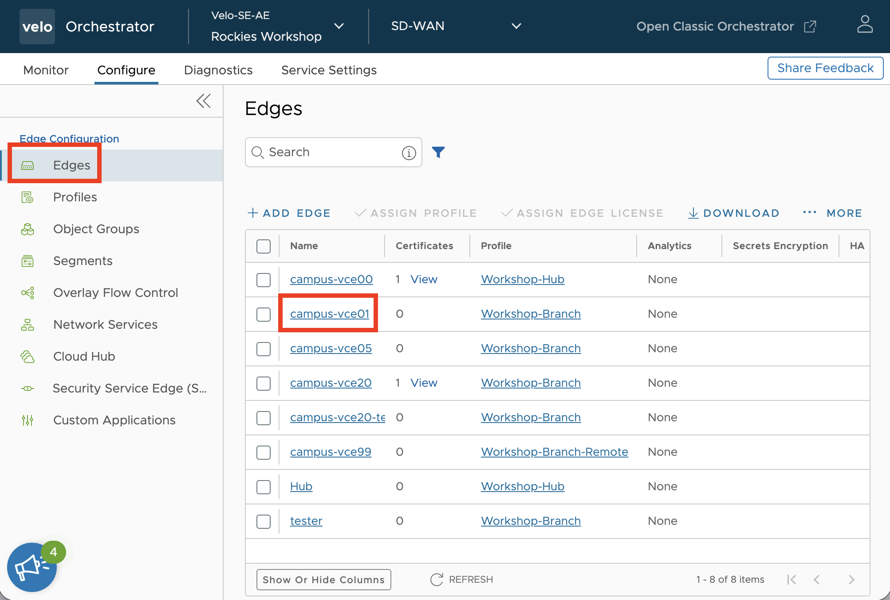
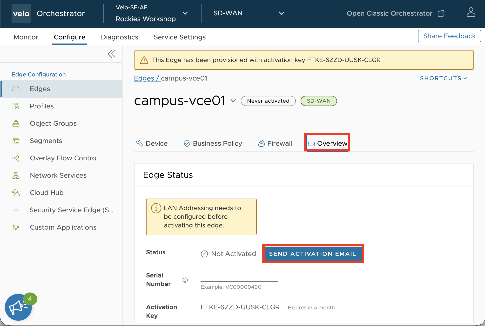
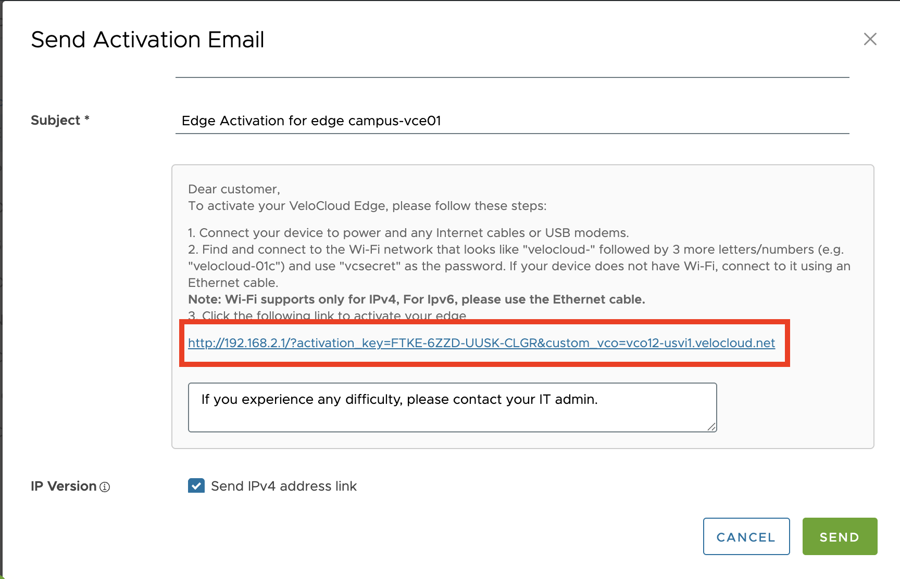
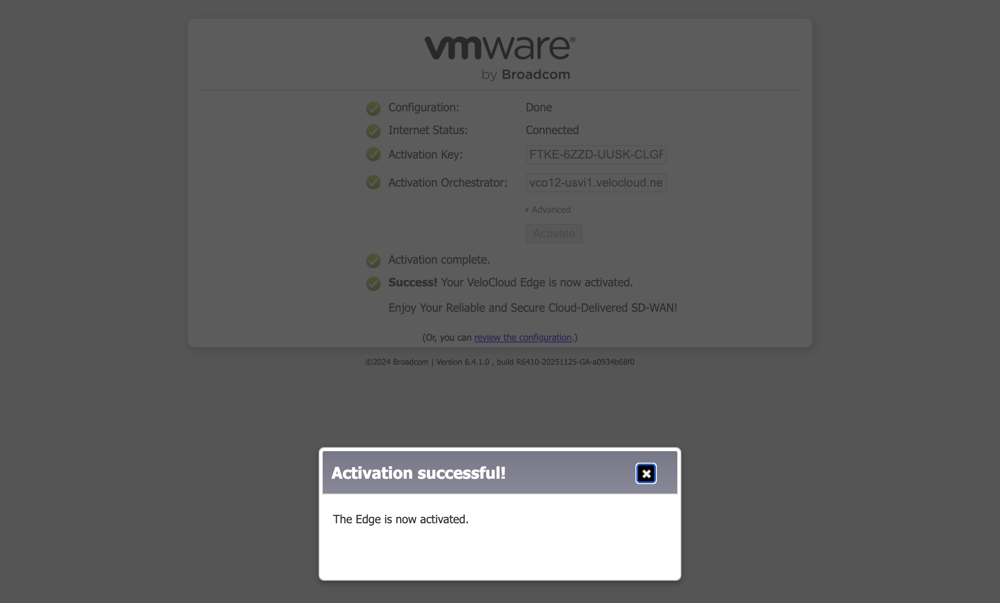
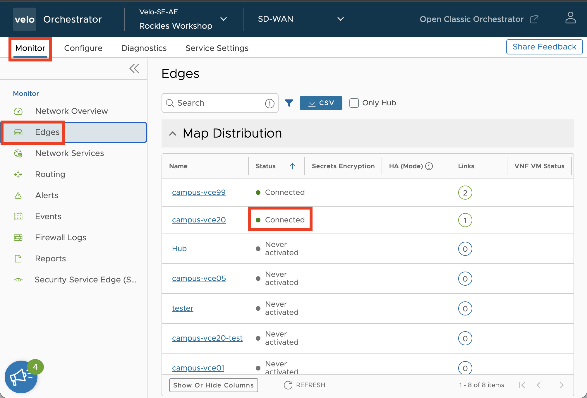
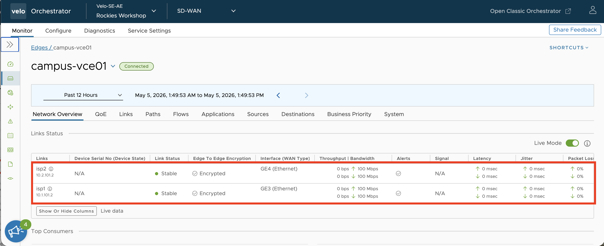
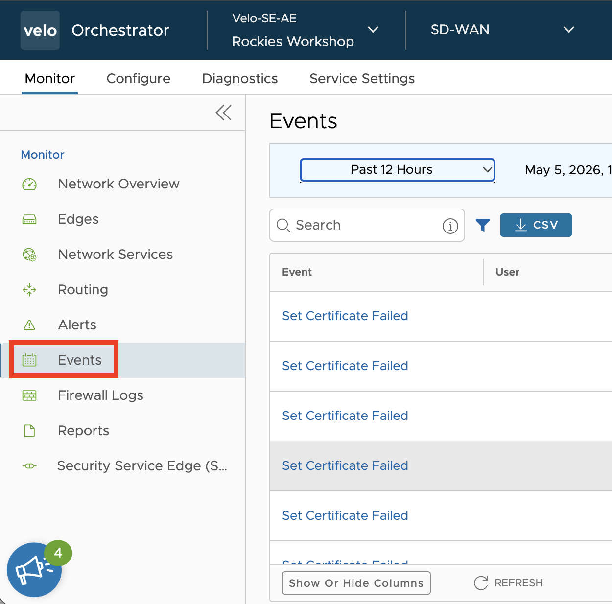
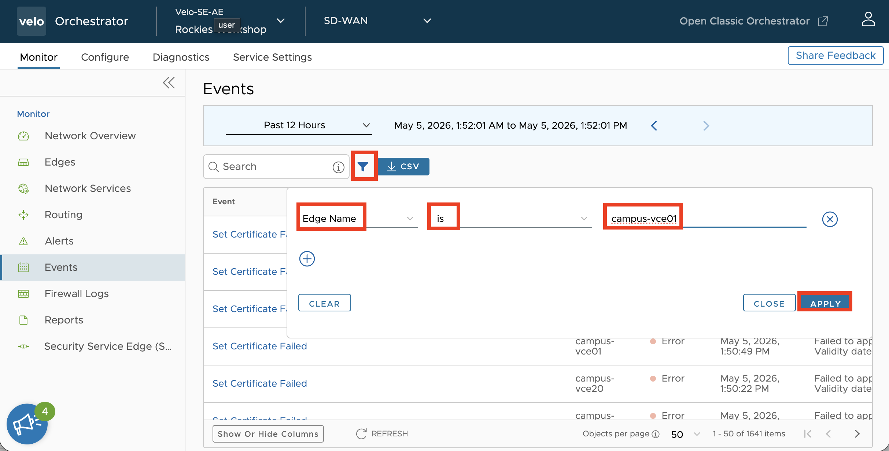
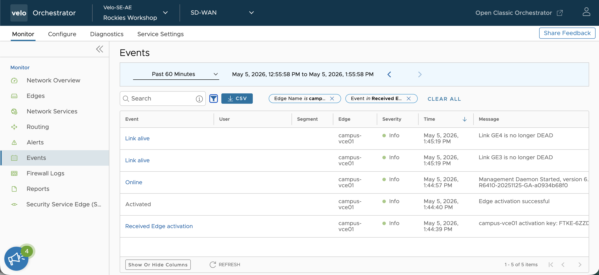

# Campus SD-02
## Activate SD-WAN Edge

---

## This Lab Guide:
[Campus SD-02 VeloCloud Lab Guide - Activate SD-WAN Edge](https://github.com/arista-rockies/Workshops/blob/main/Campus/2026_Campus_Workshop/SD-02/2026_Campus_SD-02_VeloCloud_Lab_Guide_Activate_SD-WAN_Edge.md)

## Table of Contents
1. [Full Lab Topoology](#1-full-lab-topology)
2. [POD Topology](#2-pod-topology)
3. [Access VeloCloud Orchestrator](#3-access-velocloud-orchestrator)
4. [Activate your VeloCloud Edge](#4-activate-your-velocloud-edge)

---

## 1. Full lab Topology

---

## 2. POD Topology

---

## 3. Access VeloCloud Orchestrator

1. Go to the Arista Ignition GUI via: https://ignition.campus-atd.net/
- Enter the 6 digit Access Code found on the Pod Handout Worksheet
- Click. 

2. Click the **VeloCloud Orchestrator** tile

3. Enter the VeloCloud Orchestrator credentials provided in the Pod Handout Worksheet
- Click. 

4. You will now be logged into VeloCloud Orchestrator (VCO)

---

## 4. Activate your VeloCloud Edge

In this lab, you will take the configuration that was defined in the last lab and apply it to a VeloCloud Edge device.

1. Login to VeloCloud Orchestrator, then click on the **Configure** tab.

2. Nagivate to the **Edges** menu and select your Edge (**campus-vce\#\#**)

3. Navigate to **Overview** and select the **SEND ACTIVATION EMAIL** button.

4. This screen allows you to send an email to an installer with instructions and a link for activating the edge. We will not actually send the email but you will need the URL provided in the Email so scroll down and find the link but do not click it yet.

5. When unactivated, the VeloCloud Edge 710 will create a Wifi SSD that can be used for Activation. Please connect to that SSID using the details that below,

   - SSID: **velocloud-###** (### is the last 3 digits of the serial number for your edge. See the label on your edge.)
   - Password: **vcsecret**

6. Open the Activation Email link in your Web Browser. The VeloCloud Edge should connect to the VeloCloud Orchestrator and activate.

<!-- TODO: Edge Activation Image -->

9. Navigate back tot he VeloCloud Orechestrator and click on the **Monitor** table and then navigate to the **Edges** menu option. You should see your Edge (**campus-vce##**) listed with a Status of **Connected** and **2** Links.

<!-- TODO: Update image to show 2 links -->

10. Select your Edge (**campus-vce##**). You should see both Links that you created with the following details:
   - Link Status is **Stable**
   - Throughput (up and down) is shown
   - Bandwidth was detected
   - Latency (up and down) is shown
   - Jitter (up and down) is shown

11. To troubleshoot the activation process, you can look at the event logs by navigating to the **Events** menu option.

12. There are a lot of events. You should filter the events by **Edge Name**.
    - Click 
    - Select **Edge Name**
    - Select **is**
    - Select **campus-vce\#\#**
    - Click **Apply**

13. Some interesting events for your activation are:
    - **Received Edge activation** - The Edge contacted the VCO with the Activation Key
    - **Activated** - The edge finished the activation process
    - **Online** - The edge finished any necessary upgrade, reboot and configuration steps and has connected to the VeloCloud Orchestrator
    - **Link alive** - The WAN link is up and can reach the VeloCloud Gateway

**Congratulations, your VeloCloud Edge is now Configured and Online!**

**LAB GUIDE COMPLETE**

---