# CloudVision Lab 01
## Inventory and Topology

## This Lab Guide:

[CloudVision Workshop Lab Guide 01 - Inventory and Topology](https://github.com/arista-rockies/Workshops/blob/main/CloudVision/2026/Lab-01/CV_Workshop_Lab1.md)

---

## Table of Contents
1. [Lab Topology](#1-lab-topology)
2. [Accessing the Lab](#2-accessing-the-lab)
3. [Lab Details](#3-lab-details)

---

# 1. Lab Topology

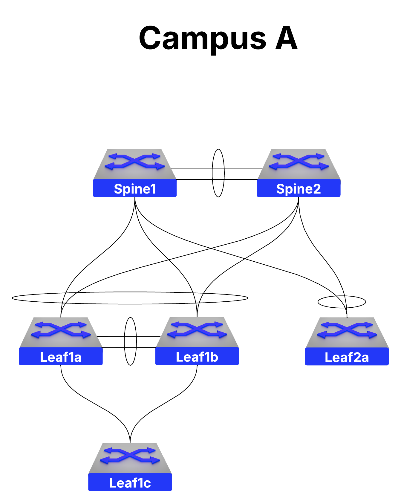

---

# 2. Accessing the Lab

VERY ELABORATE LOGIN SECTION TO FOLLOW - Need to verify how we are doing this first. Here is a picture of a dog as a placeholder.

---

# 3. Lab Details

## Lab Overview

In this lab, we will onboard devices to the **Inventory and Topology Studio**. This is the first action required to allow devices to be configured using CloudVision Studios.

## Inputs

The following is all of the information you will need to complete this lab. Feel free to name your devices as you see fit. Keep in mind that the hostnames will be used to identify devices in later labs.

| **HOSTNAME** | **DEVICE ID** |
| :----------: | :------------: |
| CampusA-Spine1 | P[$POD#]-CampusA-Spine1 |
| CampusA-Spine2 | P[$POD#]-CampusA-Spine2 |
| CampusA-Leaf1a | P[$POD#]-CampusA-Leaf1A |
| CampusA-Leaf1b | P[$POD#]-CampusA-Leaf1B |
| CampusA-Leaf1c | P[$POD#]-CampusA-Leaf1C |
| CampusA-Leaf2a | P[$POD#]-CampusA-Leaf2A |

## Lab Steps:

1. Using the blue navigation pane on the left, navigate to **Provisioning** > **Studios**.

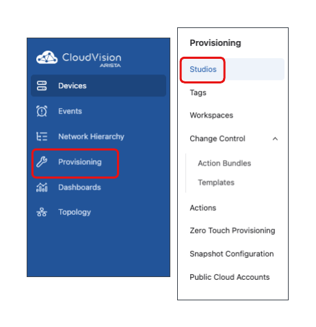

2. Under the **Essential Studios** section, locate and select the **Inventory and Topology** Studio.

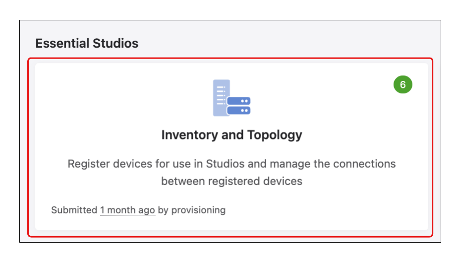

3. Notice that there are currently no registered devices listed. We need to register our devices to this Studio before we can begin making configuration changes. Locate the devices that are in ZTP by selecting **Network Updates**.

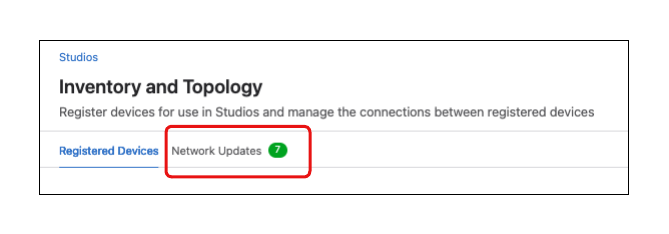

4. Select all of the ZTP devices with an **Update** status of **Device Added**, then select **Accept Updates**.

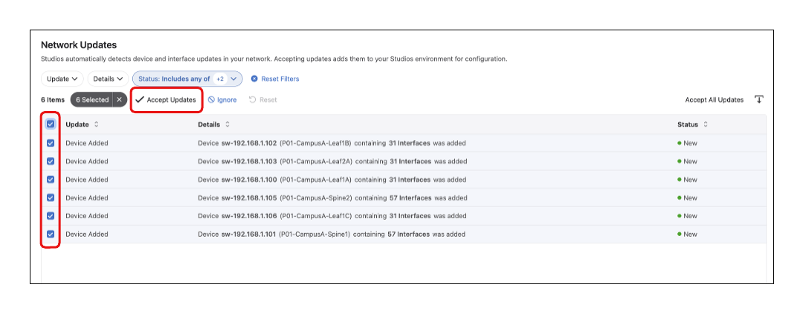

5. Select **Accept**.

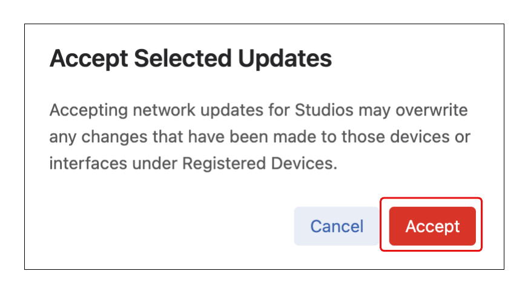

6. Return to the **Registered Devices** tab.

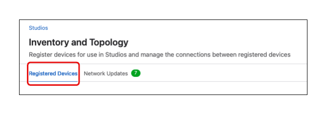

7. The lab devices that are currently in ZTP will now be shown under **Registered Devices**. In the **Hostname** field for each device, add the intended hostname for the device.

> [!NOTE]
> We will be utilizing Universal Cloud Network Architecture to identify device types in future lab guides (Leaf, Spine, Member Leaf, Border Leaf), so try to make it easy for yourself to identify those device types in your naming convention.

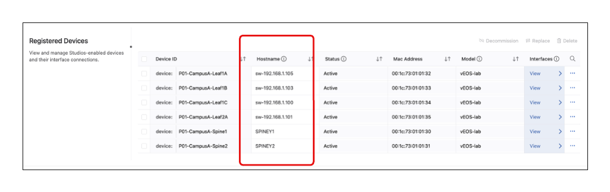

8. After you have updated the **Hostname** value for each device, we need to save these changes to CloudVision. Select the **Clipboard** icon in the Workspace Island toolbar at the bottom center of your screen.

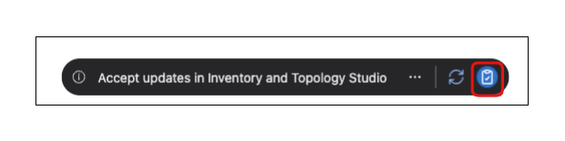

9. After the workspace builds, there should be no device configuration changes within the lab. However, we have added the devices to the Inventory and Topology Studio. Select **Submit Workspace** to save those changes.

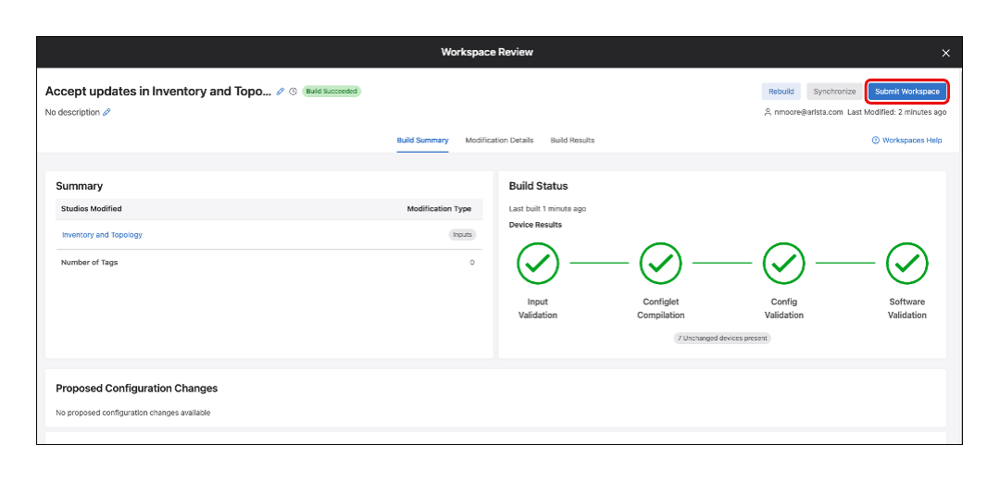

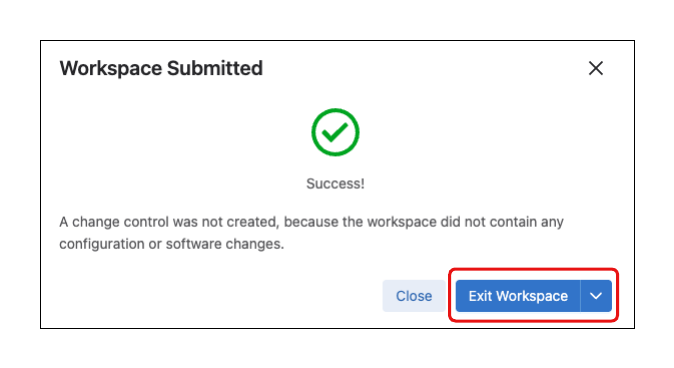

---

**LAB GUIDE COMPLETE**