# CloudVision Lab 02
## Inventory and Topology

## This Lab Guide:

[CloudVision Workshop Lab Guide 02 - Inventory and Topology](https://github.com/arista-rockies/Workshops/blob/main/CloudVision/2026/Lab-02/CV_Workshop_Lab2.md)

---

## Table of Contents
1. [Lab Topology](#1-lab-topology)
2. [Accessing the Lab](#2-accessing-the-lab)
3. [Lab Details](#3-lab-details)

---

# 1. Lab Topology

---

# 2. Accessing the Lab

VERY ELABORATE LOGIN SECTION TO FOLLOW - Need to verify how we are doing this first. Here is a picture of a dog as a placeholder.

---

# 3. Lab Details

## Lab Overview
In this lab, we will utilize the **Static Configuration Studio** to apply a base and management configuration to the devices in Campus A.

## Static Configuration Studio
The Static Configuration Studio allows you to apply static configuration "configlets" to devices. Configlets can be assigned directly to a device or to a container. Containers are arranged in a hierarchical structure. This allows devices lower in the hierarchy to inherit all of the configlets applied to containers higher in the hierarchy. The end result is the complete designed configuration of the device within the Static Configuration Studio.

There is no right or wrong way to design this hierarchy, and each organization may have a different methodology to accomplish this.

## Lab Steps:

1. Navigate to **Provisioning > Studios**

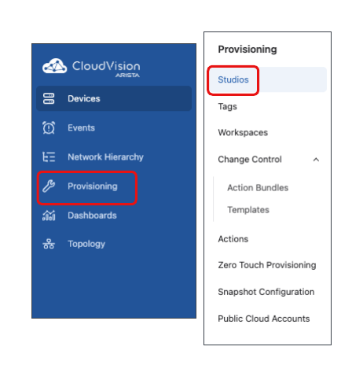

2. Select the **Static Configuration Studio**

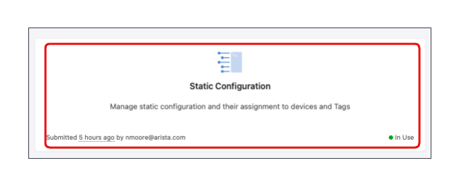

3. Begin your hierarchy design by selecting **+Configuration Container**

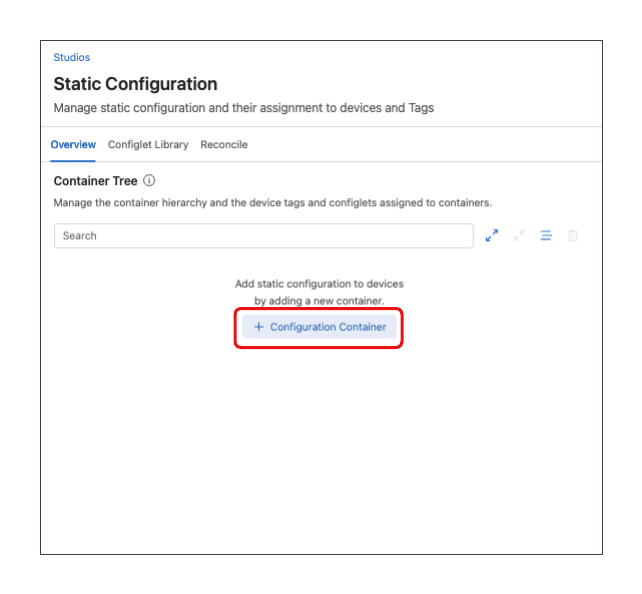

4. Create a **Custom Tag** of **Workshop:CampusA** to be used in your hierarchy structure. Select **+ Create**

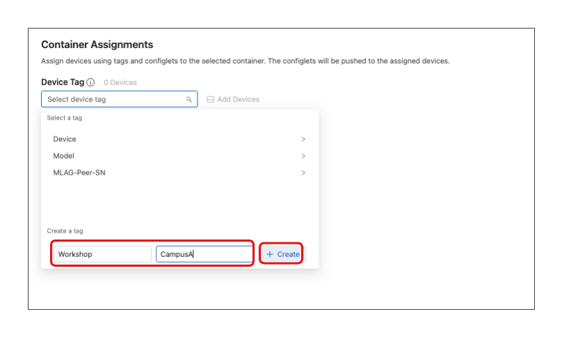

5. Develop your own hierarchy as you see fit.
   - Below are 2 examples that accomplish the same end result within our lab. Developing a more in-depth hierarchy provides additional locations where shared configuration can be applied.

  > [!NOTE]
  > DO NOT USE the **Devices:All** tag in your hierarchy, as we will have Campus B devices that will not utilize the Static Configuration Studio.

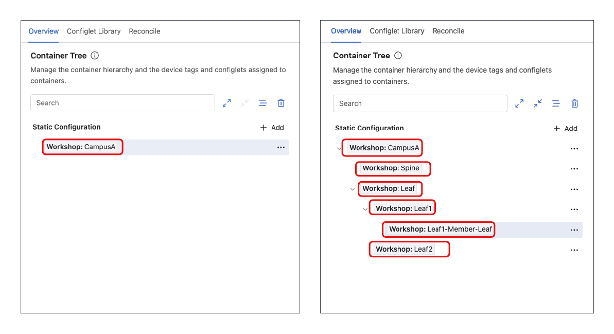

6. After you have created your hierarchy structure:
   - Select the container **Workshop:CampusA**
   - On the right side of the screen, select **+Configlet**
   - Select **Configlet Library**

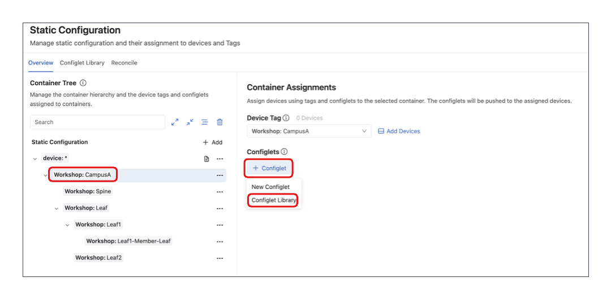

7. Locate and select the configlet **CampusA_Base**.
    - Select **Assign**

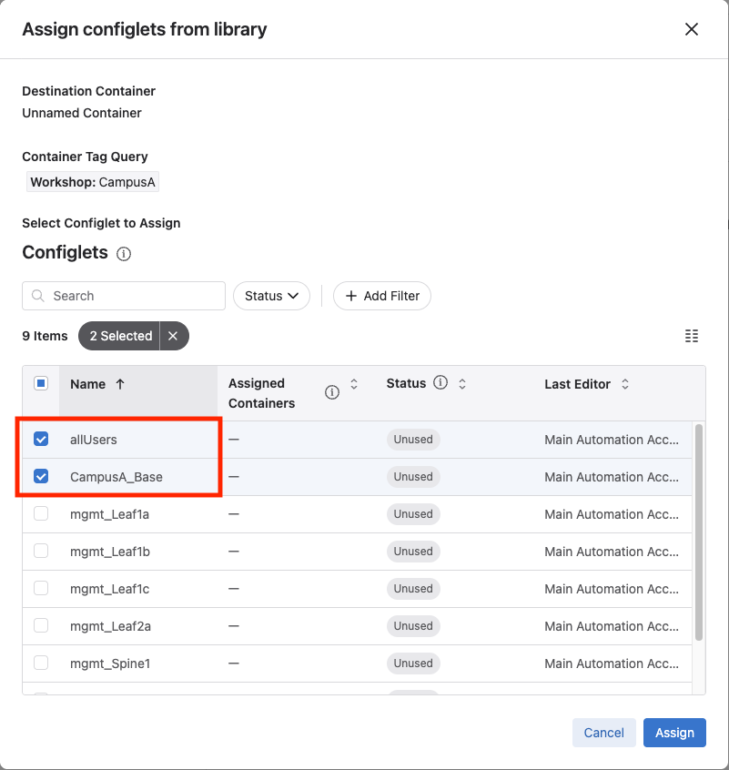    

8. Assign all devices to their intended containers.
   - Locate the device's intended container.
   - Select the **3 dots** next to the container.
   - Select **Add Device**

 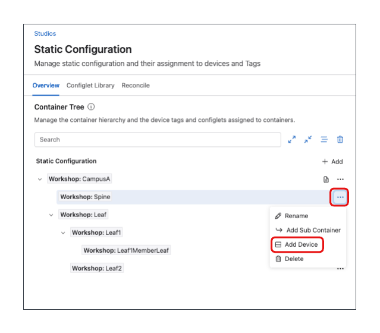     

9. Select the intended device.
   - Select **Add**

 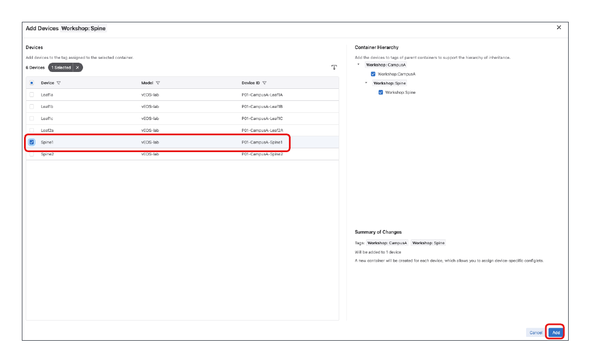     

10. Select the newly added device.
    - Select **+ Configlet**
    - Select **Configlet Library**

 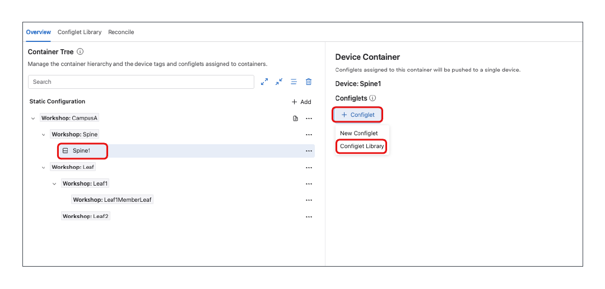    

11. Locate the pre-staged configlets for the added device. We are utilizing the UCN nomenclature for our configlet names: **mgmt_$Device**
    - Select **Assign**

   > [!NOTE]
   > The **mgmt_$Device** configlet does assign a hostname. If you wish to continue utilizing your previously established names, update the hostname field in the per-device configlet.

 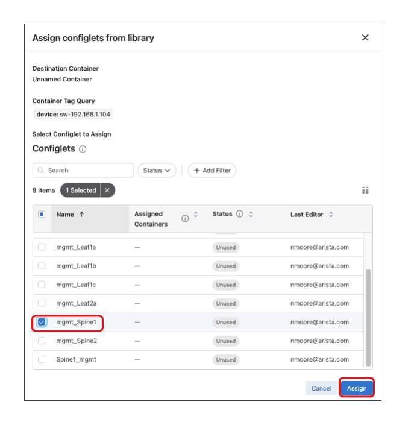    

12. Repeat this process until all devices in the topology have their per-device configlet assigned.

13. After all devices have their per-device configlet and base configlet associated, select the **Clipboard Icon**

 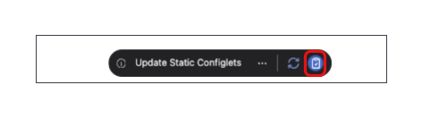  

14. After the Workspace has finished building, review the proposed configuration.

 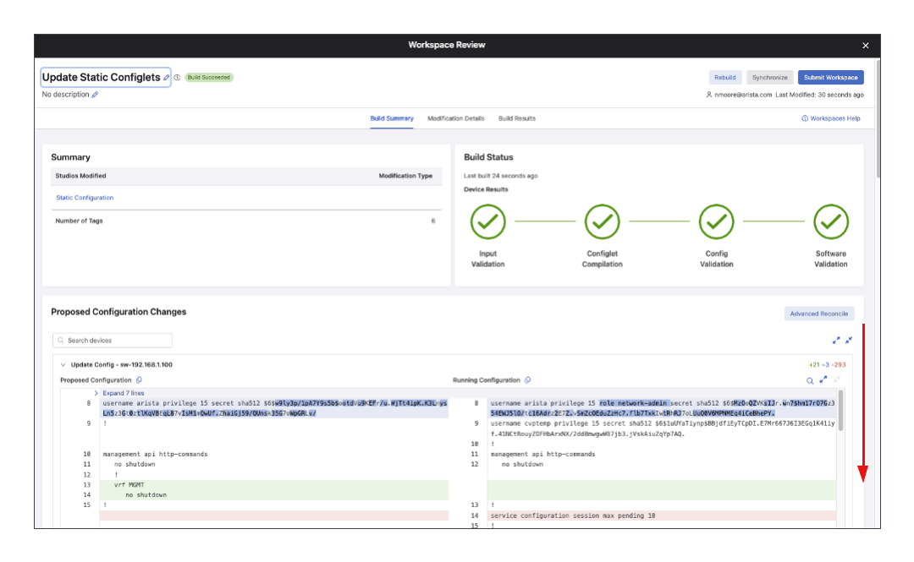  

15. After you have reviewed the proposed configuration, select **Submit Workspace**

 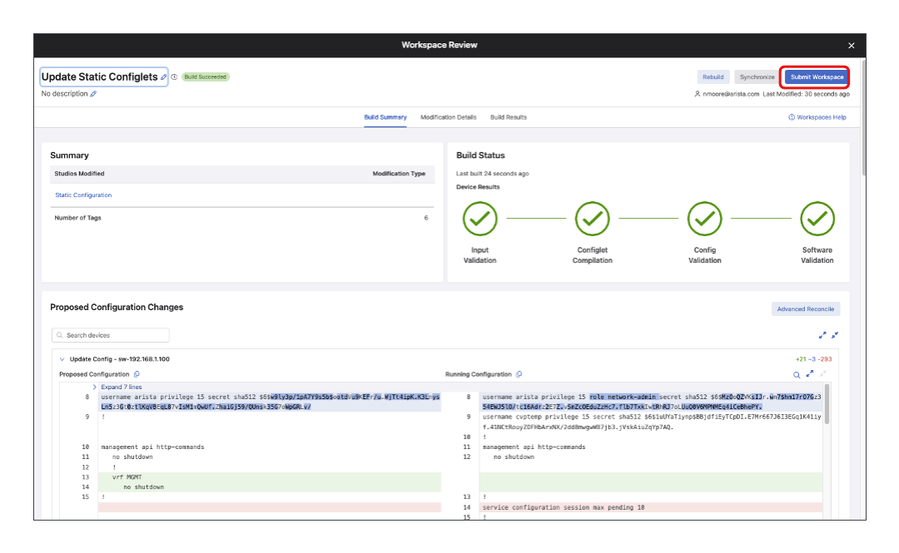  

16. Select **View Change Control**

 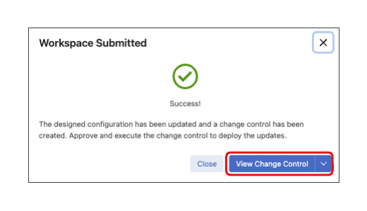 

17. You are now presented with a Change Control that will push the configuration to the devices.
    - Select **Review and Approve**

 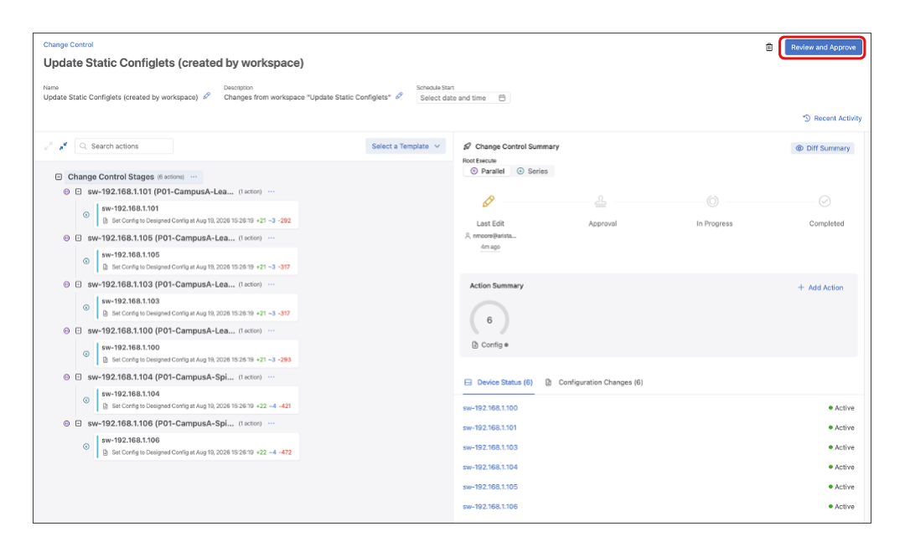 

18. If the **Execute Immediately Slider** is greyed out, select the slider.
    - Select **Approve and Execute**

 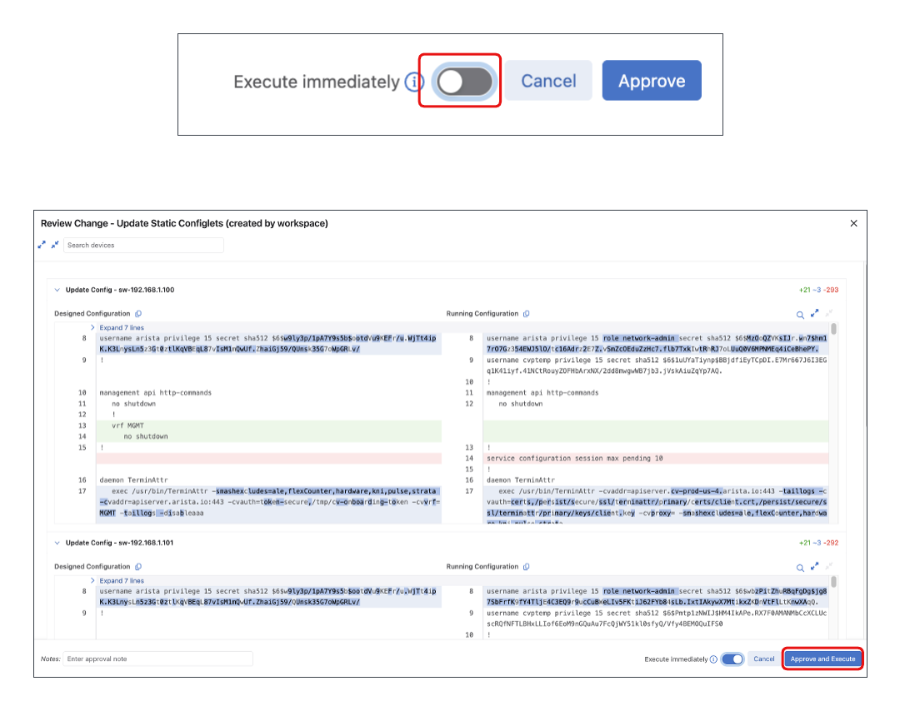 

19. Pushing the configuration to the devices will take them out of Zero Touch Provisioning. This requires a reload and may take a few minutes. After the devices have reloaded and the configuration has been applied, your Change Control will complete.

 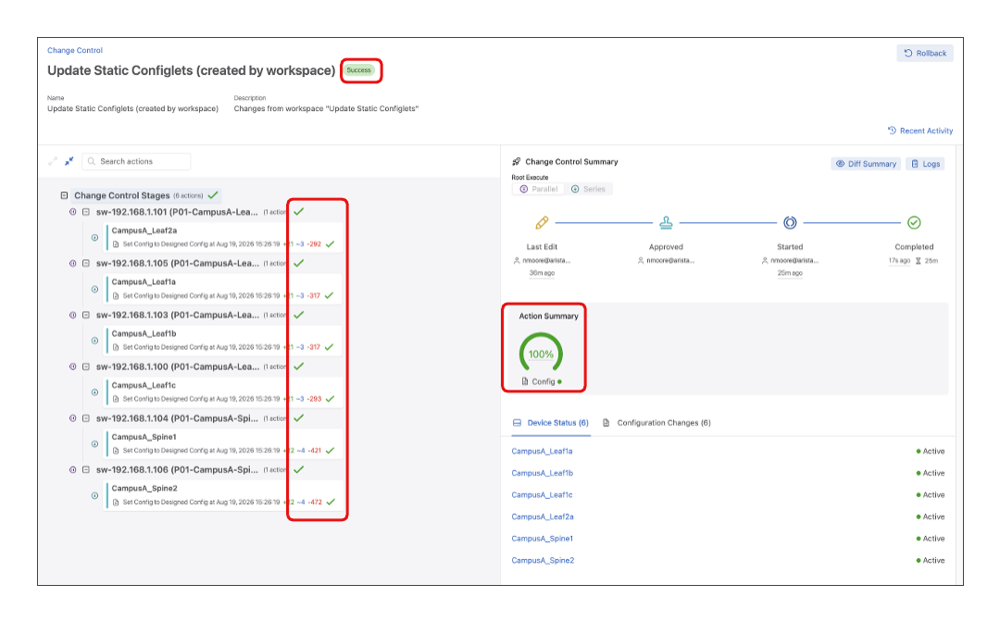 

---

**LAB GUIDE COMPLETE**