# CloudVision Lab 05
## Campus Fabric Studio

## This Lab Guide:

[CloudVision Workshop Lab Guide 05- Inventory and Topology ](https://github.com/arista-rockies/Workshops/blob/main/CloudVision/2026/Lab-05/README.md)

---

## Table of Contents
1. [Lab Topology](#1-lab-topology)
2. [Accessing The LAb](#2-accessing-lab)
3. [Labs](#3-lab-details)
4. [Lab Customize Events and Notification](#customize-events-and-notifications)
5. [Port Profiles](#port-profiles)
6. [Code Upgrade](#code-upgrade)
7. [Monitor The Fabric](#syslog)
8. [Dashboards](#dashbaords)

---

# 1. Lab Topology

---

# 2. Accessing the Lab

To authenticate to CloudVision you will need to visit the following page:

[CloudVision Auth](https://labs.arista.com/ignition/event/9gk8a4d3)

Each attendee will be provided with a unique access key. Enter you access key and select the Blue Arrow

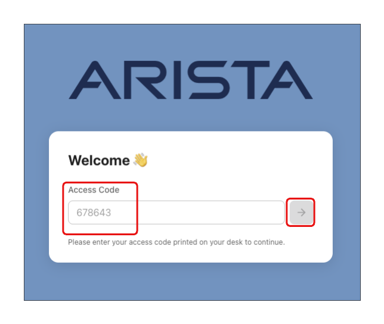

After succesfully authenticated you will should see **CVaaS** avaialble under Services. Selecting the CVaaS tile will authenticate you directly to the Lab CVaaS environment

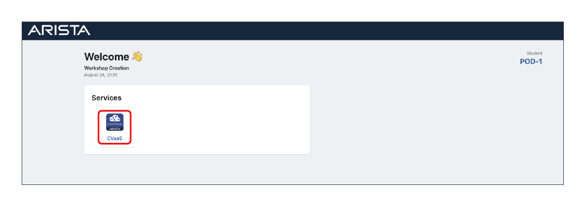

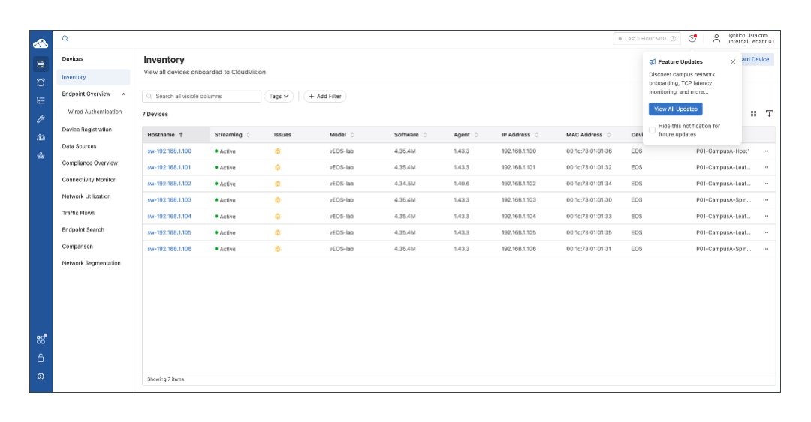

---

# 3. Lab Details

## Lab Overview

In this lab, we will setup CloudVision's tags and Events system to create a customized email alert when leaf to spine uplinks or specific devices go offline, create a port profile using Network Hierarchy, Upgrade Code on a switch, and monitor our fabric.

### Customize Events and Notifications

1. Navigate to **Provisioning > Tags**

2. Select Create Tag

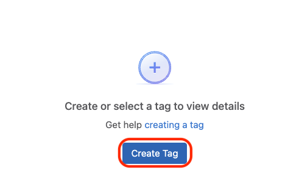

3. Set a new tag Name and a value for devices you wish to receive an alert for.
  - Create the tag as Assignment Type - Device tag
  - Click Create

4. Click the **"+ Assign"** (right side) 

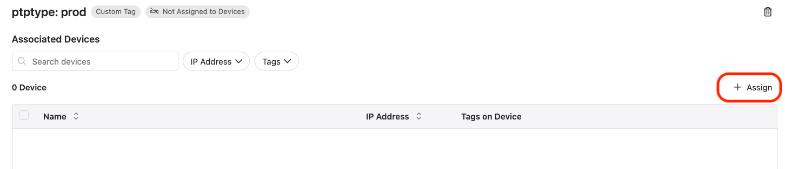

5. Assign CampusB-Leaf2A device to this tag and click Assign

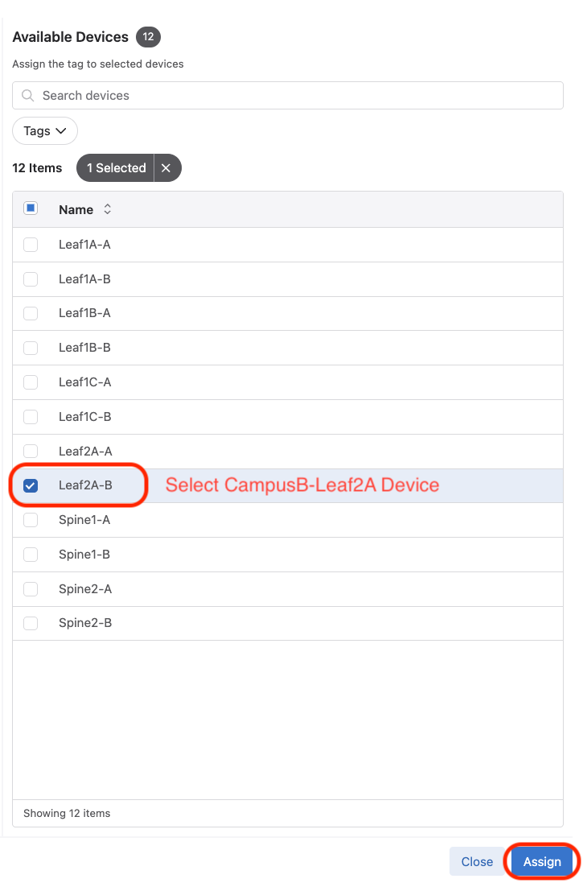

6. Notice the Leaf2A is now a member of the Associated Devices Column
   - Additionally, purple diamonds indicate which tags have modifications. This indicator is helpful when making changes to multiple tag keys within a single workspace. 

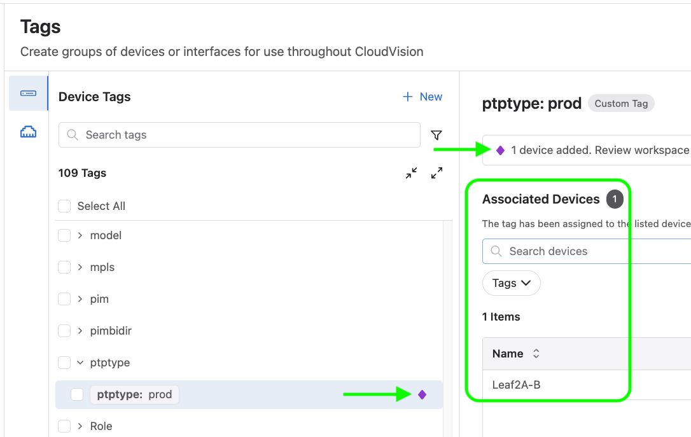

7. Revoew **Interface Tags** by selecting the Interface Tags button (upper left)

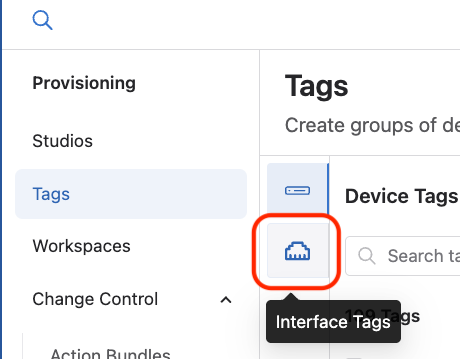

8. Within the Interface Tags tree, browse for **Link-type** expand the key and then select **Uplink** value.

 *This view displays the tags which are auto-assigned by the provisioning process*

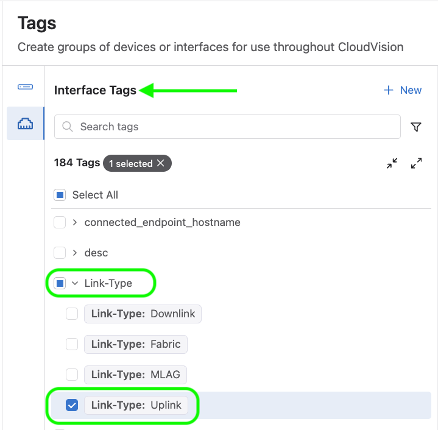

9. In the Tag Selected Column on the right, verify your CampusB-Leaf2A device shows its uplink interfaces as members.

> [!NOTE] -- if you desire, your can create your own custom interface tags to further customize filtering events and dashboards by interface tags--for example you may wish to tag an application which uses these infrastructure components. In this Lab we are using one of the automatically provisioned interface tags. We know this tag will get configured for us on all future devices following the same provisioning procedure.

10. Now that you have verified the custom device tag and the auto-assigned interface tags are in place, **review and submit your workspace**. No studios are modified, only a single device tag update.

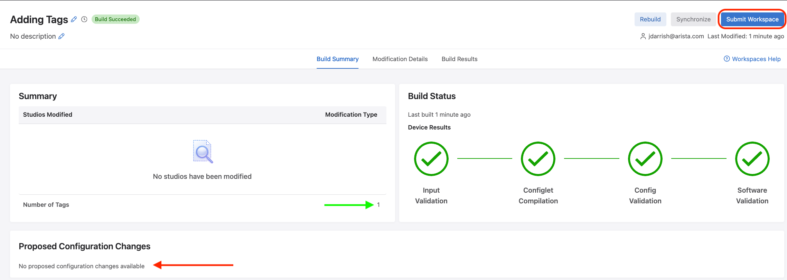

11. Navigate to Events

12. In the upper right select **Configure** then **Event Generation**

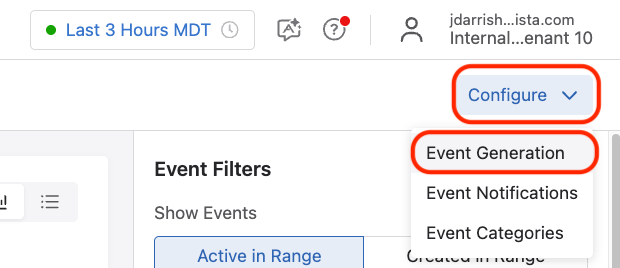

13. Search for the **Unexpected Interface Failure** event and click on it

14. Click **+ Add Rule**

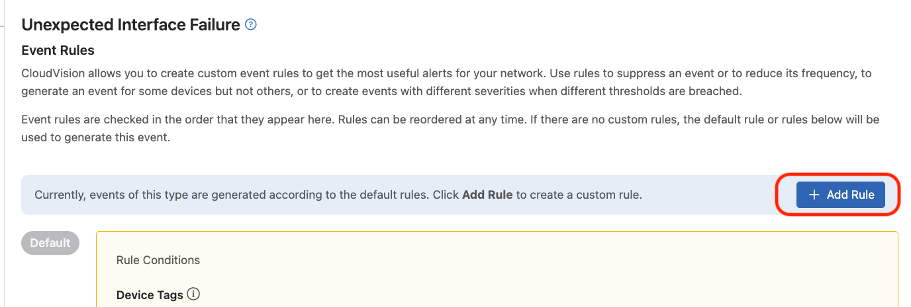

15. Create a Custom Rule Condition
    - Within the Device Tag field, specify key **Access-Pod** and select your CampusB Pod2.
    - Within the Interface Tags field, specify **Link-Type** and select **Uplink**
    - Ensure Ignore Subsequent Rules and Generate an Event remain selected
    - Set a desired Severity, such as Critical
    - Finally give the rule an explicit **Rule Label** so that we can reference it later

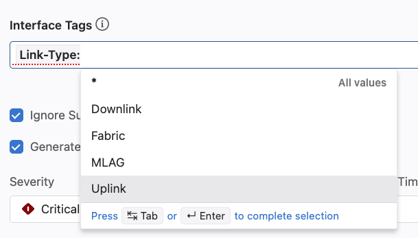
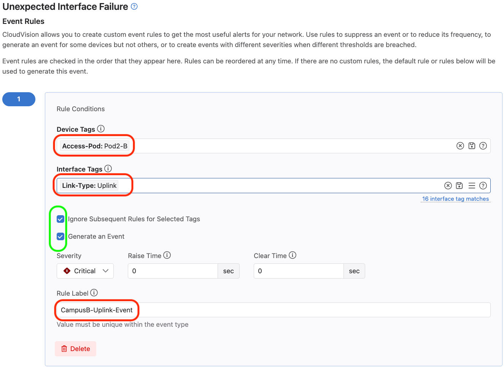

*This configuration will filter the custom interface event generation to this device tag and with interface tags of **Link-Type: Uplink**. The default event generation for these tag matches will be ignored in the default rule while falls below. Non-matched uplink interfaces will still get the default rule event generation.*

16. Next, customize the **CloudVision Not Receiving State from Device** by searching for it and clicking it from upper-left menu

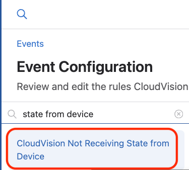

17. Add a Rule

18. Create your Rule Conditions
    - Specify your custom device tag e.g. **ptptype: prod**
    - Verify the tag match by clicking the save icon and seeing CampusB-Leaf2A device
    - Label this rule something you can reference later such as **Prod-device-down**

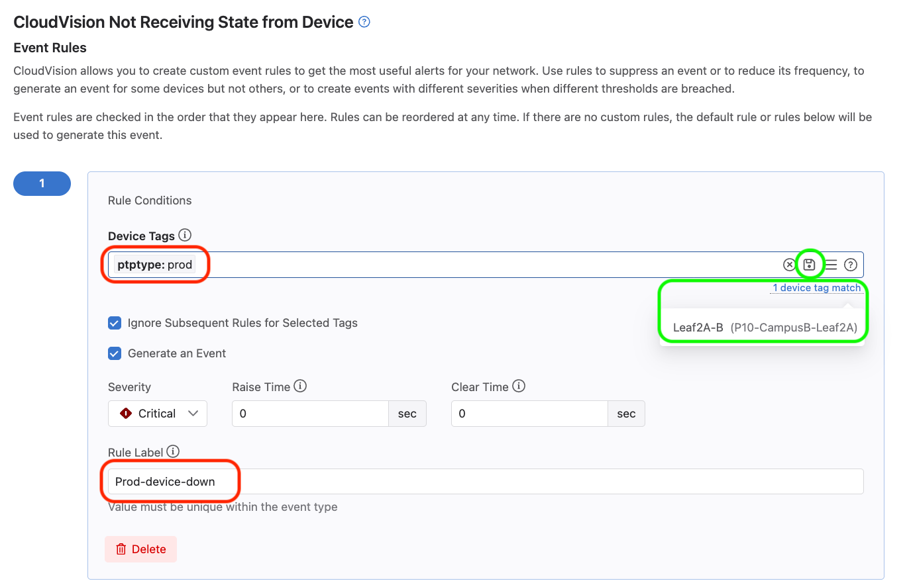

19. Click **Save** in the upper right to save your changes:

*At this point our events have been customized, but no notifications for these events will yet come out of CloudVision. These events will always record into CloudVision's time-series NetDL datalake based on the default rule configuration, but alerts going to other systems must be explicitly configured.*

Next, let's configure an email alert to send when our customized events are detected by CloudVision

20. Navigate back to the main **Events** menu using the upper-left breadcrumb

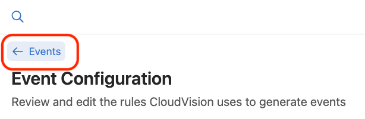

21. In the upper-right, select **Configure** then **Event Notifications**

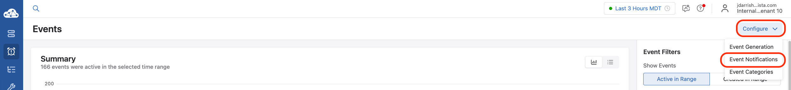

22. Within the Notification Configuration menu, Select **Receivers**

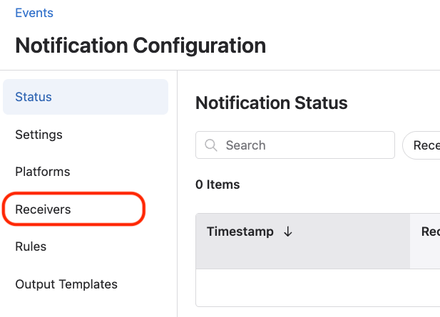

23. Click **Add Receiver**

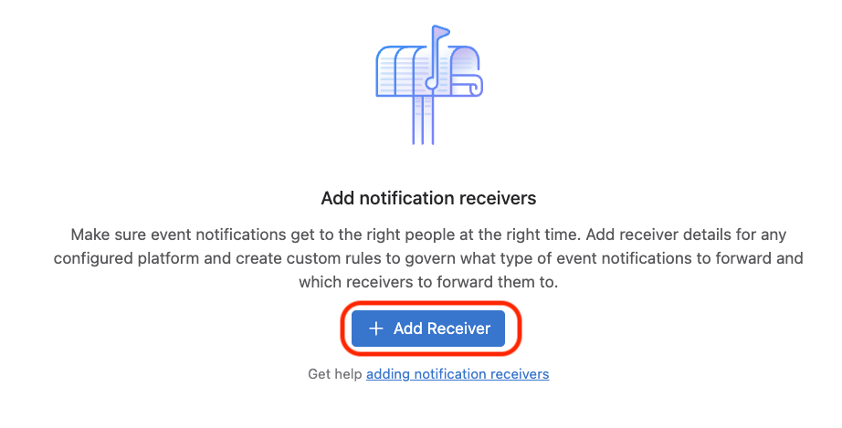

24. Add a receiver name and click **Add Configuration** and select **SendGrid** from the list of Email configurations

25. Add your email address

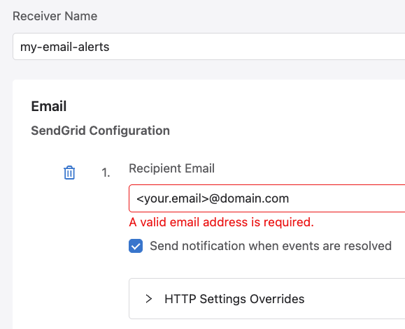

26. Save your changes

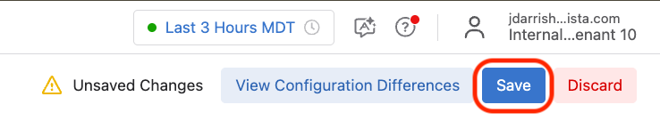

27. Next, Add a notification rule by navigating to **Rules** within the Notification Configuration menu.

28. Create your notification rules
    - Select **Rule Labels**
    - Add your newly created Uplink **Event and Device Event** rule labels
    - Add your email receiver (destination)

29. Save your changes

30. Send a test notification if you desire. Make sure to use your rule label for example use the  **Rule Label: Prod-device-down**

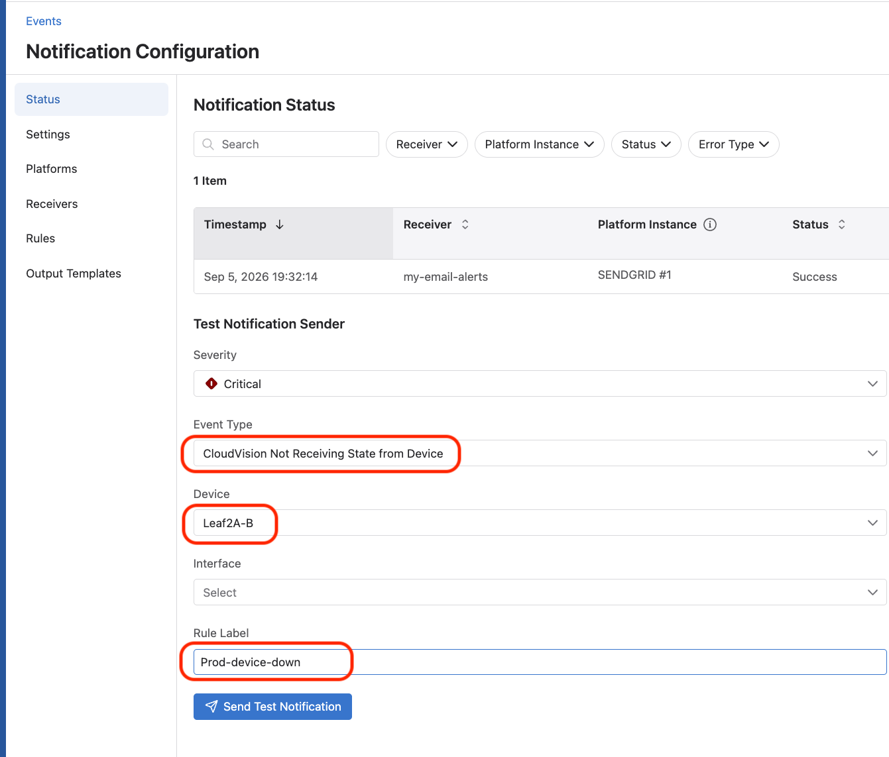

31. Create change control and reboot either one of the CampusB Spine devices.
    - Navigate to **Provisioning**, **Change Control**, then click **Create Change Control**

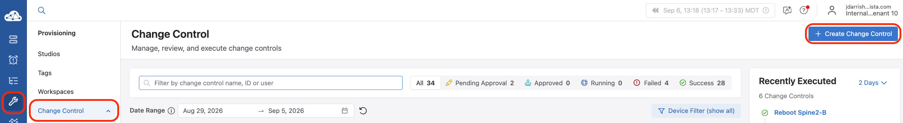

32. Give the Change Control a more descriptive name by clicking the **pencil icon**
     - Then click **Add Action**

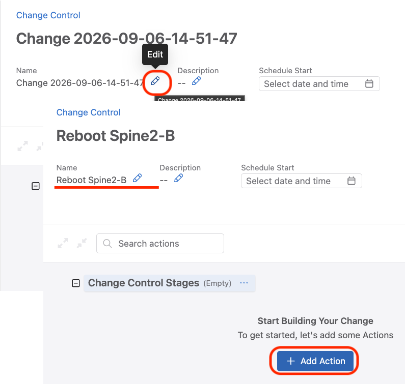

33. On the right side Add Action menu, search for Action **Reboot** and click on it to select and add it

34. Search for your Campus B naming standard, and find one of the Spine devices (either spine will do) and click **Add to Change Control**

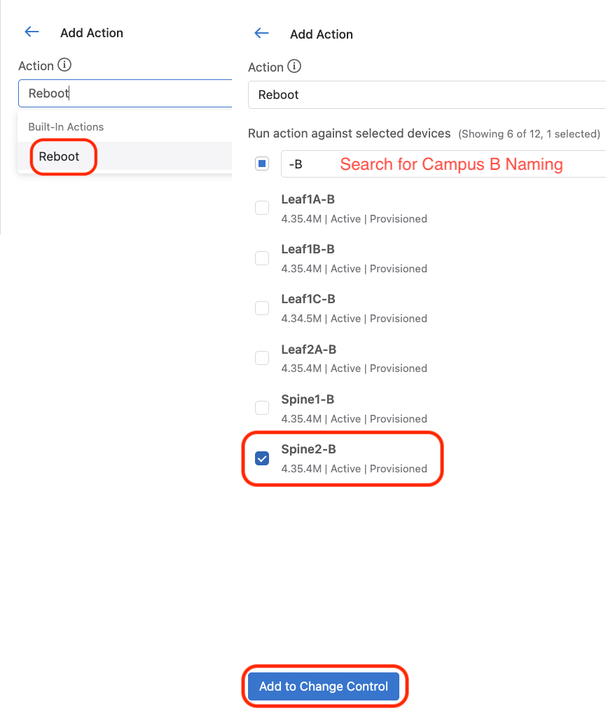

35. Verify that a Campus B spine device has been added to the Reboot Change and **Click Review and Approve**

*This Change Control will cause Campus B leafs to have an uplink failure including Leaf2A which will trigger your customized email alert*

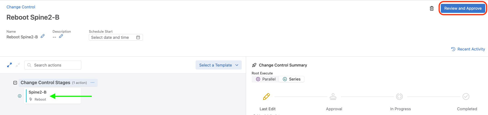

36. **Approve and Execute** immediately the Reboot Change Control

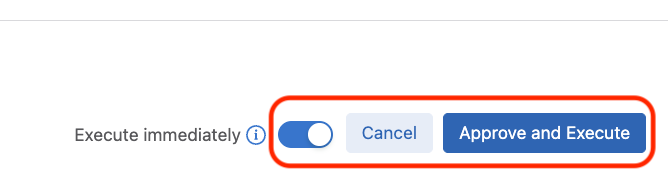

37. Navigate back to the Events main dashboard using the menu bar, and adjust your viewport to show **Last 15 mins**

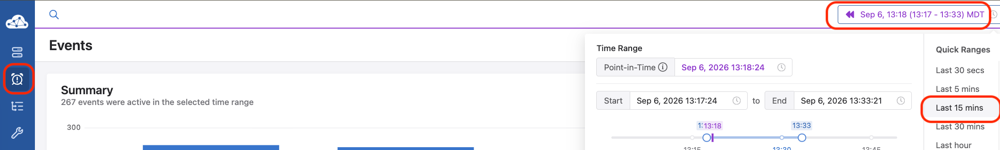

38. From this view you should see events periodically stream in to the Event List

> [!NOTE]  CloudVision also recorded all of the default events for events and device reboots in the Events menu. However only the customized uplink alert is set to generate email alerts. Also note that even though many uplink interfaces went down, the only email alert received for this event type is for the uplinks failure occuring on Leaf2A because it is the only device matching the device tag configured for the custom event.

39. Check for alert emails sent from **cvaas-alerts@arista.com** After a few minutes you should receive the uplink failure email alert containing additional information and a link to the event in CloudVision viewport date/time

40. Filter the main Events dashboard
    - Deselect the **Warning** and **Info** level events.
    - Type in your uplink event rule name in the **Rule Label** filter
    - Click the **Unexpected Interface Failure** event name in the Event List to open details about that event

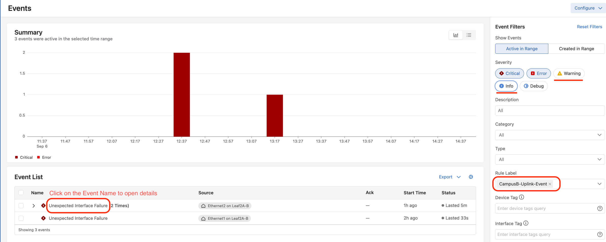

*Notice your viewport has moved to the date and time the event occurred. If you browse to other dashboards in CloudVision from here, it will render those dashboard at that point in time.*

41. Browse the additional related information in the Summary tab to see this interface's history and LLDP neighbors
    - Select **Related Events** menu tab (to the right of Summary) and view the events CloudVision correlates with the alerted interface failure event.

  
*Notice the Change Control event is correlated and the link failures are shown with likely **Administrative Interface Shutdown** events. From this information the user is shown that the Unexpected Link Failure and Change Control events are related and that it was administrative in nature, rather than a correlated hardware or software failure events.*

**This concludes the CloudVision Events and Notifications Customization Section**

---

### Port Profiles 

In this lab we will create a custom port profile and assign it to an interface using the Network Hierarchy portion of Cloud Vision.

1. Navigate to Network Hierarchy

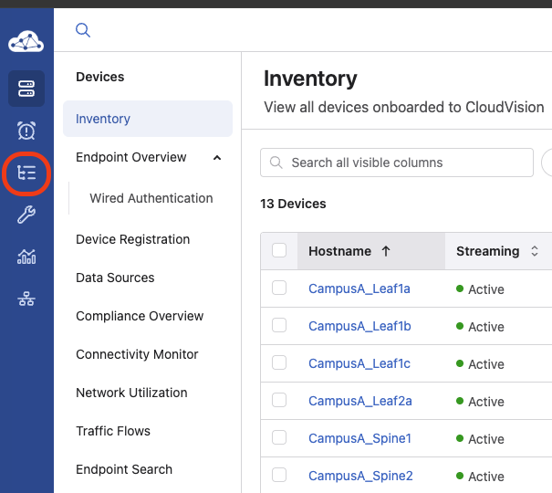

2. Expand the dropdowns and click on Campus B / Pod 1

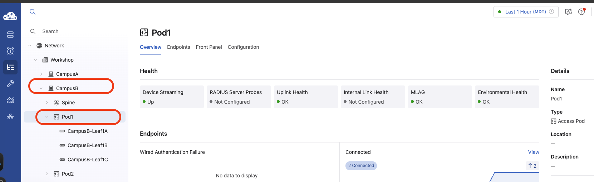

3. Navigate to the Front Panel View and Click on **Manage Profiles**

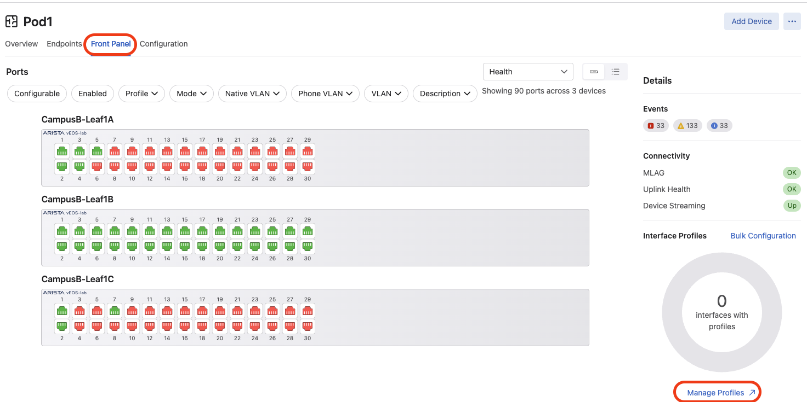

4. Click **Add Profile**

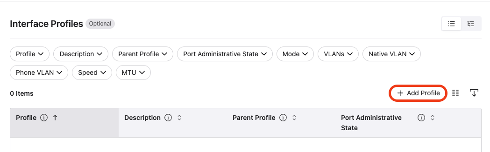

5. Create a Port Profile with the following attributes
   - **Name** = Your Choice
   - **Description** = Your Choice
   - **Enabled** = Yes
   - **Mode** = Access
   - **VLAN** = 1
   - **Spanning Tree Portfast** = Edge
   - **BPDU Filter** = Enabled
   - **BPDU Guard** = Enabled 
   - Select **Create**

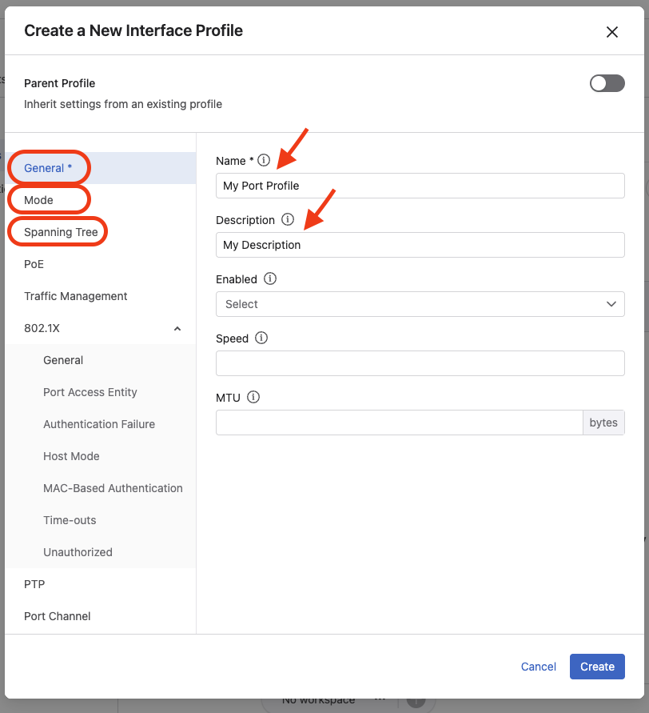

6. Review your workspace

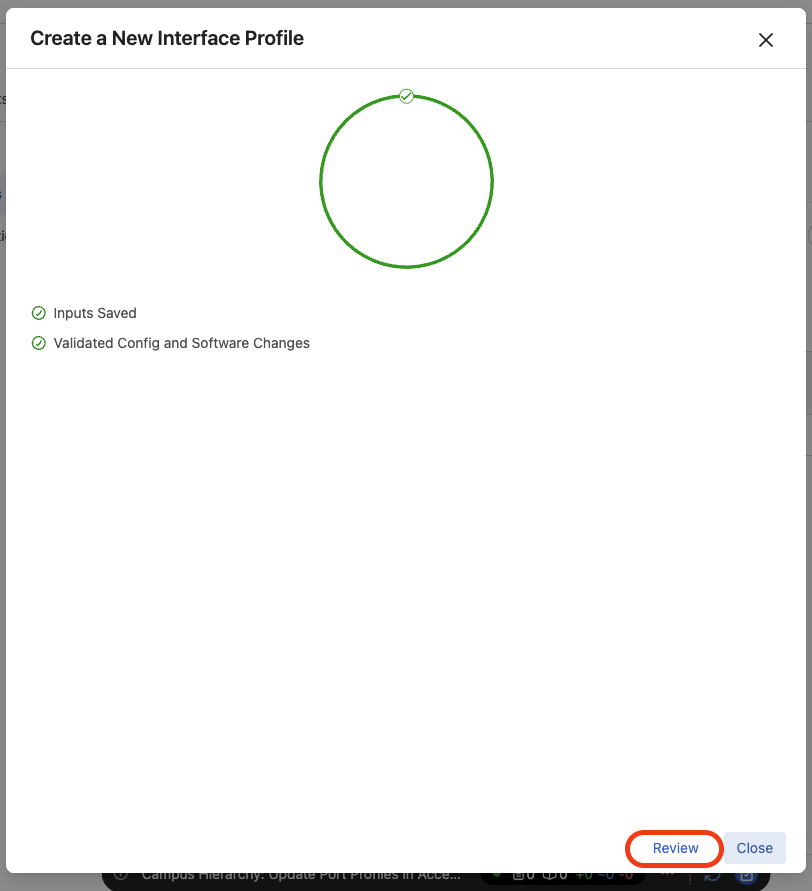

7. Submit your workspace and complete the Change Control

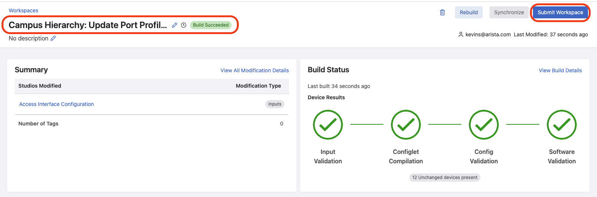

8. Click on **Network Hierarchy** and verify your port profile has been created

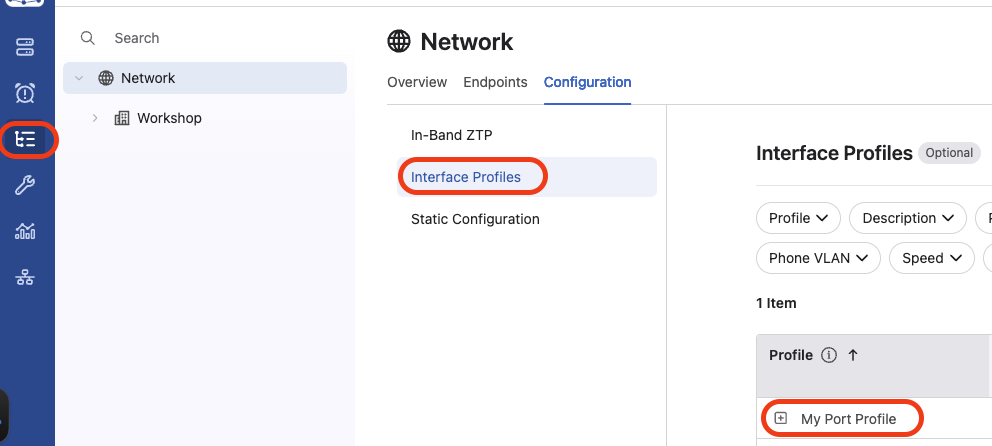

9. Navigate to **Campus B**, **POD 1**, **Front Panel**
   - For switch **CampusB-Leaf1C** click on port **7**
   - Click **Configure** next to **Interface Configuration**

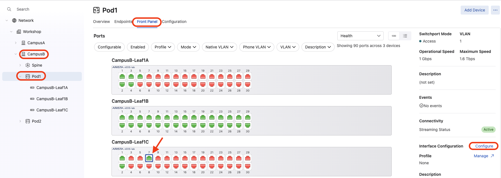

10. Under **Profile** seclect your profile you just created and hit **Save**

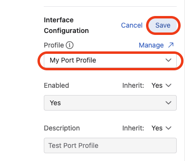

11. A Worksapce should have been created showing a single change

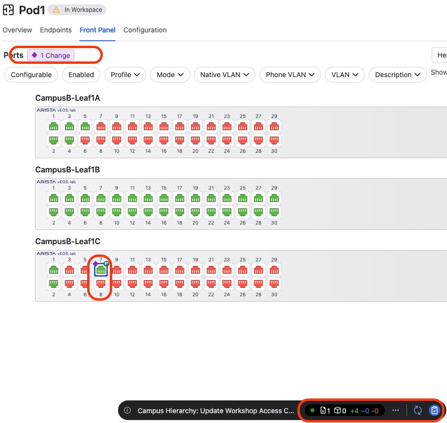

12. Validate the changes, submit workspace, and execute change control

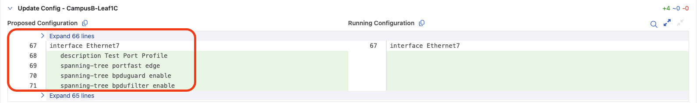

13. Naviagte Back to Network Hierarchy and check to make sure your port profile has been applied

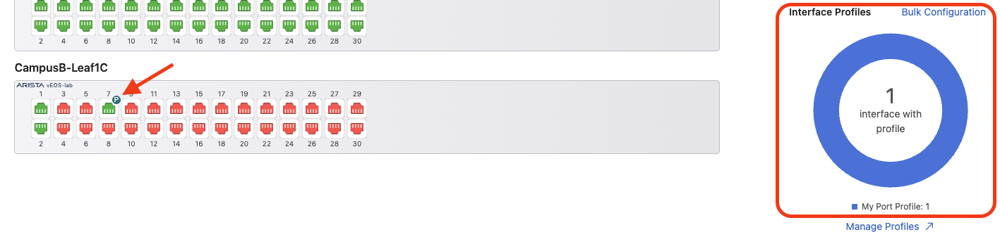

**This completes the Port Profile Section of the Lab Guide**

### Code Upgrade
In this lab we will be upgrading the image on a single device in our fabric, **CampusB-Leaf1C** All software has been prestaged for you in this lab.

1. Navigate to **Network Hierarchy > CampusB > Pod 1**

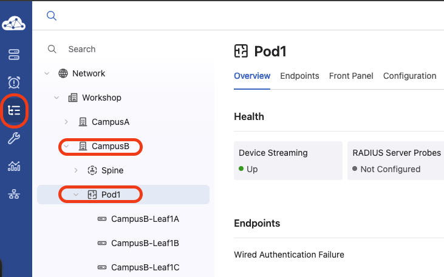

2. Click on the **3 dots** next to Pod1 and click **Upgrade**

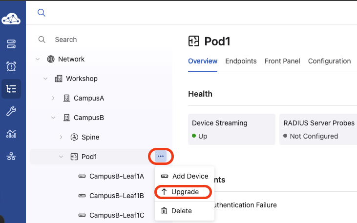

3. In the **Image** dropdown, select **EOS-4.35.4M.swi**
    - Note how the list of devices changes to just Leaf1C
    - Select **Continue**

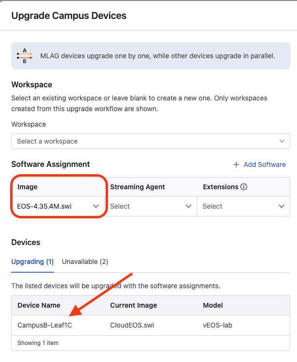

4. Configure your preferred method of upgrade, for this example we will use the following
   - Under **MLAG Pair** Seelect **MLAG ISSU** *(This will not be used in this section but is a required selection)*
   - Under **Non-MLAG Pair**
   - Select **SSU**
   - In the Dropdown Select **Fall Back to Normal**, **On Error Only**
   - Select **Apply**
   - Select **Continue**

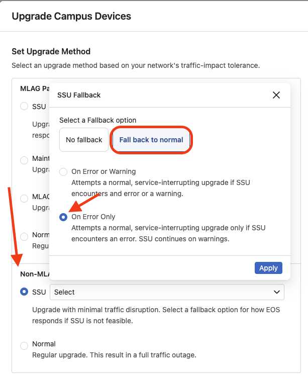

5. Verify the information is correct and click **Upgrade**

*This will build and submit your workspace, generate and start a change control to upgrade the device all in a single selection*

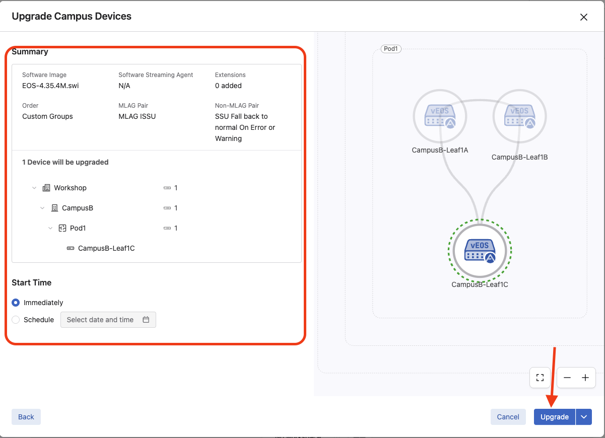

6. Click on View Change Control and watch the switch upgrade

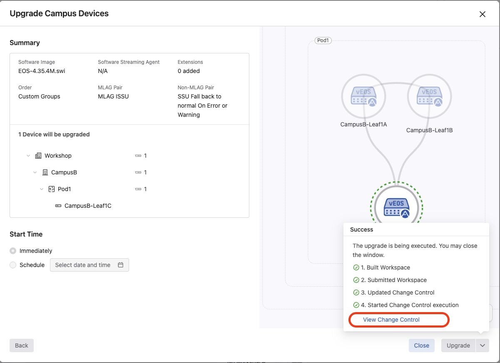

> [!NOTE] **This Reload will take roughly 5-10 minutes to complete** 

7. Check for successful completion

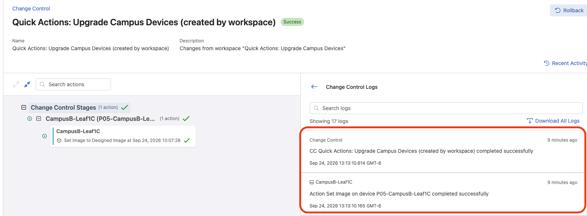

8. Navigate back to the Network Hierarchy Overview tab and verify the upgrade has been completed successfully


9. Click on **View Details** and explore the popup that shows the completed upgrade


**This completes the switch upgrade section of the Lab Guide**

### Syslog
In this lab we will learn where we can find important information about the fabric

1. From the device inventory page, select any switch and naviagte to the **System** -> **Log Messages** section of the device


2. Click on Message and type in stp - to search for Spanning Tree relatged events


### Dashbaords

1. Click on the Dashboards section of Cloud Vision and then on **Campus Health Dashboard**


2. Under the Compliance section of the Dashbaord, click on **Configuration**


3. Click on the device we want to clear our Configuration Compliance issue for


4. Click **Sync Config** and complete the Change Control process to resolve the compliance issue


**This completes the Monitoring Section of the Lab Guide**

---

**LAB GUIDE COMPLETE**
