# CloudVision Lab 06
## Campus Fabric Studio

## This Lab Guide:

[CloudVision Workshop Lab Guide 06- Inventory and Topology ](NEEDLINK!!!!)

---

## Table of Contents
1. [Lab Topology](#1-lab-topology)
2. [Lab Topology](#2-accessing-lab)

---

# 1. Lab Topology

**Note - this section uses Campus B devices including ZTR - Zero Touch Replacement of CampusB-Leaf2A.
Complete previous lab sections to ensure Leaf2A is provisioned before starting this lab section.**

---

# 2. Lab Details

## Lab Overview

In this lab exercise we will explore how CloudVision Events, Streaming Telemetry, and Dashboards assist the operator in troubleshooting activities throughout the network.
CampusB-Leaf2A device will simulate a failure requiring device replacement so that CloudVision's Zero Touch Replacement ZTR can be utilized to quickly restore failed devices to service.

# 3. CloudVision Events

### Customize Events and Notifications

Lab section goal - use CloudVision's tags and Events system to create a customized email alert when leaf to spine uplinks or specific devices go offline.

Set customized tags
  -  Create a new workspace
  -  Navigate to **Provisioning > Tags**

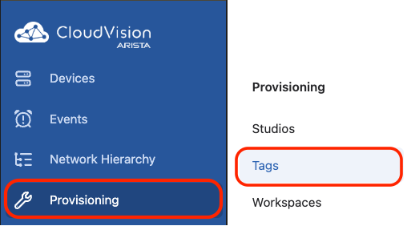

- Select Create Tag

- Set a new tag Name and a value for devices you wish to receive an alert for.
- Create the tag as Assignment Type - Device tag
- Click Create
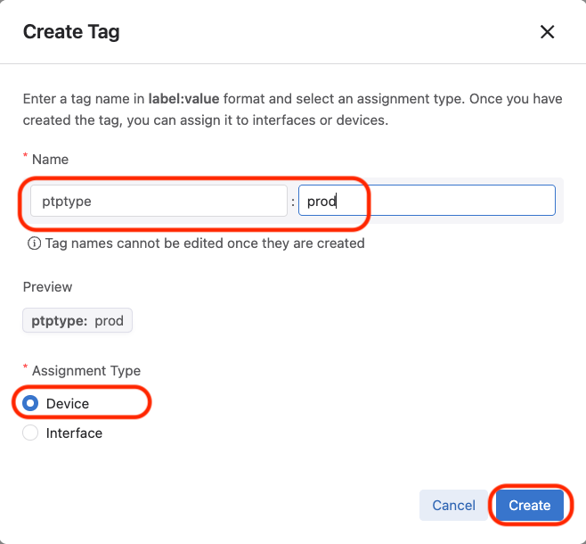

- Next, click the **"+ Assign"** (right side) 

- Assign CampusB-Leaf2A device to this tag and click Assign
- 

- Notice the Leaf2A is now a member of the Associated Devices Column
- Additionally, purple diamonds indicate which tags have modifications. This indicator is helpful when making changes to multiple tag keys within a single workspace. 
- 

- Next, Verify Interface Tags by selecting the Interface Tags button (upper left)
- 

- Within the Interface Tags tree, browse for **Link-type** expand the key and then select **Uplink** value.
- This view displays the tags which are auto-assigned by the provisioning process
- 

In the Tag Selected Column on the right, verify your CampusB-Leaf2A device shows its uplink interfaces as members.
- 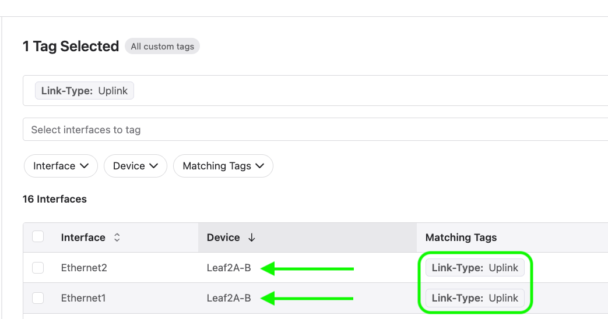

- Note -- if you desire, your own custom interface tags can be set to further customize filtering events and dashboards by interface tags--for example you may wish to tag an application which uses these infrastructure components. Since we are using one of the automatically provisioned interface tags, we know it will get configured for us on all future devices following the same provisioning procedure.

- Now that you have verified the custom device tag and auto-assigned interface tags are in place, review and submit your workspace. No studios are modified, only a single device tag update.
- 

- Navigate to Events
- 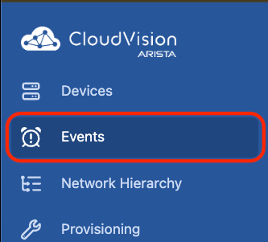

- In the upper right select **Configure** then **Event Generation**
- 

- Search for the **Unexpected Interface Failure** event and click on it
- 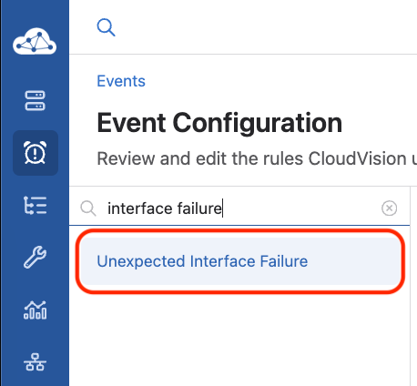

- Click **+ Add Rule**
- 

- Within the Device Tag field, specify key **Access-Pod** and select your CampusB Pod2.
- Within the Interface Tags field, specify **Link-Type** and select **Uplink**
- 
- Ensure Ignore Subsequent Rules and Generate an Event remain selected
- Set a desired Severity, such as Critical
- Finally give the rule an explicit **Rule Label** so that we can reference it later

- 
- This configuration will filter the custom interface event generation to this device tag and with interface tags of **Link-Type: Uplink**. The default event generation for these tag matches will be ignored in the default rule while falls below. Non-matched uplink interfaces will still get the default rule event generation.

- Next, customize the **CloudVision Not Receiving State from Device** by searching for it and clicking it from upper-left menu
- 

- Add a Rule
- 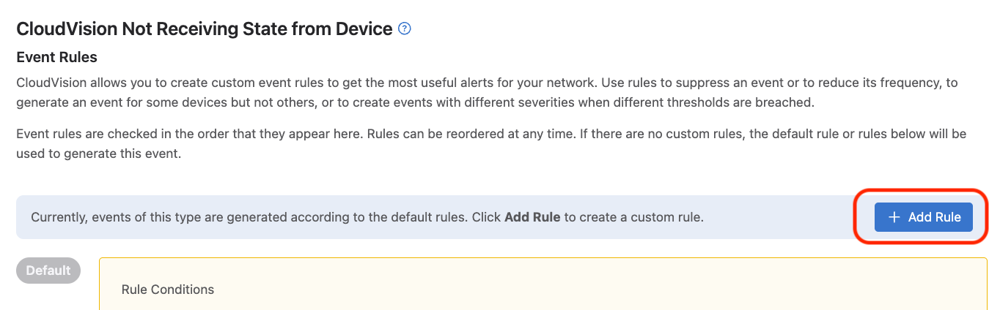

- Specify your custom device tag e.g. **ptptype: prod**
- Verify the tag match by clicking the save icon and seeing CampusB-Leaf2A device
- Label this rule something you can reference later such as **Prod-device-down**
- 

- Click Save in the upper right to save your changes:
- 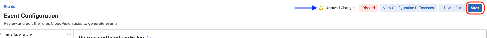

- At this point our events have been customized, but no notifications for these events will yet come out of CloudVision. These events will always record into CloudVision's time-series NetDL datalake based on the default rule configuration, but alerts going to other systems must be explicitly configured.

- Next, let's configure an email alert to send when our customized events are detected by CloudVision
- Navigate back to the main events menu using the upper-left breadcrumb
- 

- In the upper-right, select **Configure** then **Event Notifications**
- 

- Within the Notification Configuration menu, Select **Receivers**
- 

- Click Add Receiver
- 

- Add a receiver name and click **Add Configuration** and select **SendGrid** from the list of Email configurations
- 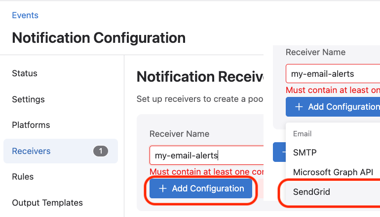
Add an email address
- 
Save your changes
- 

Next, Add a notification rule by navigating to **Rules** within the Notification Configuration menu.
- 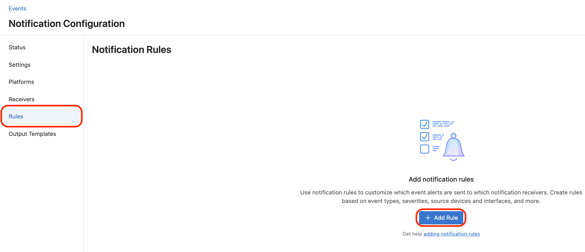

- Add your Uplink Event and Device Event rule labels
- Add your email receiver (destination)
- 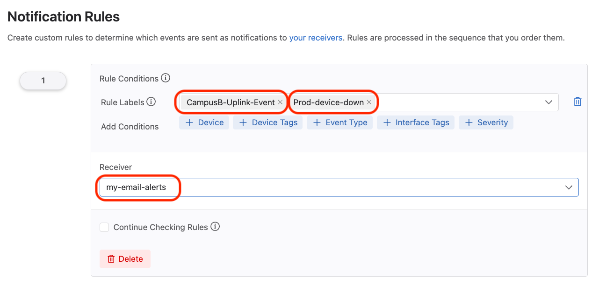

- Save your changes
- 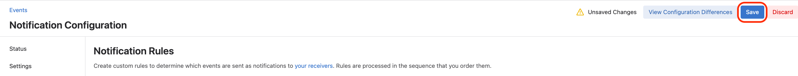

- Send a test notification if you desire. Make sure to use your rule label for example use the  **Rule Label: Prod-device-down**
- 
- 

- Create change control and reboot either one of the CampusB Spine devices.
- Navigate to **Provisioning**, **Change Control**, then click **Create Change Control**
- 

- Give the Change Control a more descriptive name by clicking the **pencil icon**
- Then click **Add Action**
- 
- On the right side Add Action menu, search for Action **Reboot** and click on it to select and add it
- 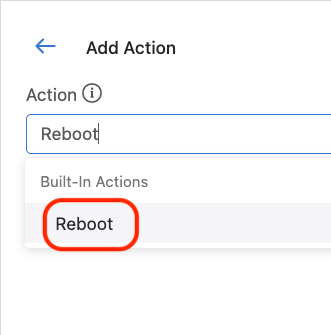
- Search for your Campus B naming standard, and find one of the Spine devices (either spine will do) and click **Add to Change Control**
- 
- Verify that a Campus B spine device has been added to the Reboot Change and **Click Review and Approve**
- This Change Control will cause Campus B leafs to have an uplink failure including Leaf2A which will trigger your customized email alert
- 
- 
- **Approve and Execute** immediately the Reboot Change Control
- 

- Navigate back to the Events main dashboard using the menu bar, and adjust your viewport to show **Last 15 mins**
- 
- From this view you should see events periodically stream in to the Event List
- 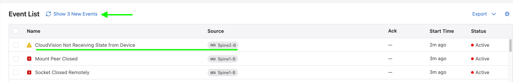
- Note that CloudVision also recorded all of the default events for events and device reboots in the Events menu. However only the customized uplink alert is set to generate email alerts. Also note that even though many uplink interfaces went down, the only email alert received for this event type is for the uplinks failure occuring on Leaf2A because it is the only device matching the device tag configured for the custom event.
- Check for alert emails sent from **cvaas-alerts@arista.com** After a few minutes you should receive the uplink failure email alert containing additional information and a link to the event in CloudVision viewport date/time
- - 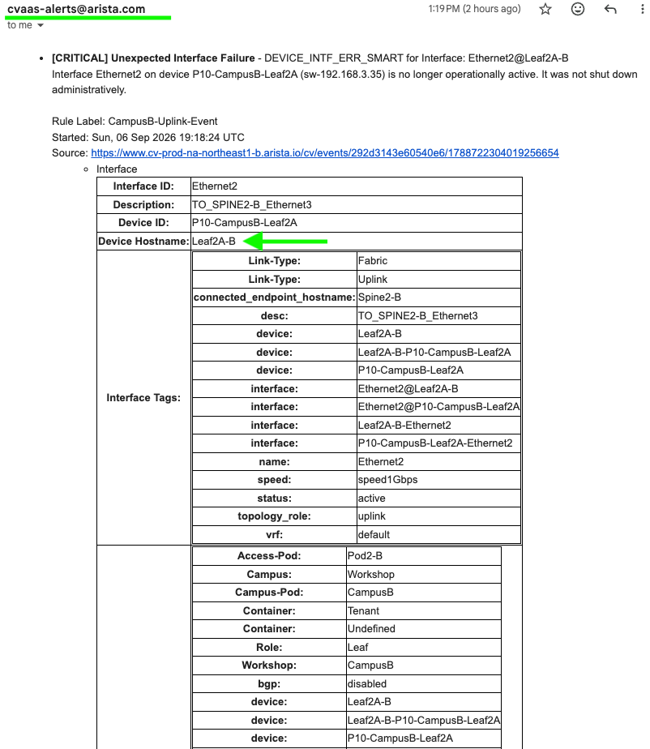

- Filter the main Events dashboard
- - Deselect the **Warning** and **Info** level events.
  - Type in your uplink event rule name in the **Rule Label** filter
  - Click the **Unexpected Interface Failure** event name in the Event List to open details about that event
- 

- Notice your viewport has moved to the date and time the event occurred. If you browse to other dashboards in CloudVision from here, it will render those dashboard at that point in time.
- Browse the additional related information in the Summary tab to see this interface's history and LLDP neighbors
- Select **Related Events** menu tab (to the right of Summary) and view the events CloudVision correlates with the alerted interface failure event.
- 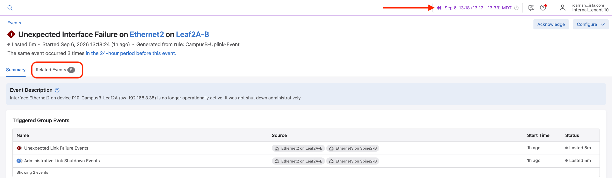
  
Notice the Change Control event is correlated and the link failures are shown with likely **Administrative Interface Shutdown** events. From this information the user is shown that the Unexpected Link Failure and Change Control events are related and that it was administrative in nature, rather than a correlated hardware or software failure events.
- 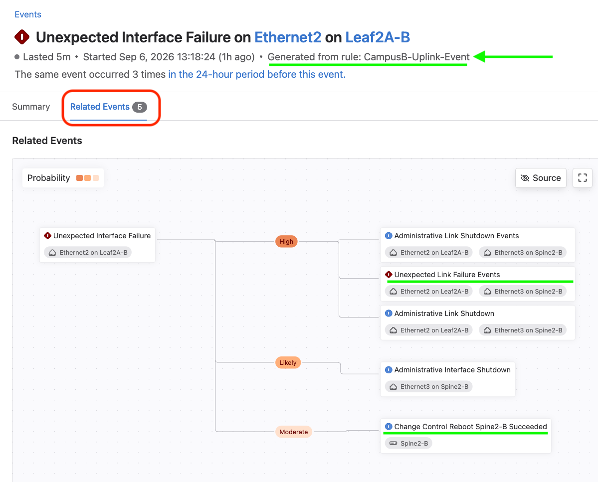

**This concludes the CloudVision Events and Notifications Customization Section**

# 4. Connectivity Monitor

### Configure Connectivity Monitor to collect data plane telemetry

Goal - In this lab section, CloudVision Studios will be used to configure **Connectivity Monitor** which runs on EOS devices and sends probes to defined destinations using in-band data plane packets. This feature is useful to collect latency, jitter, and packet loss within the network in real-time and historically.

** Connectivity Monitor Steps Overview **
1) Use Network Hierarchy to add a designated routed in-band VLAN with SVIs, if one is not already created.
2) Use Studios to Setup **in-band** mgmt addresses on VLAN X with IP subnet:__________________
3) Use CM studio to probe from leafs to spine IPs and virtual router within the VLAN

- Use the Network Hierarchy to create within Campus B a routed VLAN that is added to both Pod1 and Pod2.
- Ensure the VLAN Type is **Routed**, set as **Enabled**, and note down the IP Virtual Router Subnet you choose as it will be referred to later
- Click Save to return to the CampusB configuration
- 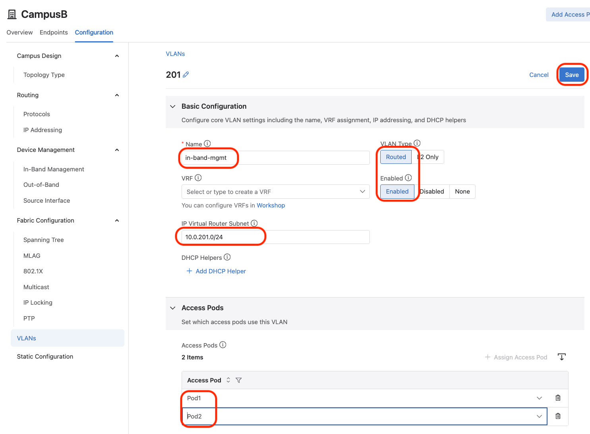

- Next, select the **In-band Management** function under Device Management Menu and click **Edit**
- Enable the in-band management toggle
- Specify **Automatic** Address Allocation and select **Front-to-Back** Allocation Order
- Specify your VLAN ID and IP subnet in CIDR notation of the routed VLAN in Campus B
- Click Save
- 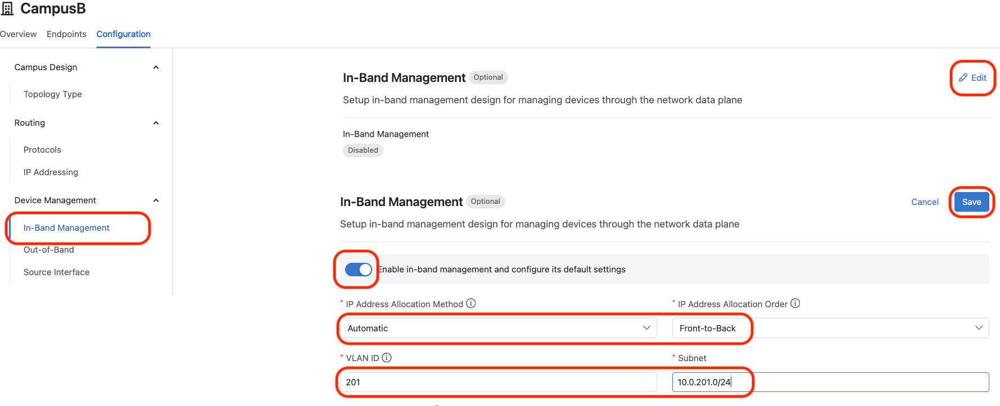

- Review your Workspace for the following changes:
- Leaf switches have truck allowed list updated and receive a unique SVI IP address within the VLAN subnet
- Spine switches receive unique IP addresses and a shared **ip virtual-router address** which is common among the spines
- Note down the virtual router address - e.g. 10.0.201.1 and spine-1 and spine-2's unique addresses, e.g. 10.0.201.2 and 10.0.201.3 in this example. These spine addresses will be the probe destination addresses for Connectivity Monitor.
- - 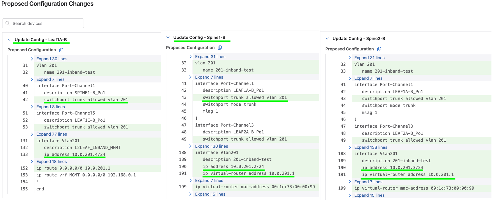
 
- Submit the workspace and push the VLAN changes out to Campus B by Approving and Executing the Change Control

- Configure Connectivity Monitor
- Navigate to **Provisioning** then **Studios**
- Deselect the Active Studios filter to show all available studios, select **Connectivity Monitoring**
- 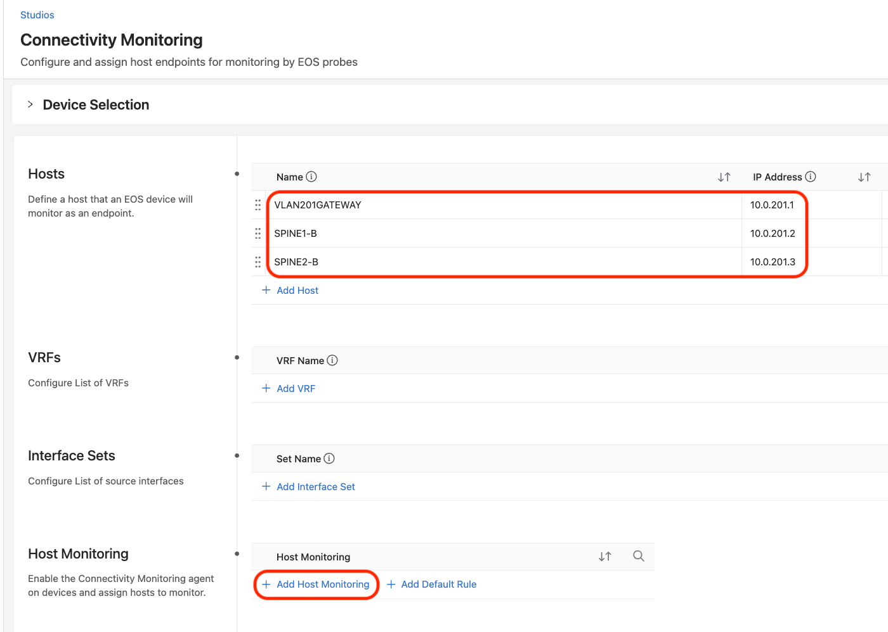

- Within the Connectivity Monitoring Studio set the following configuration:
- Add Hosts entries for each of the spine IP addresses in the routed VLAN and click the **Add Host Monitoring** 
- 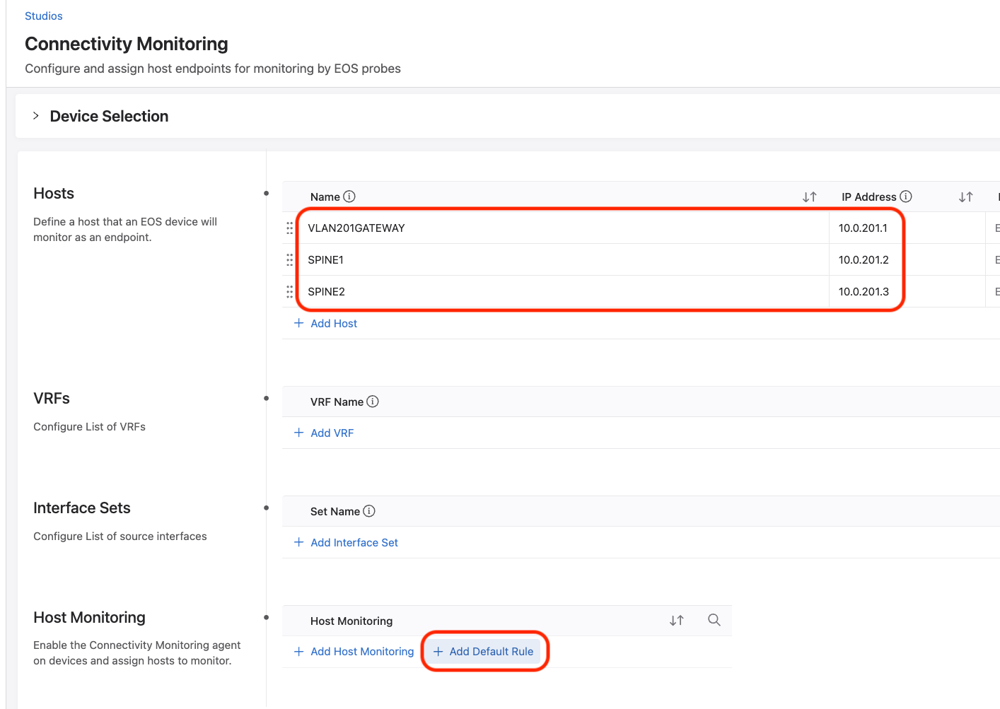
- Add Host Monitoring tags which select **Campus-Pod: CampusB** and **Role: Leaf** then click into the rule to modify it
- 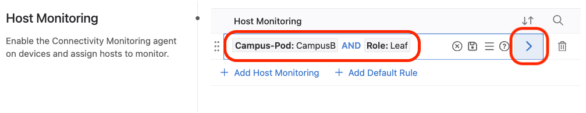

- Verify your tag match includes the top-level leaf switches in Campus B by hovering your mouse over the hint, spines and other downstream member-leaf are excluded in this example.
- 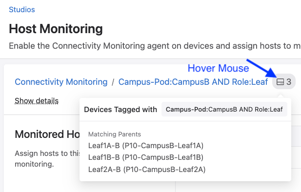
- Within the Monitoring Hosts list, add all three addresses the VLAN Gateway and each spine.
- 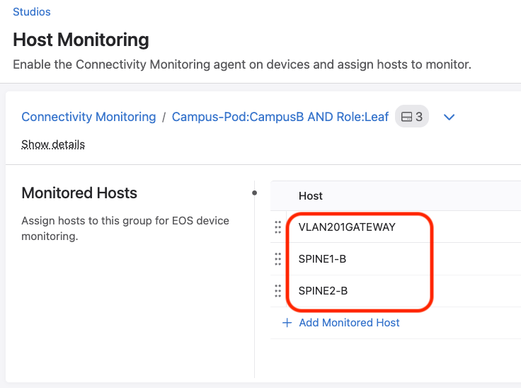
  
- Review your workspace for the following configuration

- Leaf Switches only are modified with to enable the feature **monitor connectivity** with a host entry for each host IP address to be probed.
- 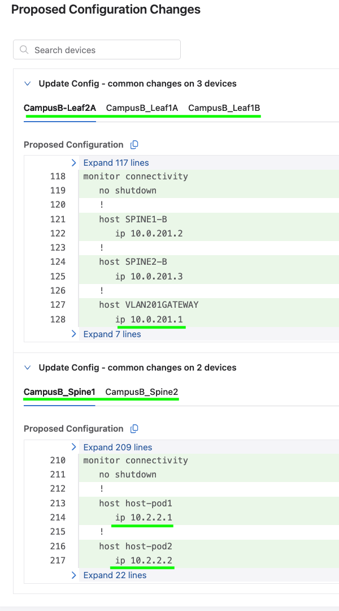
- Approve and Execute the corresponding change control to enable the feature on the leaf switches in Campus B.
- 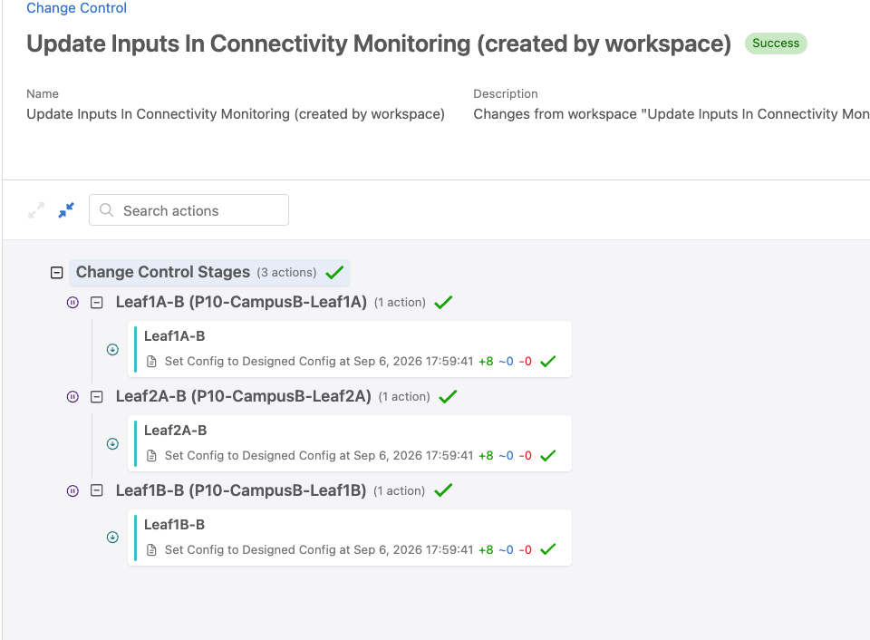

- Navigate to **Devices** then **Connectivity Monitor** menu
- Select Metric Packet Loss and Connectivity probes as all three leaf switches
- 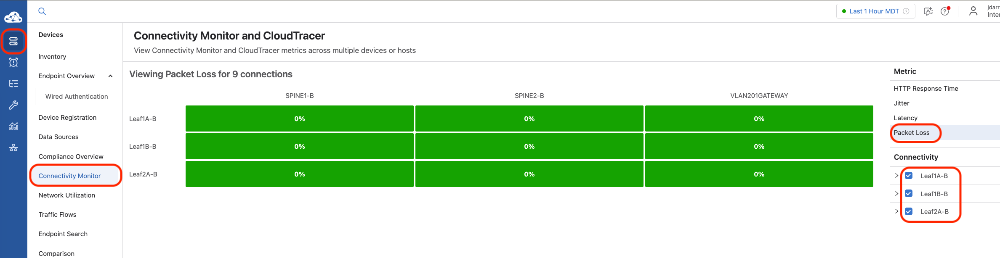
- Next, use previous lab instructions to execute a reboot change control on either Campus-B Spine device. Watch this Connectivity Monitor dashboard in another browser tab while the spine device reboots.
- Note - some probes to the Gateway virtual address may initially fail and render as brief loss as the
- 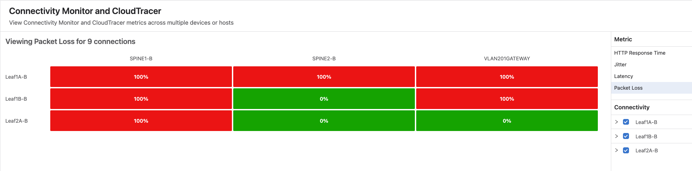
- For the remaining duration of Spine reboot we should see the network converged to only the unique IP address is affected, the other spine and gateway address are reachable
- 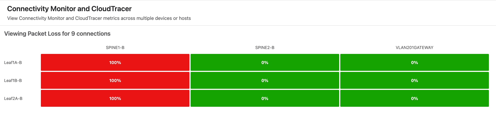
- After the Spine device recovers, the dashboard should render back to healthy
- Clicking into the boxes reveals the time-series statistics for the probe
- 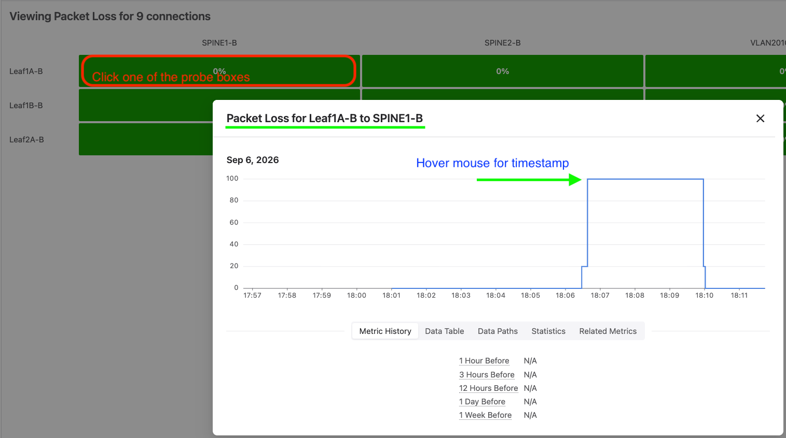
- Explore the Jitter and Latency probes similarly
- 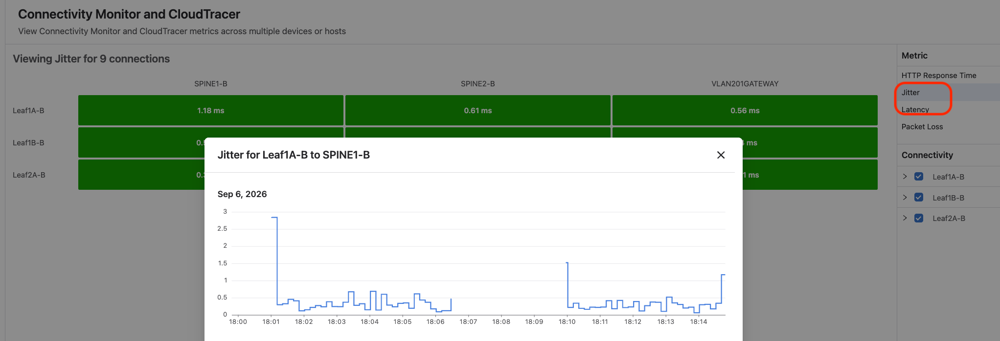
- Finally navigate to Network Hierarchy then select your **CampusB** to reveal the scoped dashboard.
- Note that Connectivity Monitor Anomalies are now summarized where this data is available to CloudVision.
- 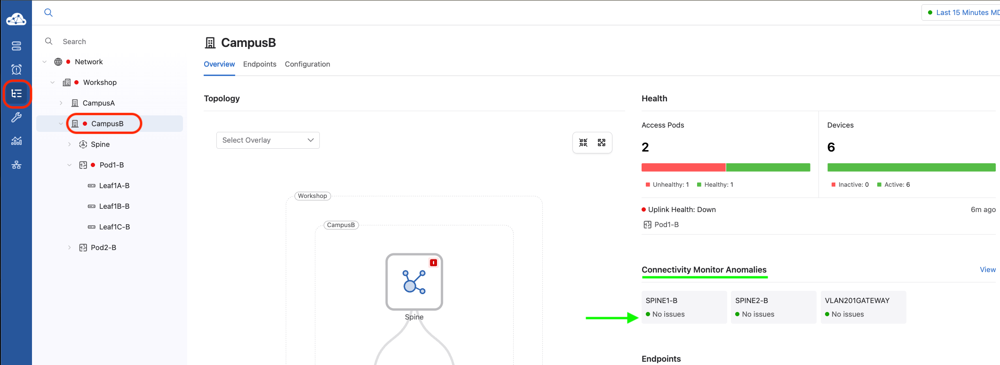
- You now have an at a glance view of the data plane health within this portion of the network. This feature can also probe to host IPs, 3rd party devices, or any destination that responds to ICMP or an HTTP get.

- **This Concludes the Connectivity Monitor lab section**

---

**LAB GUIDE COMPLETE**
