# CloudVision Lab 06 - Troubleshooting

## 


---

## Table of Contents
1. [Lab Topology](#1-lab-topology)
2. [Lab Overview](#2-lab-overview)
3. [Connectivity Monitor](#3-Connectivity-Monitor)
4. [Zero Touch Replacement ZTR](#4-Zero-Touch-Replacement)
5. [Data Plane Capture Action](#5-Data-Plane-Capture)

---

# 1. Lab Topology


**Note - this section uses Campus B devices including ZTR - Zero Touch Replacement of CampusB-Leaf2A.
Complete previous lab sections to ensure Leaf2A is provisioned before starting this lab section.**

---

# 2. Lab Overview


In this lab exercise we will explore how CloudVision Streaming Telemetry, Dashboards, and Operations workflows assist the operator in troubleshooting the network.
- Connectivity Monitor will be used to probe the data plane to show real time and historic packet loss, latency, and jitter
- CampusB-Leaf2A device will simulate a failure requiring device replacement so that CloudVision's Zero Touch Replacement ZTR can be utilized to quickly restore failed devices to service.
- AskAVA virtual assistant prompts will showcase analyzing data within CloudVision and how AVA can perform agentic read-only activities on your behalf
- Execute a data plane capture using a CloudVision custom action.
---

# 3. Lab Steps

### Configure Connectivity Monitor to collect data plane telemetry

Goal - In this lab section, CloudVision Studios will be used to configure **Connectivity Monitor** which runs on EOS devices and sends probes to configured destinations using in-band data plane packets. 
This feature is useful to collect latency, jitter, and packet loss within the network in real-time and to analyze historically.

**Prerequisistes**

- Designate a VLAN-ID for the host access ports
    * Host is preconfigured within subnet = 10.2.2.0/24
    * Host NIC1 connected to CampusB-Leaf1C Ethernet7 = 10.2.2.1/24
    * Host NIC2 connected to CampusB-Leaf2A Ethernet7 = 10.2.2.2/24
    * Host access VLAN:  ___________

- Designate **In-Band** mgmt addresses on a new VLAN-ID
    * Campus B - In-band VLAN-ID:    ___________
    * Campus B - In-band /24 subnet: ___________

---
   
1. Add the Host VLAN
   
    - Use the Network Hierarchy to create a routed VLAN in Campus B that is added to both Pod1 and Pod2.
       
    - Ensure the VLAN Type is **Routed**, set as **Enabled**, and note down the IP Virtual Router Subnet you choose as it will be referred to later
       
    - Click Save to return to the CampusB configuration
       
    - 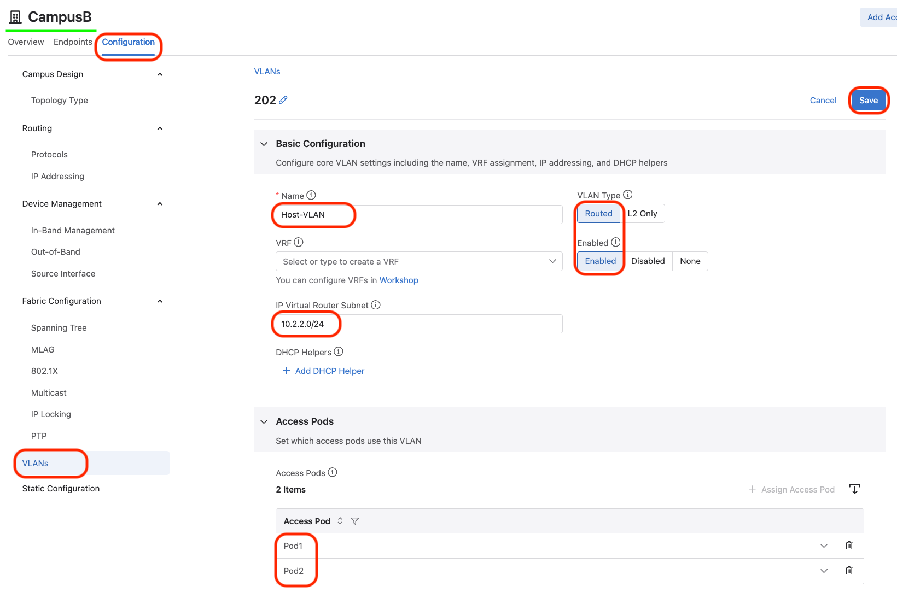
       
  
2. Next, let's adjust defaults to provision the network for the preexisting host IP address scheme
   
    - If you rebuild your workspace and see proposed configuration for CampusB-Spine1 Notice, by default, the Campus Fabric studio provisioning settings will propose the first host address as the virtual-router IP, and assign the 2nd host address to the router node.

    - 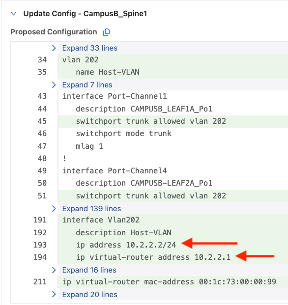

3. The Campus Fabric studio allows you to change these number defaults both fabric wide and 
Modify these by staying within your existing workspace, navigate to **Provisioning, Studios, Campus Fabric**

    - Scroll to the bottom and open Advanced Services Settings, Services Allocations

    - 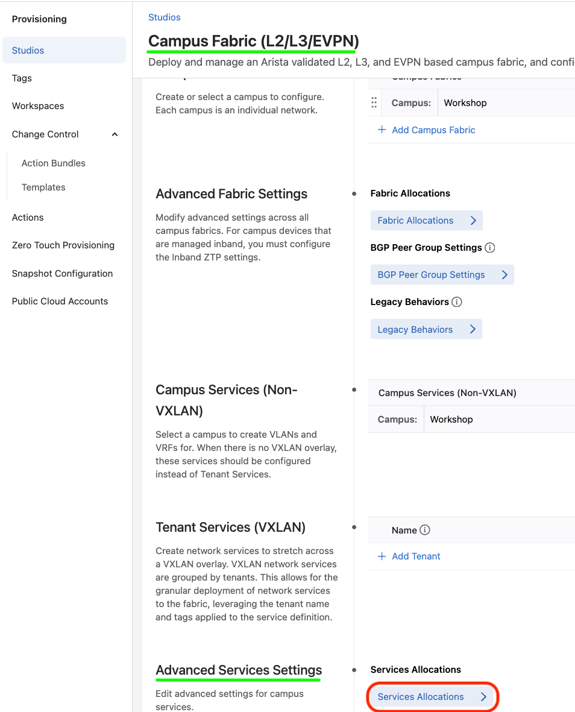
  
    - VLAN Gateway Address Convention - set to **Last**
    - 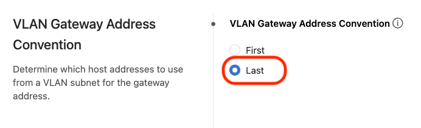

    - Rebuild your workspace and observe the gateway address has moved for **ALL SVIs** in both CampusA and CampusB. This is NOT desired.
       
4. Go back into your workspace and modify the Gateway Number convention in the following way:
    
    - Set the VLAN Gateway Address Convention back to First (the original default)
    
    - Add Gateway Address Convention - Tag match on Campus-Pod: CampusB  Set this match to convention Last

    - 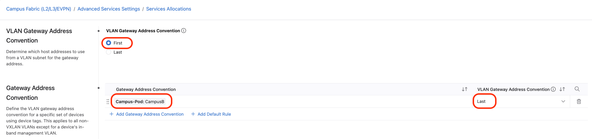

5. Rebuild your workspace once more to see that only the Campus B Spines have gateway address scheme modified to use the upper range IPs for the gateway address.
  
6. Next, use the Access Interface Configuration studio to provision the host ports CampusB-Leaf1C Ethernet7 and CampusB-Leaf2A Ethernet7 as **switchport access** within your host VLAN.
    - _Note-CloudVision provides several ways to configure interfaces including Quick Actions. The Access Interface Configuration Studio provides granular interface settings where they may be required and also acts as the source of truth when provisioning via Quick Actions submissions. This method is used within this lab section to showcase using these advanced settings._

    - Within your active workspace, Navigate to Provisioning, Studios, and open the **Access Interface Configuration** studio

    - 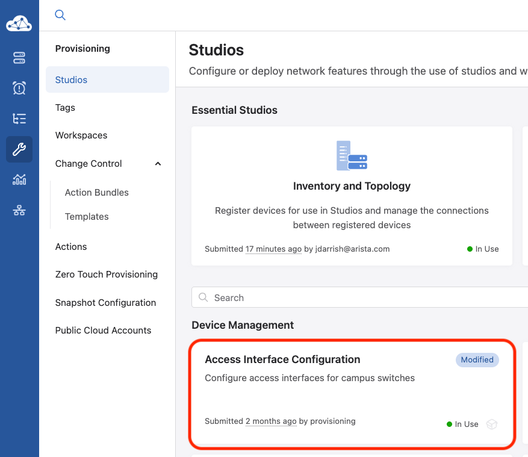

7. Within the Access Pod Interfaces section, expand the **Campus: Workshop** row
    - 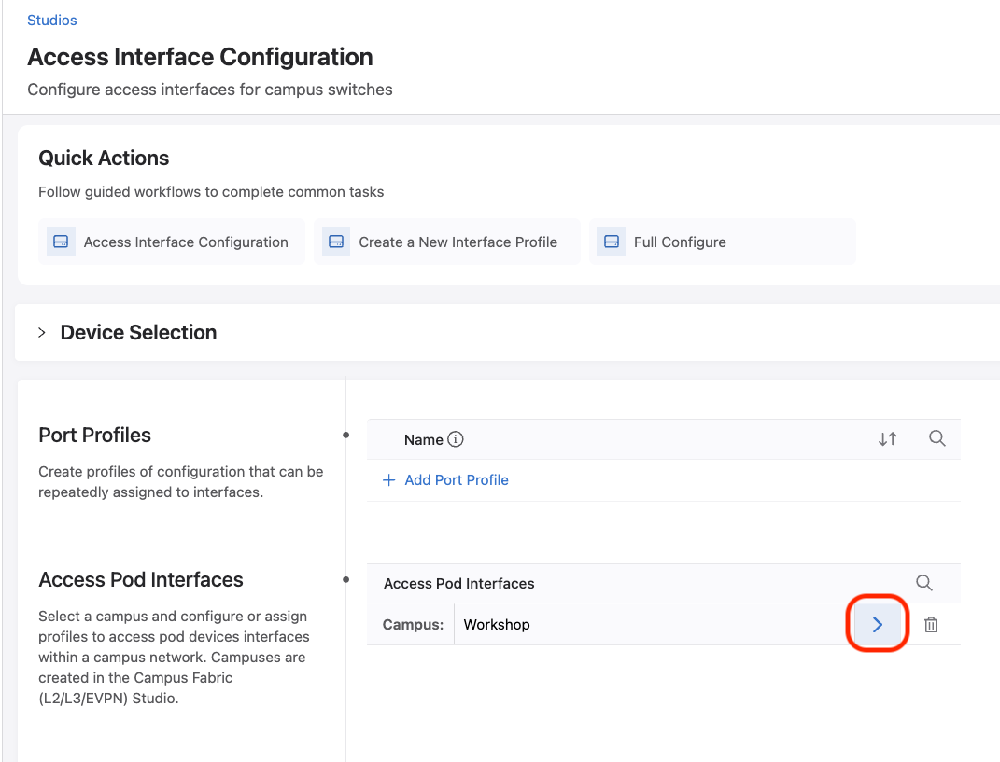

    - Then Expand CampusB
    - 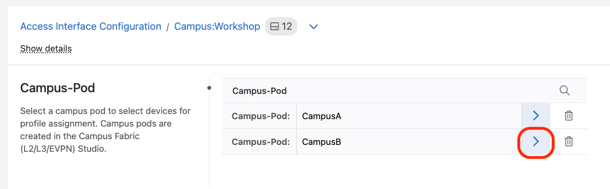

    - Then Expand Pod1
    - 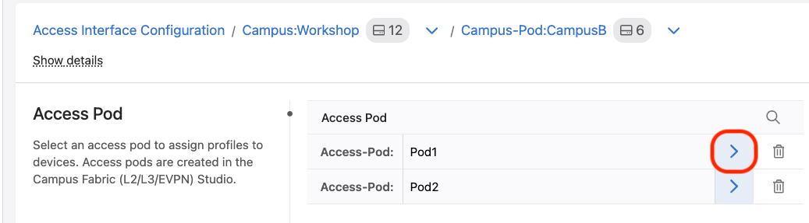
    - Find Ethernet7 on CampusB-Leaf1C and expand it
    - 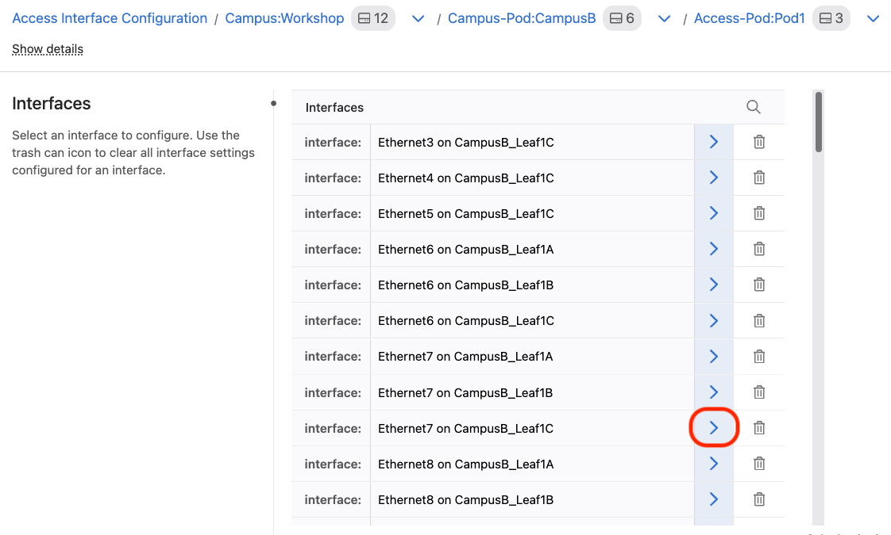
      
8. Add a description and Set **Enabled = Yes**, Set **Mode = Access**, Set VLAN to your **host VLAN ID**
    - 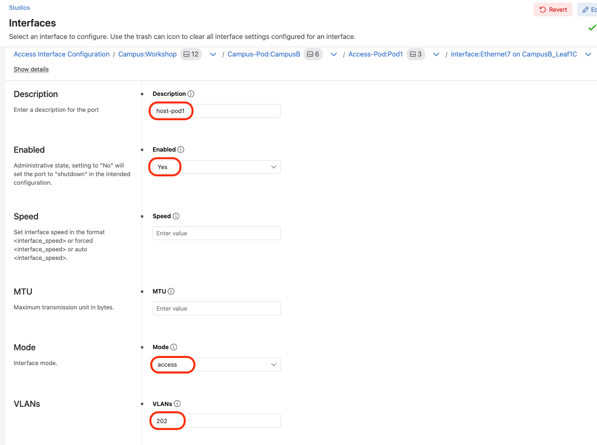

9. Repeat the steps for CampusB-Leaf2A Ethernet7 and put the interface in the same VLAN
    - Submit your workspace and verify that the host ports are both configured as access ports in the host VLAN
    - 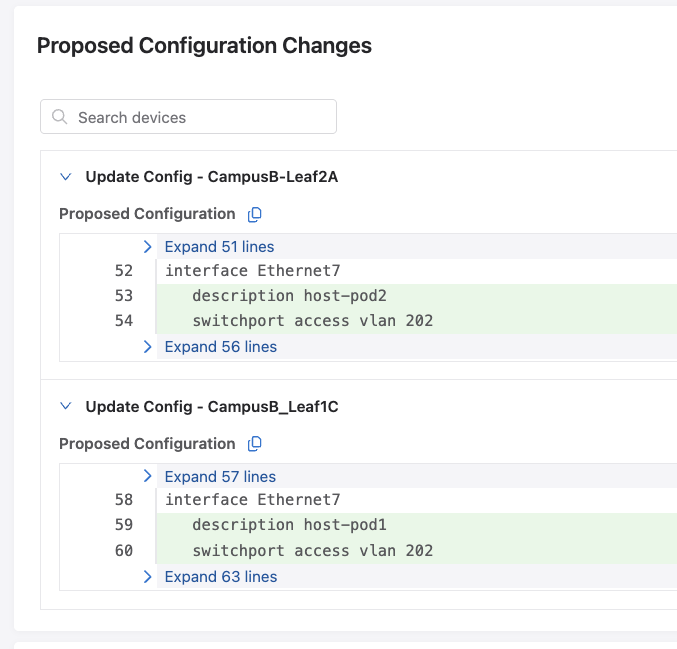
      
10. Submit your workspace, review change control for the following elements:
    - Leaf1C and Leaf2A - trunk allowed list includes host vlan, Ethernet7 switchport access vlan id
    - Spines - VLAN interface with ip virtual-rotuer address occupying high number IPs to avoid conflicting with existing host IP config
    - 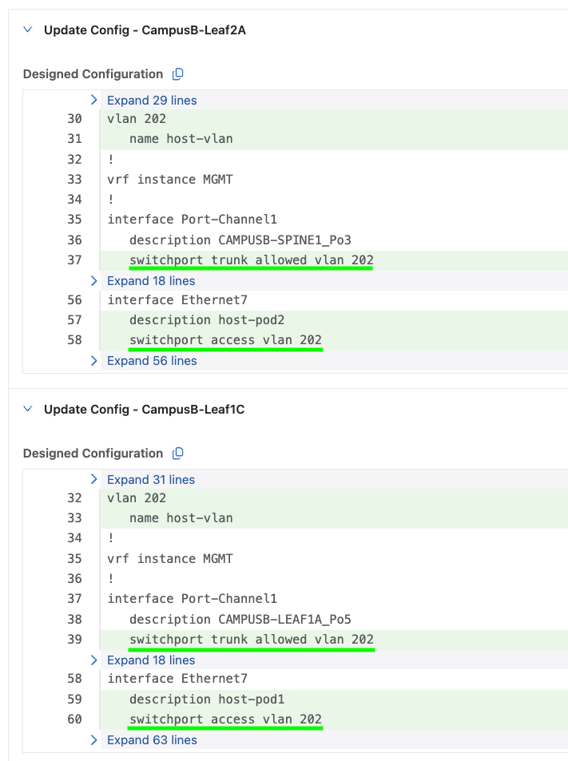
    - 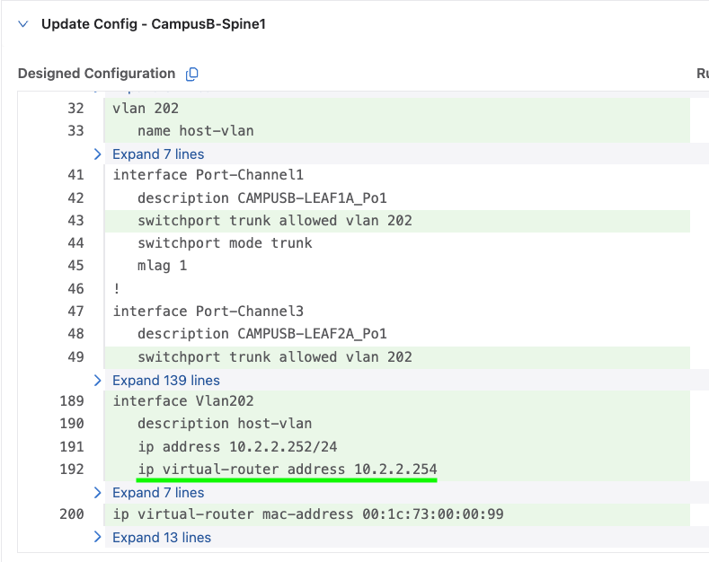

11. Approve and Execute the change control to complete pushing out host VLAN changes.  

---

**Setup In-band Management VLAN**
   
12. Repeat the Network Hierarchy steps for adding a VLAN to add your in-band management VLAN-ID and subnet
    - 

13. Next, select the **In-band Management** function under Device Management Menu and click **Edit**
    - Enable the in-band management toggle
    - Specify **Automatic** Address Allocation and select **Front-to-Back** Allocation Order
    - Specify your VLAN ID and IP subnet in CIDR notation of the routed VLAN in Campus B
    - Click Save
    - 

14. Review your Workspace for the following changes:
    - Leaf switches have trunk allowed list updated and receive a unique SVI IP address within the VLAN subnet
    - Spine switches receive unique IP addresses and a shared **ip virtual-router address** which is common among the spines
    - Note down the virtual router address - e.g. 10.0.201.1 and spine-1 and spine-2's unique addresses, e.g. 10.0.201.2 and 10.0.201.3 in this example. These spine addresses will be the probe destination addresses for Connectivity Monitor.
    - 

15. Submit the workspace and Approve and Execute the Change Control to push out the in-band VLAN changes to Campus B 

---

16. Configure Connectivity Monitor
    - Navigate to **Provisioning** then **Studios**
    - Deselect the Active Studios filter to show all available studios, select **Connectivity Monitoring**
    - 

17. Within the Connectivity Monitoring Studio set the following configuration:
    - Add Hosts entries for each of the spine IP addresses in the routed VLAN and click the **Add Host Monitoring**
    - Add Host Monitoring tags which select **Campus-Pod: CampusB** and **Role: Leaf** then click into the rule to modify it
    - 

18. Verify your tag match includes the top-level leaf switches in Campus B by hovering your mouse over the hint, spines and other downstream member-leaf are excluded in this example.
    - 
    
19. Within the Monitoring Hosts list, add all three addresses the VLAN Gateway and each spine.
    - 
      
20. Repeat these steps to add entires for the host NICs in 10.2.2.0/24 subnet.
    - Create a corresponding rule to probe the host IPs **from the spine switches** in Campus B
    - 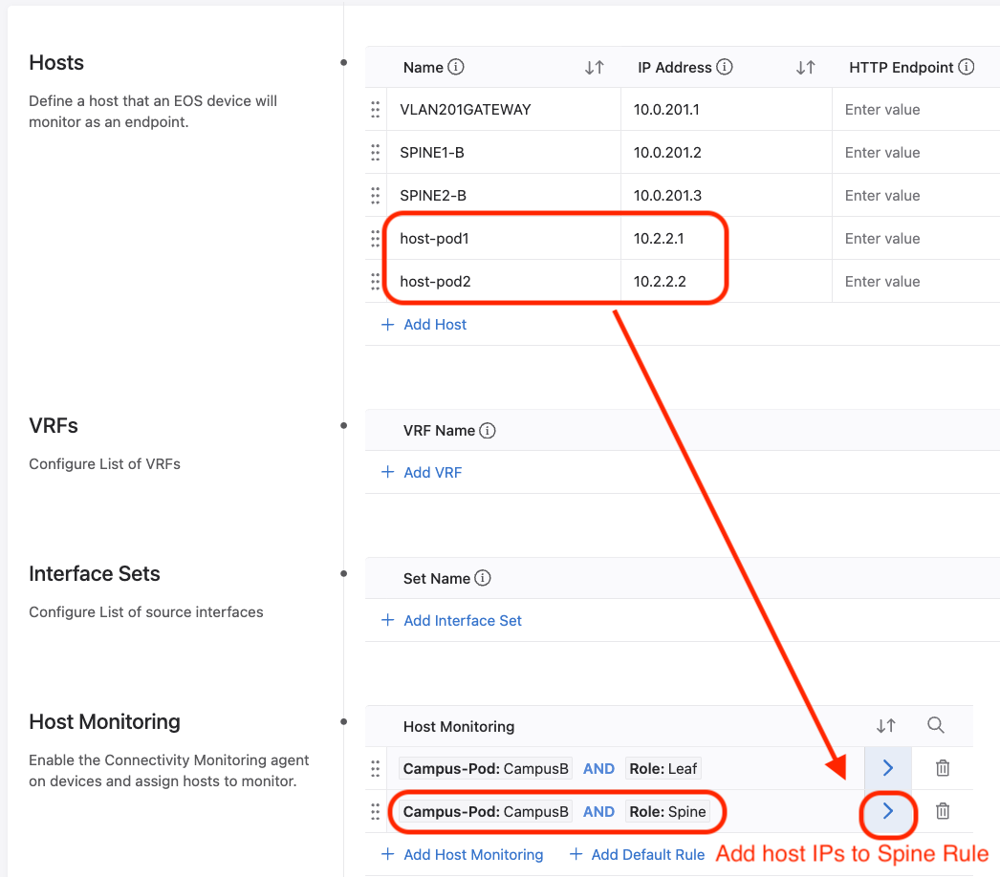
    - 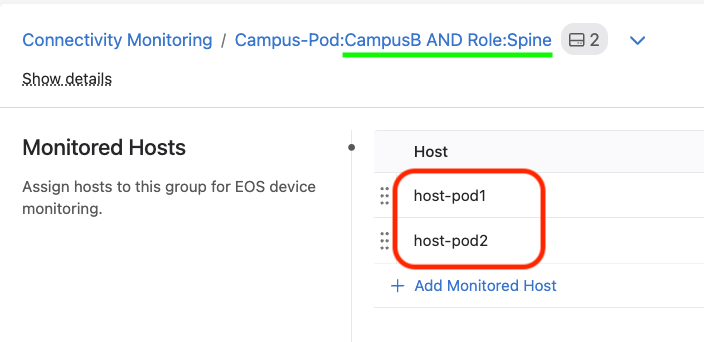

21. Review your workspace for the following configuration:
    - Leaf Switches are modified to enable the feature **monitor connectivity** with a host entry for each Spine IP address to be probed.
    - Spine Switches are modified to enable **monitor connectivity** and each spine has a host entry for each of the host NIC IPs, 10.2.2.1 and 10.2.2.2
    - 
    
22. Approve and Execute the corresponding change control to enable the feature on the leaf switches in Campus B.
    - 

---

23. Navigate to **Devices** then **Connectivity Monitor** menu
    - Select Metric Packet Loss and Connectivity probes as all three leaf switches
    - 
    
24. Next, use previous lab instructions to execute a reboot change control on either Campus-B Spine device. Watch this Connectivity Monitor dashboard in another browser tab while the spine device reboots.

25. Some probes to the Gateway virtual address may initially fail and render as brief loss as the VARP IP address resolves by the probe.
    - 

26. For the remaining duration of Spine reboot we should see the network converged to only the unique Spine IP address is affected, the other Spine and Gateway addresses remain reachable
    - 
    - After the Spine device recovers, the dashboard should render back to healthy

27. Clicking into the boxes reveals the time-series statistics for the probe
    - 

28. Explore the Jitter and Latency probes similarly
    - 

29. Finally navigate to Network Hierarchy then select your **CampusB** to reveal the scoped dashboard.
    - Note that Connectivity Monitor Anomalies are now summarized where this data is available to CloudVision.
    - 
    
30. Next, explore the Packet Loss and other probes from the Spine to the host by selecting the Spine switches
    - 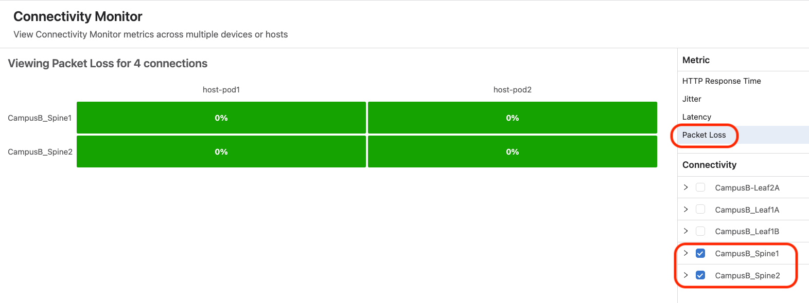

**Recapping this lab section, Connectivity Monitor is now setup to probe both the leaf-to-spine fabric connectivity as well as Spine to end host in a separate subnet.**

**This Concludes the Connectivity Monitor lab section**
  
---
AskAVA Prompts:
  
```
within interface vlan configurations, find entries for `ip virtual-router address` with IP address following those keywords. Report back summary of IPs configured by SVI
```

---
# 4. Zero Touch Replacement - ZTR

Stop and wait here until the lab instructor informs the class when CampusB-Leaf2A will be disrupted for the ZTR section. Do not start the ZTR replacement until CampusB-Leaf2A shows offline in CloudVision.

**ZTR Lab Section**
Goal - In this lab section, CampusB-Leaf2A will be simulated offline by blocking its management connection to CloudVision. A fresh virtual device Leaf-ZTR will be unblocked to replace it. Due to the nature of the virtual lab environment, the port connections must remain in-place while the topology is deployed. Therefore you will see the new ZTR replacement device is connected to different interfaces within the environment versus the original Leaf2A and how the ZTR process accommodates updating the fabric configurations to the new connections.


31. From the **Devices** menu **Inventory** page click on the offline CampusB-Leaf2A's device page by clicking on the Hostname
    - 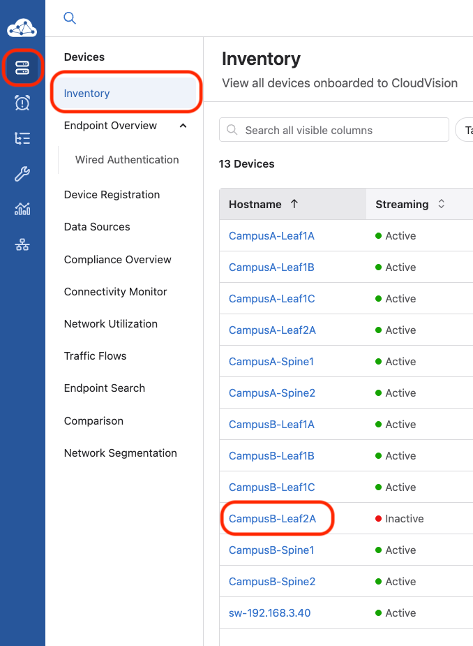

32. Within the device page, scroll down and click the **Replace Device** button.
    - 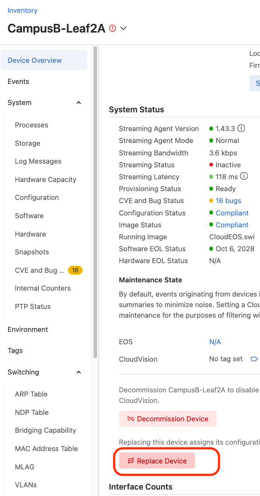

33. In the Replace Device Dialog, check the Leaf2A failed device to select it, then click the drop-down for Replacement Device and select the ZTP-status DHCP IP address device (look for the green indicator)
    - 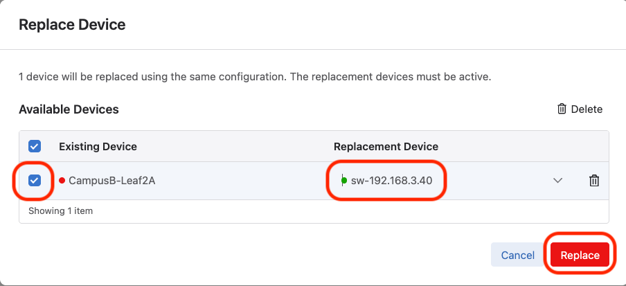
    - CloudVision will display a status window while the process is in-flight.
    - 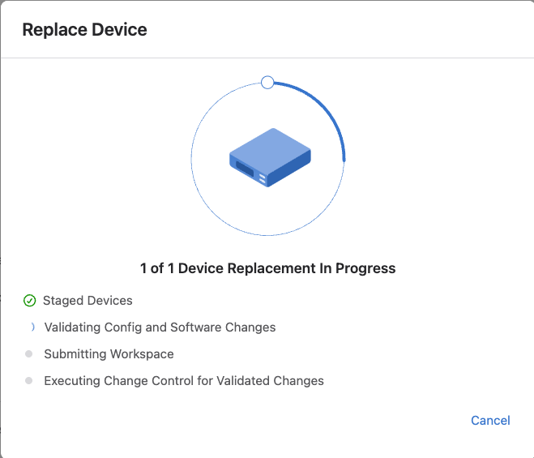

34. Next, CloudVision presents you with changes it has detected:
    - Spine connections are different since the ZTR device is pre-connected to ports adjacent to Leaf2A
    - Copies over the existing configuration from Leaf2A.
    - 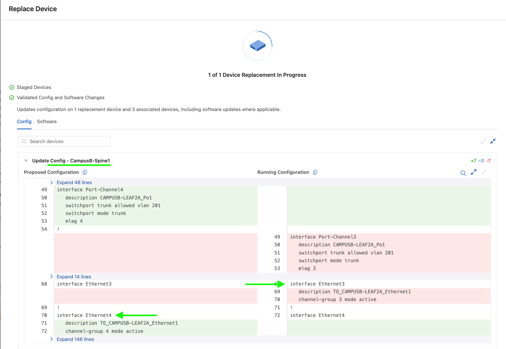
    - 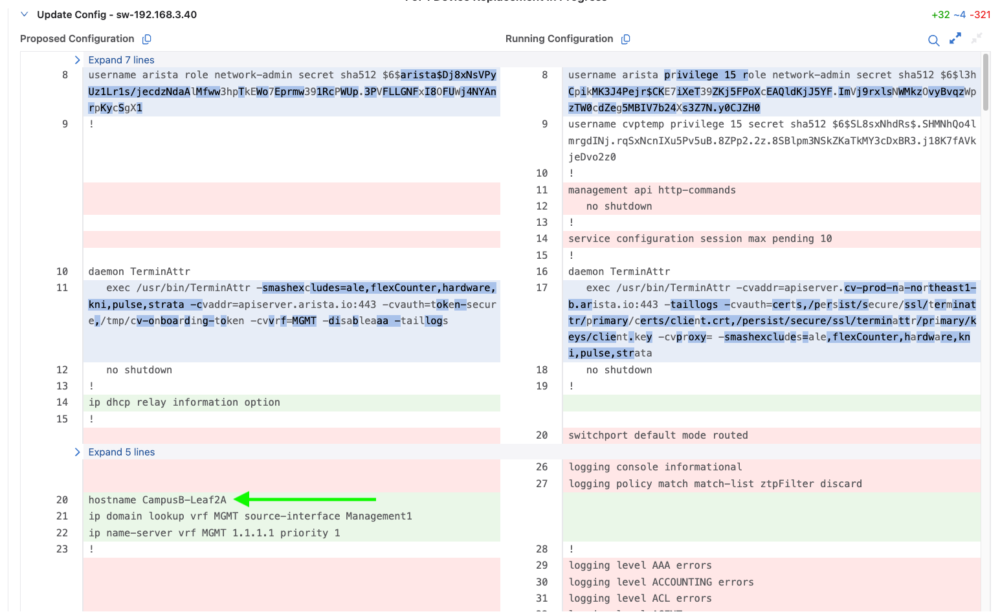

35. Once you have reviewed the changes, select **Continue to Replace** button
    - 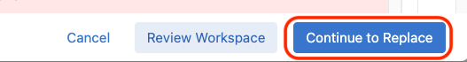
    - Note - the device replacement Change Control will execute automatically for you at this stage. The replacement device will need to go through the Zero Touch Provisioning reboot process after configuration is updated. Please give the replacement Leaf2A device to go offline and reboot after replacement is initiated.


36. After the replacement Leaf2A has booted back up, confirm that your customized device tags, interface configuration, and connectivity monitor probes are working on the new replacement switch.
    - Throughout this replacement, the Spines have been probing to the host IPs and recorded the duration of packet loss.
    - Browse to CloudVision Events and look for event named **Common Device Connectivity Monitor Events** or similar named events generated from CampusB Spine devices.
    - Clicking on the event will open detailed context
    - 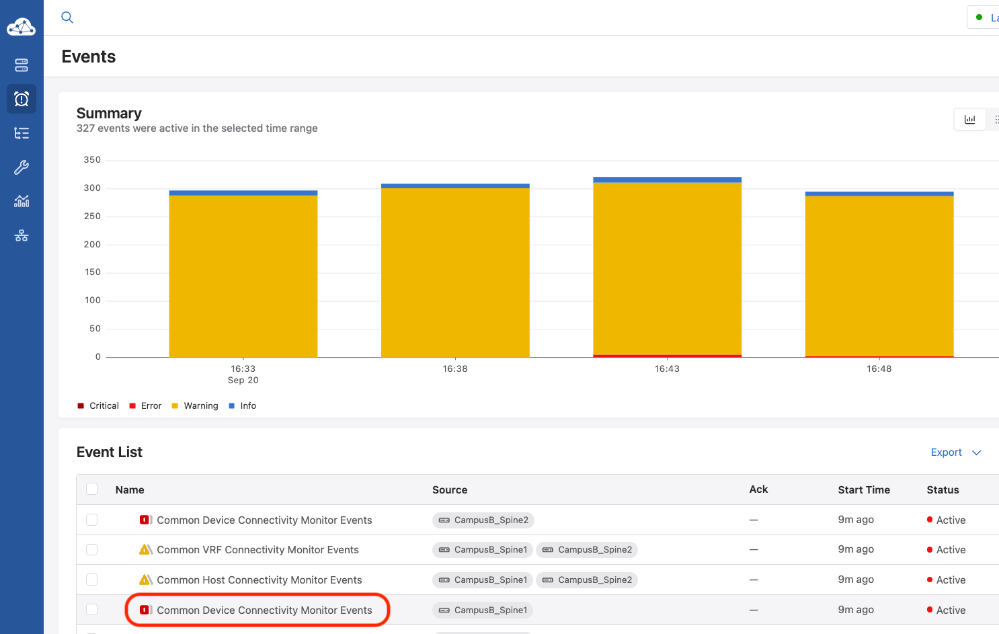
    - 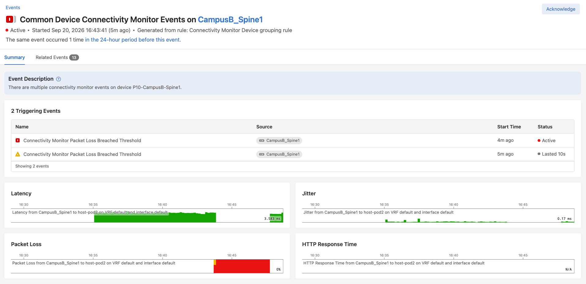

**This Concludes the ZTR lab section**
---
AskAVA Prompts:

```
Find events related to "common device connectivity monitor events"
```

```
Investigate further by looking into the connectivity monitor events
```

---

# 5. Data-Plane-Capture
- Goal - Utilize CloudVision Custom Action to execute tcpdump of data plane packets
  
## Data Plane Capture lab special considerations  
- This methodology is provided by example for convenience within the vEOS-lab environment to illustrate how CloudVision can be customized to show data to the user in flexible ways. For production environment packet captures, parsing, and secure storage, additional configuration and tools are required.
  
- Within the virtual vEOS-lab device, the data plane consists of virtual-NICs which can be directly captured without setting up a device monitor session (mirror port). In order to get data plane packets from a hardware switch, a monitor session such as the following would be configured:
```
switch(config)#monitor session TEST source ethernet 7 rx
switch(config)#monitor session TEST destination cpu
```  
- For the vEOS-lab devices used within the lab, the vmnic representing each switchport can be directly accessed by `tcpdump` when using the `interface any` keyword and allows us to skip over setting an explicit mirror session.

 ## Data Plane Capture Lab Instructions

37. Navigate to **Provisioning**, **Actions**, **New Action** button
    - 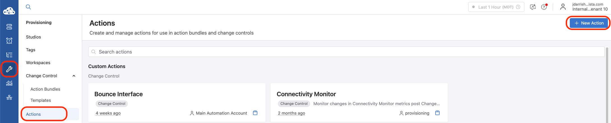
    - Name the action "tcpdump" with default Action type of Change Control and click Save.
    - 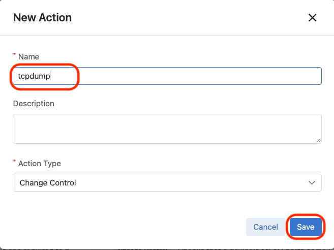
38. Add a Dynamic Argument to take a device as input by clicking **Manage Arguments** then click **+ Dynamic Argument**
    - 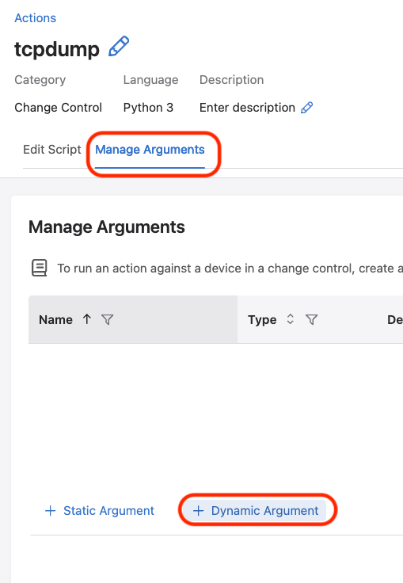
    - Name the argument(case sensitive): **DeviceID**
    - 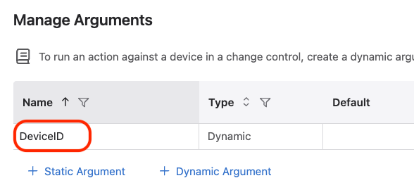

39. Select the **Edit Script** Menu and paste in the Script below:
    - 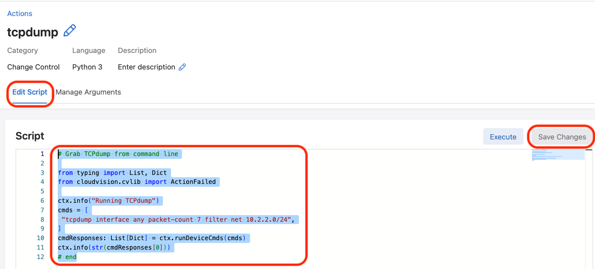
---

```
# Grab TCPdump from command line

from typing import List, Dict
from cloudvision.cvlib import ActionFailed

ctx.info("Running TCPdump")
cmds = [
 "tcpdump interface any packet-count 7 filter net 10.2.2.0/24",
]
cmdResponses: List[Dict] = ctx.runDeviceCmds(cmds)
ctx.info(str(cmdResponses[0]))
# end
```


---

40. Now, let's execute this action directly in this menu using the **Execute** button
    - 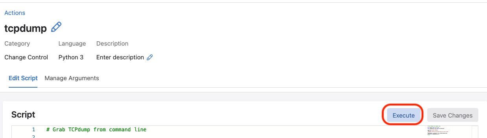
    - Expand Dynamic Argument Values and select your **CampusB-Leaf1C** device
    - 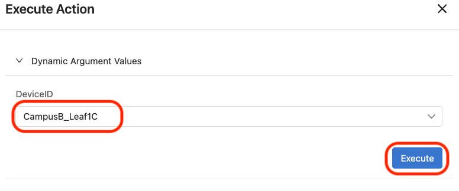
    - Expand the results to see additional packet information captured in the error response
    - 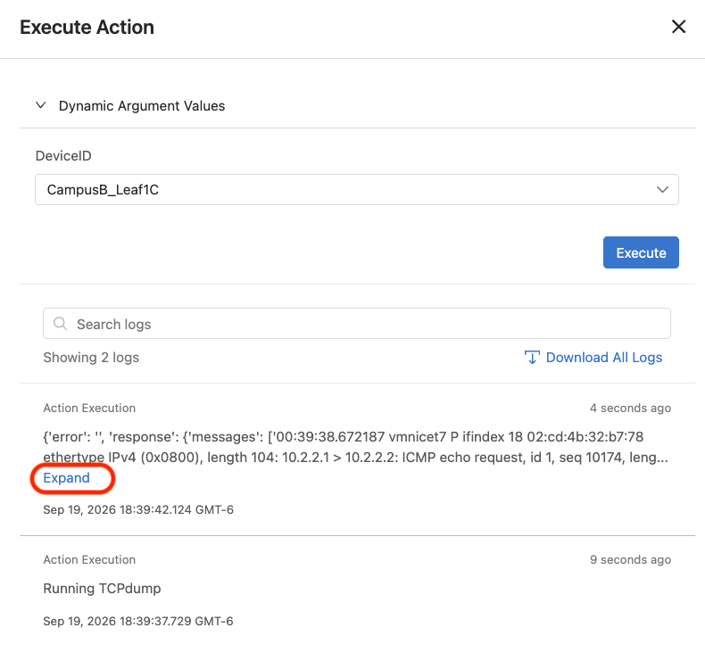
    - Notice the ICMP echo request, reply and IP address information for the connected host appear in the captured action response.
    - 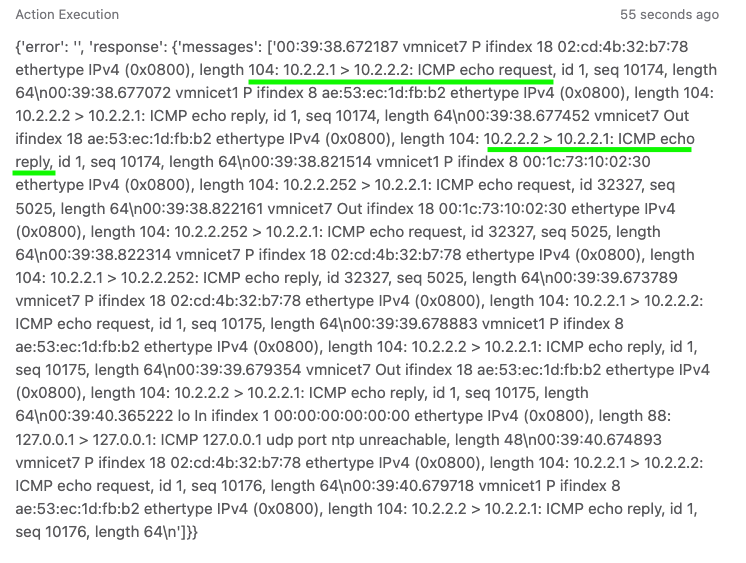

** This completes the data plane capture lab section ** 
---

AskAVA Prompts:

```
Reference the designed configuration for Campus B spines, find the individual ip address for the host VLAN on each spine. Run a traceroute from campusb-leaf2a to these IPs
```
  
```
Referencing the Connectivity Monitor events and dashboards, what information has been reported in the last 24 hours?
```

---


**LAB GUIDE COMPLETE**
