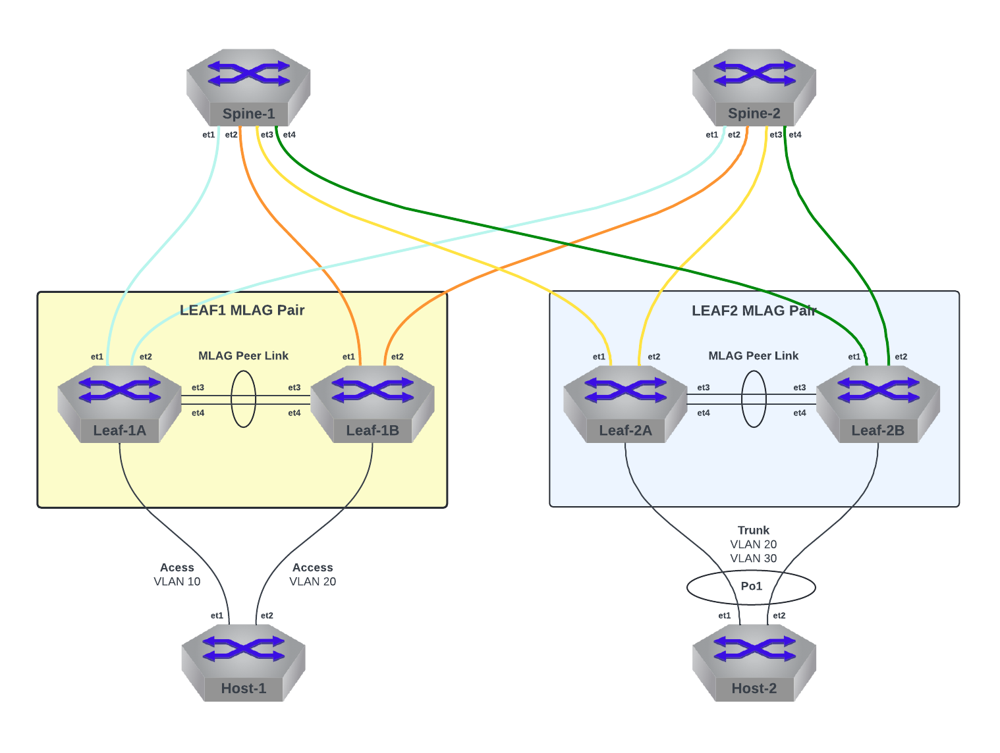

  

  

<!-- title only -->
<h1 align="center"> CloudVision Mastery Workshop Lab Guide </h1>

 
 

# **LAB TOPOLOGY**

Each lab environment consists of a Layer 3 Leaf & Spine design. There are 2 Spine switches and 4 Leaf switches. The Leaf switches are connected in MLAG pairs. There is a single host device connected to each MLAG pair. Host-1 is simulating a single-homed device, connected on Leaf-1A and Leaf-1B on different access VLAN’s. Host-2 is acting as a dual-homed server using an LACP Port-Channel to allow for active/active sharing of workloads. 

 

