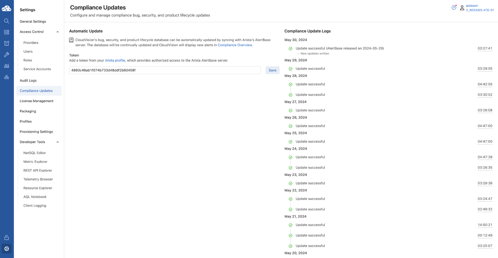

<p align="center">
  
</p>

<p align="center">
  
</p>

<!-- title only -->
<h1 align="center"> CloudVision Mastery Workshop Lab Guide </h1>

<br>
<br>

# Heading 1
## Heading 2
### Heading 3
#### Heading 4
##### Heading 5

<br>
<br>

<!-- Insert Code Block with Copy Functionality -->
## Insert Code Block
```sh
4893c46ab1f074b733d48ddf2b60458f
```
<br>

## Insert Image
<!-- Insert Image -->


<br>

## Insert Note  
> [!NOTE]
> ENTER NOTE TEXT HERE!!!

<br>

## Insert Tip
> [!TIP]
> ENTER TIP TEXT HERE!!!

<br>

## Insert Warning
> [!WARNING]
> ENTER WARNING TEXT HERE!!!

<br>

## Insert Caution
> [!CAUTION]
> ENTER CAUTION TEXT HERE!!!

<br>

## Insert Important
> [!IMPORTANT]  
> ENTER IMPORTANT TEXT HERE!!!
